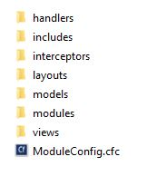
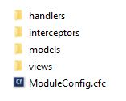

# Modules

## What are modules

Modules are self contained bundles of code, that contain their own configuration, routes, handlers, views, widgets, interceptors, and can contain other modules. They are a vital part of ContentBox, and the ease in which you can use, and develop for ContentBox.

## ContentBox is built on Modules

ContentBox itself is made up of 3 separate Modules ( and their submodules ), ContentBox, ContentBox-Admin and ContentBox-UI. One of the best security features of ContentBox is the fact that you can remove the Admin module from your production installs, removing the ability for the admin to get hacked, because it is not even present on your production server.

### ContentBox

.jpg>)

### ContentBox-Admin

### ContentBox-UI

