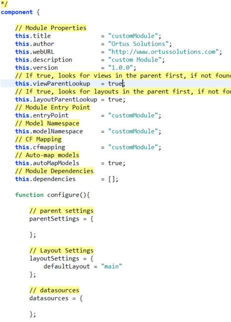
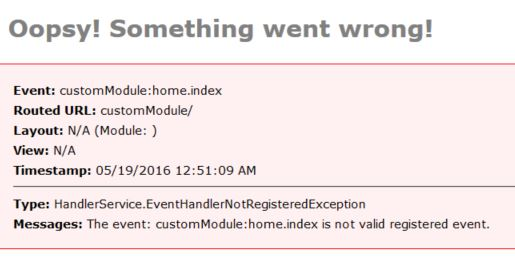
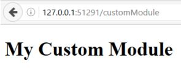
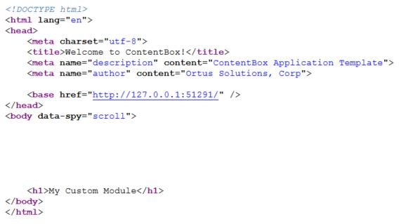

# Build a Module

Whether you have used ColdBox before or not, using Modules with ContentBox and ColdBox is fairly straightforward, in fact, I think its a great way to dip your toes into using both technologies. Working with Modules is like everything else in ColdBox, you work with conventions, but you have control.

As stated in our Module Conventions page, we showed you how there are 4 locations for modules in ContentBox. Depending on how your module will work, you should choose the appropriate location. In this example, we're going to build a custom ColdBox module, which it not managed by ContentBox Admin's Module Manager.

## Module Build Location

We'll be working in `modules_app` folder. These modules we create are for developers eyes, and will not show up in the 'Manage Modules' administration menu. These are modules that you wouldn't want someone accidentally turning on / off, for example, a key part of the website.

When you install a module from the 'module manager' in the admin, ContentBox installs those modules into another location.

## Module Building Basics

There are a few ways to build a module, including CommandBox scaffholding, where you are asked a few questions, and then it generates a module, with all of the folders you need and some you might want.

In this example, we will start simple, and add more files as we build. First, we need to know a few things about the module to get started... your folder name, and then some details to add into your Module Config file.



**Folder Name for the Module**

This is the folder you put the module in. It does not have to match anything else with the module, so you can use something meaningful... you can set the entry point / link / route manually in the Module Config file.

**Entry point - What link / route would you hit to pull up this module?**

In my example, I want to be able to go to /customModule and be able to pull up this module. I have created modules for /profile and /pay and /help in the past.

**Namespace for the Module**

This is a namespace for any models initialized in this module. Say you have a UserService.cfc in your module, you would ask for this service from wirebox with userService@customModule if that is the namespace you would like to use. I usually make the entry point and namespace and the folder all match, unless the entry point should be shorter or different, for whatever reasons.

**CFMapping for the Module**

This is an automated mapping for the module. I usually have this match the folder, and namespace.

**Version**

Start at 1.0.0, you can bump it up as you go, but this is usually not vital unless you're planning to publish on Forgebox or something. We can look at that in a future post.

### Our new Module - CustomModule

For my example, lets keep it super simple, and call the app customModule, and we'll keep everything the same, folder, entrypoint, namespace, mapping.

**Create Folder**

Lets create a folder `/modules_app/customModule/`

**Create ModuleConfig.cfc**

Next, lets create a file called ModuleConfig.cfc - this is the config file that ColdBox loads to setup the module, and get it ready to use. It can setup a lot of things, including the mapping, entry point, and a lot more. We'll start simple, here is a gist for my bare bones moduleConfig file.

[https://gist.github.com/gpickin/f7b0a53353230d326ef31d1d3d4996ef](https://gist.github.com/gpickin/f7b0a53353230d326ef31d1d3d4996ef)

Once you have your folder, and your moduleConfig file, you can reinit your app, and then try hitting your entrypoint.

Error - so lets see what we need next to be able to get this Module Working.



If you read the error message, you'll see that the event customModule:home.index is not a valid registered event.

What does this mean? This means the entry point worked, and found your module, but its looking for an event to run. If you look in your routes in your config, you'll see some basic routes setup for you.

## Module Routing

```text
// SES Routes
routes = [
// Module Entry Point
{ pattern= "/", handler="home" , action="index" },
// Convention Route
{ pattern= "/:handler/:action?" }
];
```

These routes are children routes of the entrypoint.

So `/customModule/` is added to the apps main routing table, by setting the entry point above. These children routes build on top of that.

So if someone hits the child route / then its the same as `/customModule/` - and if that pattern is matched, that route says we want to use the 'Home" handler, and the "index" action. That is why you see the error looking for that, its because this is the default event for this module. You will also see there is another route pattern below, `/:handler/:action` - this includes placeholders. So this will match anything with 2 or more values, and then it will use the first value as the handler name, and the second piece as the action.

* /customModule/profile/view/ would be the customModule with the profile handler and the view action.
* /customModule/product/add/ would be the customModule with the product handler and the add action.

We could change our default to be something else, but for now, lets keep it simple. Home Handler and Index action.

## So how can we create this event?

This is where ColdBox conventions really shine. You might think you have to create a Handler folder, and create the handler named Home.cfc and then put a function inside of it called index... which is correct but you don't HAVE to. ColdBox's conventions requires less than that to create an event. In fact, the lowest point of entry for creating an event, is just to create a view.

Lets make a folder called views \( the convention for where your views live \) `/modules_app/customModule/views/`

To create the view for home.index, we need to create an index.cfm. Conventions tell us, to make a folder inside views to match the handler, and then place the action's view in that folder. So lets create `/modules_app/customModule/views/home/index.cfm` We'll put in an _&lt;h1&gt;My Custom Module&lt;/h1&gt;_ and see what happens when we hit the entry point now.



Amazing, just 2 files, and we have a working module. You could paste in your legacy spaghetti code right in here, and it would work. Of course, we probably want to dress it up a little more, and add some more functionality, so lets look at the layout first. If we view the source, you'll see there is more than just the h1 tag we added.



## Where is all of that coming from? Layouts

[Check out this blog post about Module layouts.](https://www.ortussolutions.com/blog/contentbox-creating-custom-layouts-for-you-custom-modules)

