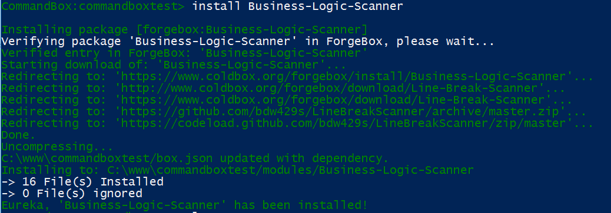

# Installing a Module

Using ContentBox's Module Manager can help you install modules from Forgebox, Commandbox can help you install modules from Forgebox into wherever you need them, and of course, you can get your hands dirty and write some code too. You can either build one, copy the source manually, install with CommandBox, or install via ContentBox itself.

## Where are modules located in a ContentBox application

Depending on the type of module, there are different methods and locations to install the module into.

* `/modules` - ColdBox Modules - git ignored, controlled by CommandBox
* `/modules_app` - ColdBox App Modules - Your application global modules - included in your git repo
* `/modules/contentbox/modules` - ContentBox Always Load Modules
* `/modules/contentbox/modules_user` - ContentBox Admin Managed Modules

## Installing a Module via ContentBox

You can manage ContentBox Modules through the ContentBox Administration. Click on the ForgeBox tab, you can search, locate and install modules directly.

## Installing a Module using CommandBox

If you are not using CommandBox yet, you should be. It is not only great for easily spinning up CFML Servers ( multiple server types ), but CommandBox's true strength is using it to manage your projects and packages, similar to 'npm' for node.

At Ortus Solutions, we use CommandBox to manage all of our CFML Projects. We track all of our dependencies and do not commit any CommandBox module to our Git repos. CommandBox will install dependencies from the CLI during our build process.

Let's walk through installing a ColdBox module, to scan our views for Business Logic, there is a module for that. If you look on Forgebox, you'll find Business Logic Scanner by Brad Wood. [https://www.forgebox.io/view/Business-Logic-Scanner](https://www.forgebox.io/view/Business-Logic-Scanner)

To install, we cd into the site root, and type

`box install Business-Logic-Scanner`

Once CommandBox is done, you can log into ContentBox, and click 'Modules > Manage' and activate the module ( or reinit the app ).

Now, you have quickly installed a module, and activated it...time to use the module.

## Can I install a Module without CommandBox?

Absolutely, you can just copy a module into your modules folder, and sometimes, your modules will not be on Forgebox... a perfect example, Commercial Products, like DataBoss.

For a customer recently, who has a large custom database, we decided we wanted to use Databoss to help our customer view, add and edit data. DataBoss is a commercial product of Ortus Solutions and a complete Application in a Module. You can download a trial of Databoss, drop into your Modules folder, activate it, and now you have a full DataBoss application running on your /databoss route/url.
