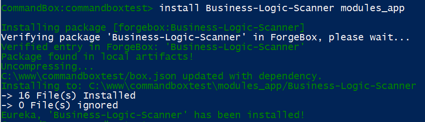

# Module Locations and Conventions

## Where are modules located in a ContentBox 3 application

Depending on the type of module, there are different methods and locations to install the module into.

* `/modules` - ColdBox Modules - git ignored, controlled by CommandBox
* `/modules_app` - ColdBox App Modules - Your application global modules - included in your git repo
* `/modules/contentbox/modules` - ContentBox Always Load Modules
* `/modules/contentbox/modules_user` - ContentBox Admin Managed Modules

## Why are there 4 locations? Which location should I use?

There are 4 locations because each location has a different set of conventions, and different behaviors. Depending on what your module is, and what it will do, helps you determine where you should install / create it. The other reason the location matters, is because of source control. If your module interacts with ContentBox's life cycle, ie adding admin menu items when the module is loaded, the module is considered a ContentBox module, and should be installed in one of the last 2 locations.

## ColdBox Modules /modules

Applications can have many dependencies, and keeping them out of your repo, and managing them with package managers, like Node, Bower, CommandBox, can keep your apps clean and light. Your gitignore file can get out of hand if you are individually adding and removing modules. To make life easier, we have 2 ColdBox App locations, 1 is /modules, which is controlled by CommandBox, and should be set to ignored. This means you can install hundreds of ColdBox modules, and do not have to worry about them filling up your repo. Note:Since these files in the /modules folder are not in source control, editing these files is pointless. Your changes will never get committed, and therefore deploy to any other developers, or staging / production servers. If a module requires you to edit files inside the module to work, you should install the module to the ColdBox Apps Modules location \( below \).

## ColdBox App Modules - /modules\_app

This location is not ignored by git, it is a part of your source control repo. These modules can be created by you, or manually installed, or installed by CommandBox by using an alternative location \( read below for when you should do this \). There modules behave just like modules installed into the modules folder, the main difference is source control. Do you want the module to be embedded in your repo, or linked, using commandbox to resolve the module as a dependency.

### Installing CommandBox modules to modules\_app folder instead of the modules folder

When installing modules with CommandBox, they are usually installed to the /modules folder, but sometimes you should install modules to the modules\_app folder. The main reason, if the module requires configuration changes to the files, those files need to be in source control. So the best location for that module, is inside of the modules\_app folder. Not all modules need file changes to get the module working, so install those normally, but if a module requires those types of changes, a simple change to the install command will change the installation path. ? 1

`box install Business-Logic-Scanner modules_app`

The last parameter is the installation directory. This will install the module to that directory. Note: If you are creating a module, and you know someone will need to modify the module to get it to work, you can set the directory in your modules box.json so when commandbox installs your module, it knows it should be in that folder by default.

## ContentBox Always Load Modules - /modules\_app/contentbox/modules

This one is pretty self explanatory, they are ContentBox modules that always load. This location is stored for core ContentBox submodules, that are not controllable by the admin. My advice is, do not develop modules in here. Since these modules always load, trying to use a normal module in here, can have loading order issues. For example, if you design a module to add menu items to the admin, this module will have issues loading the adminMenuService@cb since the contentbox-admin module hasn't been loaded when these modules are being loaded. Its best to put those modules in the next location - ContentBox Admin Managed Modules

## ContentBox Admin Managed Modules - /modules\_app/contentbox/modules\_user

This is where you should create modules that require the contentbox lifecycle to function correctly. A perfect example of the contentbox lifecycle, is after the core admin module has been initialized, it then loads these modules. The lifecycle fires events, that your modules can listen to, for example, onLoad and onUnload which are perfect for adding and removing menu items from the main menu item for your customer admin modules. If you module was not in this folder, your modules would not be able to intercept these events, making simple tasks, harder to do.

Another great aspect of having ContentBox managed modules, is that logged in users can activate, deactivate, or reload modules. This is the best way to extend contentbox, you can tie the module into all the internal events of Contentbox. In a future post, we'll be showing you show to make your own Admin Module where you can add menu items like the screenshot below... the last main menu item is Mapigator, which has submenu items, added dynamically by using modules in this folder.

