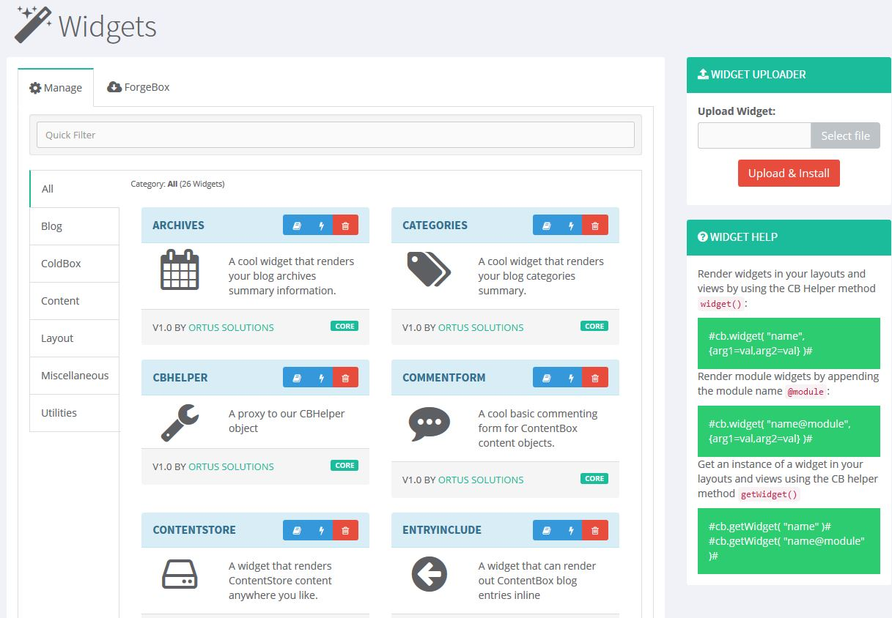

# Widgets

## What are Widgets?

Widgets are small pieces of software that you can add to your ContentBox website to perform a **specific** function.  A widget is simply a ColdFusion Component \(**cfc**\) that extends our core widget \(`contentbox.models.ui.BaseWidget`\) and lives in a specific location where ContentBox can register it.  It must have at least one rendering function called `renderIt()` and it has full access to [WireBox](https://wirebox.ortusbooks.com) dependency injection and helper objects.

```java
component extends="contentbox.models.ui.BaseWidget" singleton{
    
    function renderIt( .... ){
        return "Hola froim WidgetLand!";
    }
    
}
```

There are several Widgets built into ContentBox \([**Core Widgets**](core-widgets.md)\) that are used for various parts of your website, and you can insert widgets into blog posts and pages to make your website even more dynamic.

### Base Widget

The Base widget has been created with some properties and injections in order to help you in development. 

#### Widget Properties

The following are the _optional_ base properties defined for all widgets.

```java
property name="name"					type="string" default="";
property name="version"					type="string" default="";
property name="description"				type="string" default="";
property name="author"					type="string" default="";
property name="authorURL"				type="string" default="";
property name="forgeBoxSlug" 			type="string" default="";
property name="category" 				type="string" default="";
property name="icon" 					type="string" default="";
```

#### Widget Injections

All widgets receive the following injections that you can leverage in your code. Please refer to the [API Docs ](http://apidocs.ortussolutions.com/contentbox/current)for further reading on the dependencies.

```java
property name="categoryService"			inject="id:categoryService@cb";
property name="entryService"			inject="id:entryService@cb";
property name="pageService"				inject="id:pageService@cb";
property name="contentService"			inject="id:contentService@cb";
property name="contentVersionService"	inject="id:contentVersionService@cb";
property name="authorService"			inject="id:authorService@cb";
property name="commentService"			inject="id:commentService@cb";
property name="contentStoreService"		inject="id:contentStoreService@cb";
property name="menuService"				inject="id:menuService@cb";
property name="cb"						inject="id:CBHelper@cb";
property name="securityService" 		inject="id:securityService@cb";
property name="html"					inject="HTMLHelper@coldbox";
property name="controller"				inject="coldbox";
property name="log"						inject="logbox:logger:{this}";
```

## Manage Widgets

Widgets are maintained through the Administrator under `Look & Feel > Widgets`. You can manage existing widgets, upload new widgets, or download widgets from Forgebox as well.

The manager also allows you to read the widget's documentation and actually test out its rendering functions.  So please use this playground to your advantage.



## Widget Locations

Widgets can exist in many locations depending on your needs.  They can also be discovered when used as markup in your ContentBox editors \(More on this later\)

### Core Widgets

`/modules/contentbox/widgets`

Core widgets are widgets that exist inside the ContentBox core module and are shipped by the version of ContentBox installed.  **These widgets should not be modified or you should not really place custom widgets here**. Check out the [Api Docs](https://apidocs.ortussolutions.com/contentbox/4.2.0/contentbox/widgets/package-summary.html) for further information.

### Custom Widgets 

`/modules_app/contentbox-custom/_widgets`

Custom widgets are your very own widgets that you will program to enhance ContentBox.  These should definitely be in source control and are managed by you!

### Module Widgets

```text
# Core Module Widgets
/modules/contentbox/modules_user/{name}/widgets

# Custom Module Widgets
/modules_app/contentbox-custom/_modules/{name}/widgets
```

Module widgets are widgets that live inside **ContentBox Modules** not vanilla ColdBox modules, ContentBox MUST know about the module.  They can come from **core** or **custom** module registrations.  All you need to do is place the widgets inside a `widgets` folder in the root of the module.


**Important:** If you put modules outside of the ContentBox conventions they will not be inspected and registered.


### Theme Widgets

The currently active theme can also do widget contributions.  If the theme package contains a `widgets` folder in its root, then all of those widgets will also be registered in ContentBox.


**Important**: Please note that if you use theme widgets in your content and you switch themes, you could have nasty exceptions or warnings in your content.


## Rendering Widgets

Widgets are rendered in your UI when you place them in content via the editors or manually using our triple mustache markup.  The UI approach can be seen in the [Using ContentBox](../../../usage/using-contentbox/look-and-feel/widgets/) Section.  The Markup notation is shown below, please note that the name of the widget has meaning:

```text
# Simplest Form
{{{WidgetName}}}

# Passing Arguments
{{{WidgetName arg1="value" arg2="value"}}}

# Calling a different function than renderIt()
{{{WidgetName.function}}}
```

### Widget Discovery

By default, the `WidgetName` will be searched for in the following locations by convention:

1. Custom Location
2. Active Theme Location
3. Core Location

If the widget cannot be found in either of those locations an exception will be thrown.

### Explicit Module Widget

If you want a widget from a module rendered then you need to give it the address of the module like so:

```text
{{{WidgetName@ModuleName}}}
```

### Explicit Theme Widget

If you want a widget from the current theme explicitly then give it the `~` address:

```text
{{{~WidgetName}}}
```

## Manually Rendering Widgets

You can manually render widgets outside of content by leveraging the CBHelper's `widget()` method:

```java
/**
 * Execute a widget's renderit method
 *
 * @name The name of the installed widget to execute
 * @args The argument collection to pass to the widget's renderIt() method
 */
function widget( required name, struct args=structnew() ){
	return getWidget( arguments.name )
		.renderit( argumentCollection=arguments.args );
}
```

This method calls the `renderIt()` method by convention. If you want more control, then retrieve the widget instance and use it.

## Retrieving Widgets

If you want to use the widget, then retrieve it using the `getWidget()` method from the CBHelper.

```java
/**
 * Return a widget object according to name convention:
 * - ~name = Active Theme Widget
 * - name@module = Module Widget
 * - module = Custom or Core Widget
 *
 * @name The name of the installed widget to return
 */
function getWidget( required name ){
	return widgetService.getWidgetByDiscovery( arguments.name );
}
```

Please note that the **name** of the widget is important as ContentBox will try and figure out the location of the widget.  Please refer to the [Widget Discovery](./#widget-discovery) section above.

