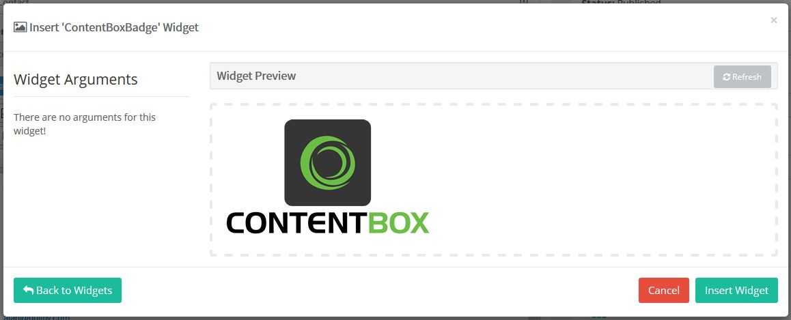
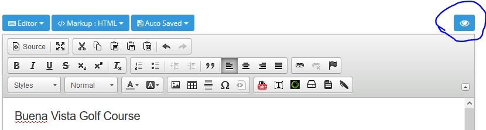

# Simple Widget

Widgets can range from very simple to very complex, depending on what your goal with the widget is.

Let's build a simple widget, that takes no parameters or arguments from the user, it simply outputs a ContentBox Logo, wrapped in a link to the ContentBoxCMS webpage.

There are several things a Widget needs to work with ContentBox. We'll cover all of these items with a simple example. In other sections we'll look at more complex options you have as a Widget builder.

* File in the right Location
* CFC Definition and Extension of the BaseWidget
* Widget Properties
* RenderIt\(\) Function

_**Remember: Widgets are loaded into memory when the Application is started. To make changes, please reinit your app, or Reload the App from the admin menu to see those changes.**_

## File in the right Location

First, you need to create a CFC, in a Widget loading location. In this example we're going to create a ContentBox Logo and Link. So we'll call it `ContentBoxBadge.cfc`

There are several locations for loading widgets, the main ContentBox core location is:

* `modules/contentbox/widgets`

For now, that is a good location.

## CFC Definition and Extension of BaseWidget

```text
component extends="contentbox.models.ui.BaseWidget" singleton{

    ContentBoxBadge function init(){
        return this;
    }
}
```

See the init line includes the name of the CFC. `ContentBoxBadge function init()` If you CFC was called GoogleLink your init line would be: `GoogleLink function init()`

Now when we look in the Widget list, and find our widget... this is what we'll see.


## Widget Properties

For ContentBox to know more about your widget, you should add some Properties to your widget. This is done in the `Init()` and can include the following.

```text
component extends="contentbox.models.ui.BaseWidget" singleton{

    ContentBoxBadge function init(){
        // Widget Properties
        setName( "ContentBoxBadge" );
        setVersion( "1.0" );
        setDescription( "A cool basic widget that shows a linked Logo.
                         that links you to the ContentBox website" );
        setAuthor( "Ortus Solutions" );
        setAuthorURL( "http://www.ortussolutions.com" );
        setIcon( "image" );
        setCategory( "Content" );
        return this;
    }
}
```

* Name: The Name of the Widget.
* Version: A meaningful version number
* Description: A short description of the widget and its use
* Author: Author of the Widget
* AuthorURL: The URL of the Author of the widget
* Icon: This is the icon used by ContentBox. Icons are Font Awesome Icons. [Refer to Font Awesome Website for a full list.](http://fontawesome.io/) 
* Category: This is the grouping the widget will be placed in. This is completely customizable, but the default groups are:
  * Blog
  * ColdBox
  * Content
  * Layout
  * Miscellaneous
  * Utilities

Now when we load Reload the app, and look at the widget list, you will see the details are filled out.


## RenderIt Method

When you build a Widget, they are built to render something out to the user. To use a Widget, you must have a renderIt\(\) function... and it must return something to the RenderData function that calls it.

At it's simplest, you can add this function under your Init\(\)

```text
function renderit(){
    return 'Test';
}
```

Once we reload the app, we can test our Widget from the Widget Manager.


## Render the Logo and Link

Lets build a logo and link in a string, and return that.

```text
function renderit(){
        var thehtml = '<a href="https://www.contentboxcms.org/" target="_blank">
            </a>';
        return thehtml;
}
```

Now we reload, and then test it again


## Inserting our Widget into a Page

Lets add our widget into a page. Lets browse in the admin to `Content > Sitemap` and click on a page. Find the location in the text you would like to add your widget, and click the Green ContentBox Widget icon \( circled below \).


Pick the Widget out of the list, you can filter the widgets, or select by category \( as we defined in our Widget properties \)


Click anywhere on the Widget itself, and the Insert Widget Dialog will open like the screen below.



If there were arguments, you could adjust them here. If this is the widget you want, and the preview looks good, click `Insert Widget`. `Back to Widgets` allows you to return to the Widget list to look for a different widget. `Cancel` returns you to the Content Editors.

Once inserted, click Publish, and then you'll see a Widget placeholder like this.


If you right click on the widget, you can get a Widget Context menu like below. You can edit, or remove a Widget through that context menu, or just double click the Widget placeholder to edit directly.


This example has no arguments or parameters to change, but if you did, you would be able to edit those here, and click `Update Widget` to save those changes.


You can preview the page using our Responsive Previewer which allows you to see what your page will look like, in desktop, tablet and phone views \( horizontal and vertical \).




When you are happy, ensure you save / publish your page to keep your changes. Once saved, you can view it on the front end of the website.

