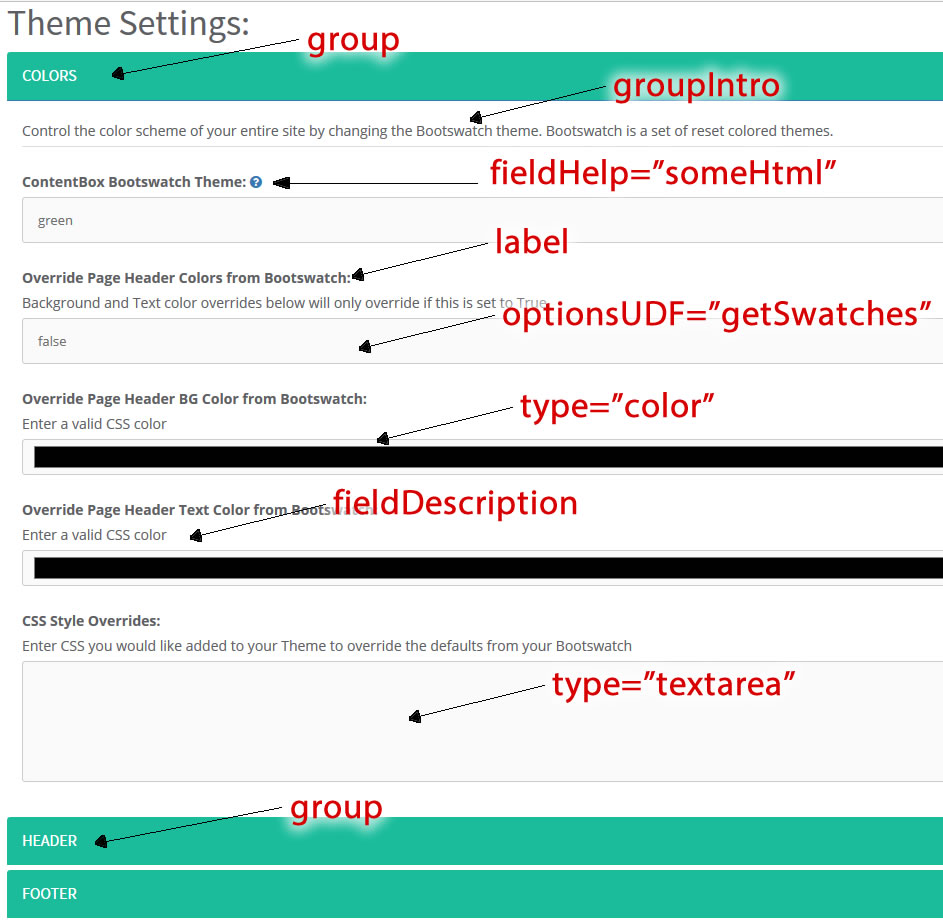

# Theme Settings

You can declare settings for your Themes that ContentBox will manage for you. The form itself is built from the Theme.cfc file itself.

The value is an array of structures with the following keys:

* `name` : The name of the setting (required), the setting is saved as cb\_layoutname\_settingName
* `defaultValue` : The default value of the setting (required)
* `required` : Whether the setting is required or not. Defaults to false
* `type` : The type of the HTML control (text=default, textarea, boolean, select, color)
* `label` : The HTML label of the control (defaults to name)
* `title` : The HTML title of the control (defaults to empty string)
* `options` : The select box options. Can be a list or array of values or an array of name-value pair structures
* `optionsUDF` : The select box options. This points to a UDF that returns a list or array of values or an array of name-value pair structures. Example: getColors not getColors()
* `group` : lets you group inputs under a Group name - settings should be in order for groupings to work as expected
* `groupIntro` : Lets you add a description for a group of fields
* `fieldDescription` : Lets you add a description for an individual field
* `fieldHelp` : Lets you add a chunk of HTML for a Modal, openable by the User by clicking on question mark next to the field label. Recommended use is to readFiles from the `./includes/help` directory, with a helper function, for example: `loadHelpFile( 'cbBootswatchTheme.html' );`

## Example

```
this.settings = [
    { name="Title", defaultValue="My Awesome Title", required="true", type="text", label="Title:" },
    { name="Colors", defaultValue="blue", required="false", type="select", label="Color:", options="red,blue,orange,gray" }
];
```

## Theme Settings Admin Form

Below is an annotated screenshot showing most of the visible elements generated in the Theme Settings Admin form from the Theme Settings configuration structure.


