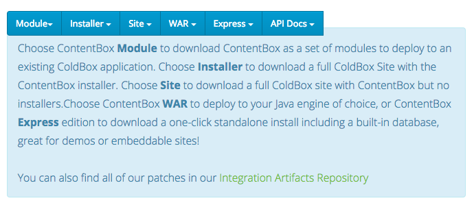

# Installation

We are so excited you are here and ready to get started with ContentBox Modular CMS one of the most modern ColdFusion \(CFML\) Content Management Platforms. __ There are several ways to install ContentBox, so make sure you explore all the options.

* Deploy the source using the [CommandBox Server ](https://www.ortussolutions.com/products/commandbox)with a supported modern ColdFusion \(CFML\) engine.
* Deploy the source to any modern ColdFusion \(CFML\) engine \(Adobe 11+ †, Lucee4.5+\)
* Leverage the `ContentBox.war` and deploy to any **Java** enabled server
* Run an express self-contained version
* Install into an Existing ColdBox MVC application
* Run as a docker container: [https://hub.docker.com/r/ortussolutions/contentbox/](https://hub.docker.com/r/ortussolutions/contentbox/)

So let's get started.

† There is a known compatibility issue in Adobe ColdFusion 2018 Update 3 which has been raised with Adobe.
