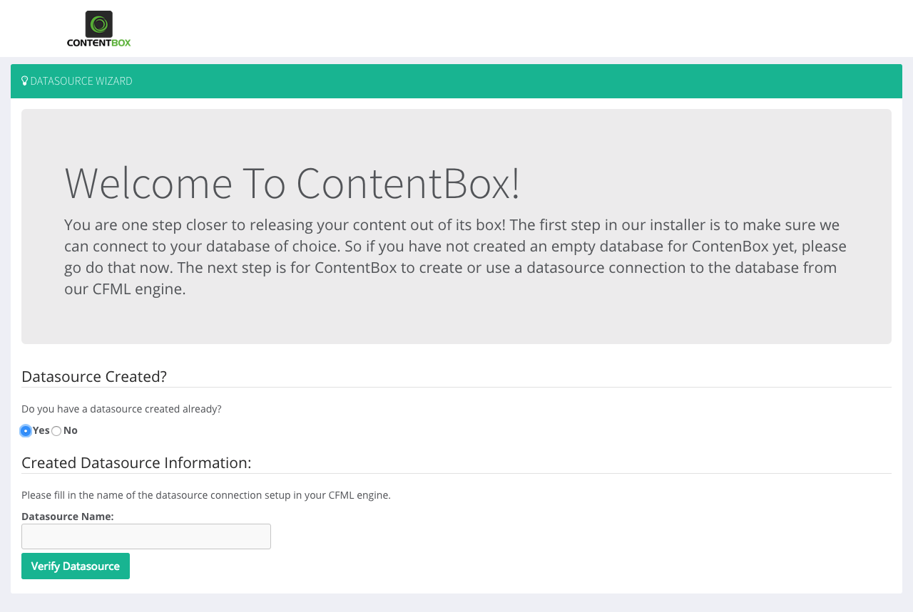

# CommandBox Installation


[CommandBox](http://www.ortussolutions.com/products/commandbox) is a ColdFusion \(CFML\) Command Line Interface \(CLI\), REPL, Package Manager and Embedded Server. We will leverage the CLI in CommandBox to install, deploy and configure ContentBox. The full CommandBox installation instructions can be found here: [http://commandbox.ortusbooks.com/content/setup/installation.html](http://commandbox.ortusbooks.com/content/setup/installation.html). We will do the short version.

## Download CommandBox

You can download CommandBox from the official site: [http://www.ortussolutions.com/products/commandbox\#download](http://www.ortussolutions.com/products/commandbox#download) and install it in your preferred Operating System \(Windows, Mac, Unix\). CommandBox comes in two flavors:

1. No Java Runtime \(30 Mb\)
2. Embedded Runtime \(80 Mb\)

So make sure you choose your desired installation path and follow the instructions here: [http://commandbox.ortusbooks.com/content/setup/installation.html](http://commandbox.ortusbooks.com/content/setup/installation.html)

## Starting CommandBox

Once you download and expand CommandBox you will have the `box.exe` or `box` binary, which you can place in your Windows Path or \*Unix `/usr/bin` folder to have it available system-wide. Then just open the binary and CommandBox will unpack itself your user's directory: `{User}/.CommandBox`. This happens only once and the next thing you know, you are in the CommandBox interactive shell!


We will be able to execute a-la-carte commands from our command line or go into the interactive shell for multiple commands. We recommend the interactive shell as it is faster and can remain open in your project root.

## Creating A ContentBox Site

Now that we have CommandBox we can use it to install and startup a ContentBox site using the embedded server \(Lucee 5.x\). You can use an embedded database or connect the embedded server to any database server as well. 

### Code Installation

Open a CommandBox shell in your directory of choice by typing `box` or executing the `box` binary and after the welcome screen type the following commands:

```bash
mkdir mysite --cd
install contentbox-installer
```

### ORM Dialect \(Optional\)


Please note that if you are using Lucee and a non-MySQL Database, you will have to update the dialect in the Application.cfc so the ORM knows how to treat your database correctly. We have seen this be automatic in Adobe ColdFusion, but Lucee has a bug that comes and goes on this.


Open the `Application.cfc` and look for the `orm` settings especially the `dialect` setting. Uncomment it and update it accordingly:

* Derby
* PostgreSQL
* MySQLwithInnoDB
* Oracle10g
* MicrosoftSQLServer

```javascript
this.ormSettings = {

    dialect = "MicrosoftSQLServer"
    
}
```

### Start the Server

Go back to the shell where you installed the code and run:

```bash
server start
```

The server will be created and started for you using the latest Lucee version.  A browser window should pop up after and you can run the installer.

### Setup Admin Password

Once you start the engine make sure you log in to the CFML web admin using the URL below in order to set up the CFML engine password. You will need this password to create the data source via the wizard.

```text
http://localhost:{port}/lucee/admin/web.cfm
```


You can install the bleeding edge of ContentBox by using the `contentbox-install@be` identifier in the install command. Basically, you can add any `@be` to any ID and CommandBox will try to retrieve the latest bleeding edge.


This will install the latest stable ContentBox and run an embedded server \(Lucee 5.x\) for it. After this, you will get the ContentBox installer. Just follow it through.



### ColdFusion Engine of Choice

Since we are leveraging CommandBox, you can replace the `server start` command to use any version of Lucee or Adobe ColdFusion. Below are some choice for the engines we support:

```bash
# default Lucee 5.x
server start

# Latest Adobe 2018
server start cfengine=adobe
# Adobe 2016
server start cfengine=adobe@2016
# Adobe CF11
server start cfengine=adobe@11
```

## Custom Datasources

To change the data source you can go into the CFML engine administrator and change it. Just look in your taskbar for an Ortus Logo like the one below:


Click on `open server admin` and go into the data sources section and create one.

## Installation Slugs

ContentBox is partitioned into three installation slugs from ForgeBox in order to allow for more flexible installation structures. We used the installer above, but you can use the following approaches as well:

1. `contentbox` - Installs ContentBox as a module into any existing ColdBox application.
2. `contentbox-site` - Installs a new ColdBox site enabled for ContentBox with a dependency on `contentbox` for its module but **no** installer or DSN creator are installed.
3. `contentbox-installer` - Same as above but with our DSN Creator and Installer Module available.

