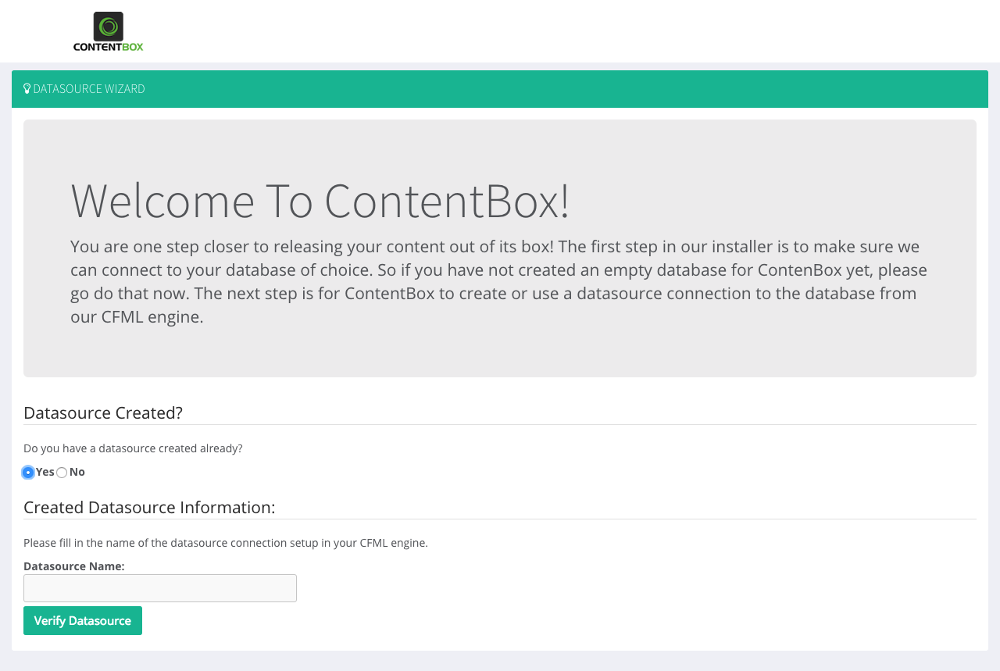
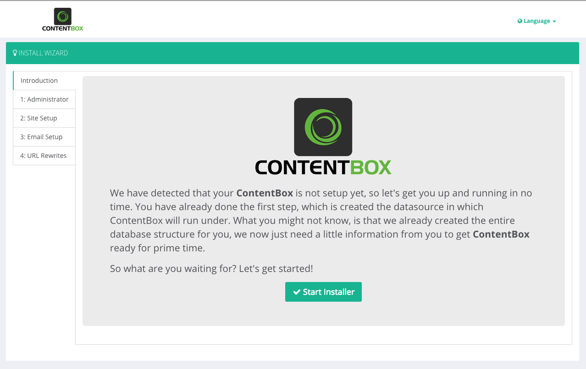

# Express Installation

The express version of ContentBox is a fully embedded running server powered by [Lucee](http://lucee.org/), an open-source CFML engine, and Tomcat. It comes bundled with a JRE for your operating system or one without a JRE can be downloaded as well.

## Requirements

Make sure your system has a working Java Runtime 1.7+ environment if you are downloading the express version with no JRE. A quick test to see if your system supports Java is to open a terminal or command prompt and typing:

```text
java -version
```

You should see something like this:

```text
java version "1.8.0_40"
Java(TM) SE Runtime Environment (build 1.8.0_40-b27)
Java HotSpot(TM) 64-Bit Server VM (build 25.40-b25, mixed mode)
```

Just make sure what it is Java 1.7+.

## Step 1: Download Express

The first step is for you to download ContentBox \([https://www.ortussolutions.com/products/contentbox](http://www.ortussolutions.com/products/contentbox)\) or you can use the command below:

```text
# stable no-jre
wget https://www.ortussolutions.com/parent/download/contentbox?type=express
# stable with jre for windows
wget https://www.ortussolutions.com/parent/download/contentbox?type=express-win
# stable with jre for mac
wget https://www.ortussolutions.com/parent/download/contentbox?type=express-mac
# stable with jre for linux
wget https://www.ortussolutions.com/parent/download/contentbox?type=express-linux

# bleeding edge no-jre
wget https://www.ortussolutions.com/parent/download/contentbox?type=express&version=be
# bleeding edge with jre for windows
wget https://www.ortussolutions.com/parent/download/contentbox?type=express-win&version=be
# bleeding edge with jre for mac
wget https://www.ortussolutions.com/parent/download/contentbox?type=express-mac&version=be
# bleeding edge with jre for linux
wget https://www.ortussolutions.com/parent/download/contentbox?type=express-linux&version=be
```

Once downloaded expand the archive

```text
unzip contentbox-express-{version}.zip
```

This will expand into the folder of your liking.

## Step 2: Permissions

On some operating systems like Linux or Mac, you will need to enable run permissions. So drop into a shell or terminal in that folder you expanded and type:

```text
chmod -R 777 bin
```

This will add execution and write permissions to the `bin` folder which is required.

## Step 3: Run it

Go into the `bin` folder and execute either the `startup.bat` or `startup.sh` or `startup.app` according to your OS. Then visit the site in a browser on port `8085` by default.

## Step 4: Setup Server Passwords

Make sure you visit the following URLs and set up a server and web application password for the underlying engines:

```text
# server password
http://localhost:8085/lucee/admin/server.cfm
# web password
http://localhost:8085/lucee/admin/web.cfm
```

## Step 5: Create A Datasource



You can now visit your application under `http://localhost:8085` and you will be presented with our datasource wizard. Since we are in express edition, just choose the embedded database and follow the instructions.

## Step 6: Run ContentBox Installer



That's it! We are now ready to run the ContentBox installer wizard. ContentBox will automagically create all the necessary database tables, indexes, and constraints for you. After it does this, it will present you with our ContentBox installer, where you will fill in:

* Administrator Account
* Site Information
* Notification Emails
* Email Information
* URL Rewriting
* Enjoy your ContentBox installation!


**Caution** We recommend that after you install ContentBox that you remove the installer and datasource wizard modules from the disk. You can do so manually or via the Dashboard once you log in. `{Root}/modules/contentbox-installer and {Root}/modules/contentbox-dsncreator`


## Changing the Default Port

Go to the `conf/server.xml` and look for the following:

```markup
<Connector port="8085" protocol="HTTP/1.1"
               connectionTimeout="20000"
               redirectPort="8443" />
```

Just update the `port` to whatever you desire.

