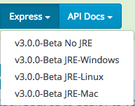
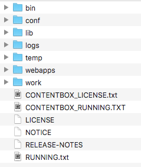
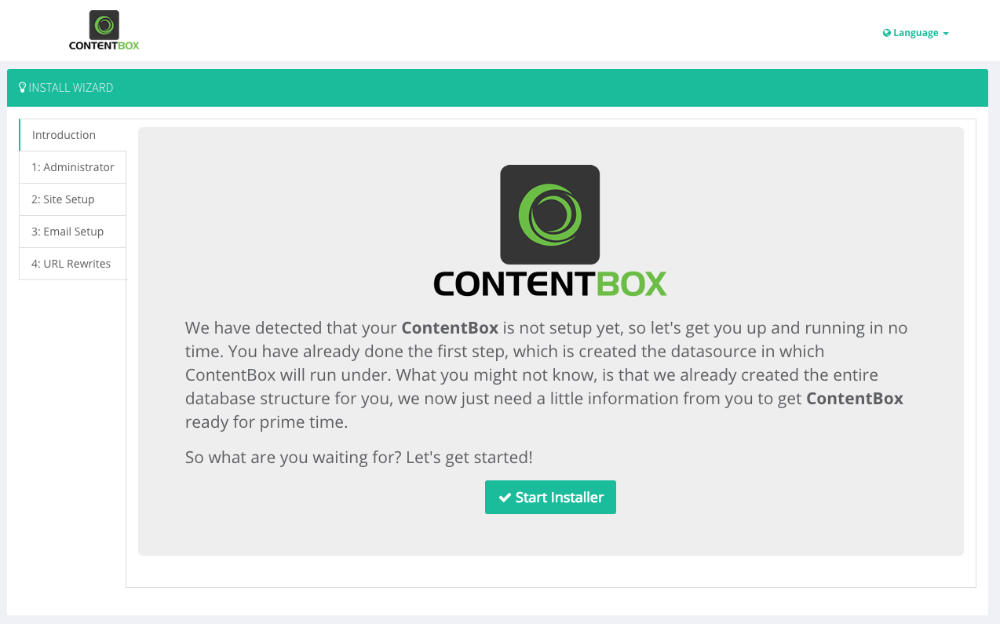
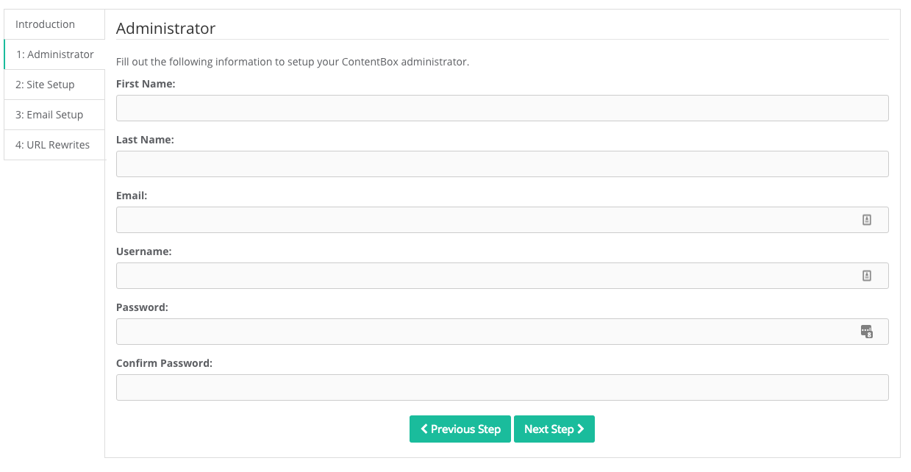
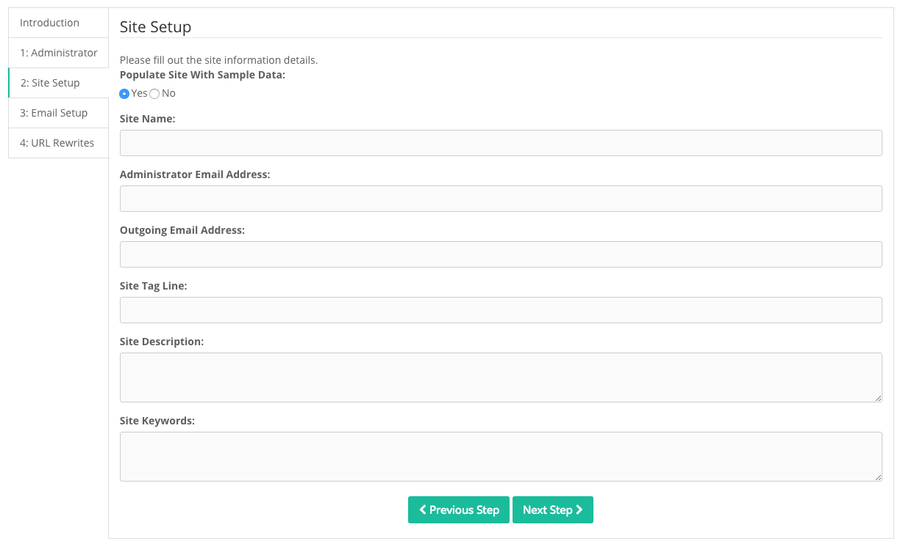
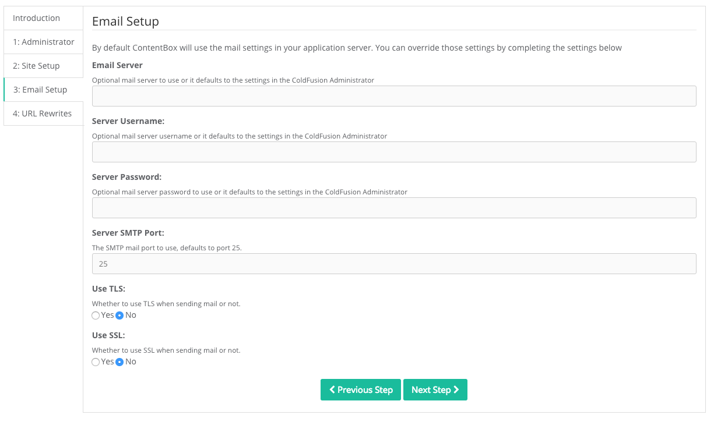
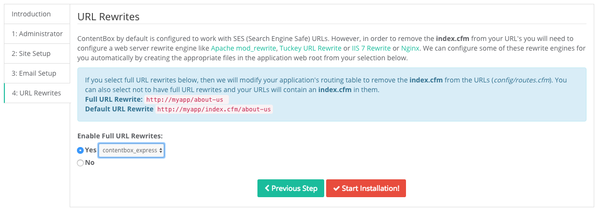
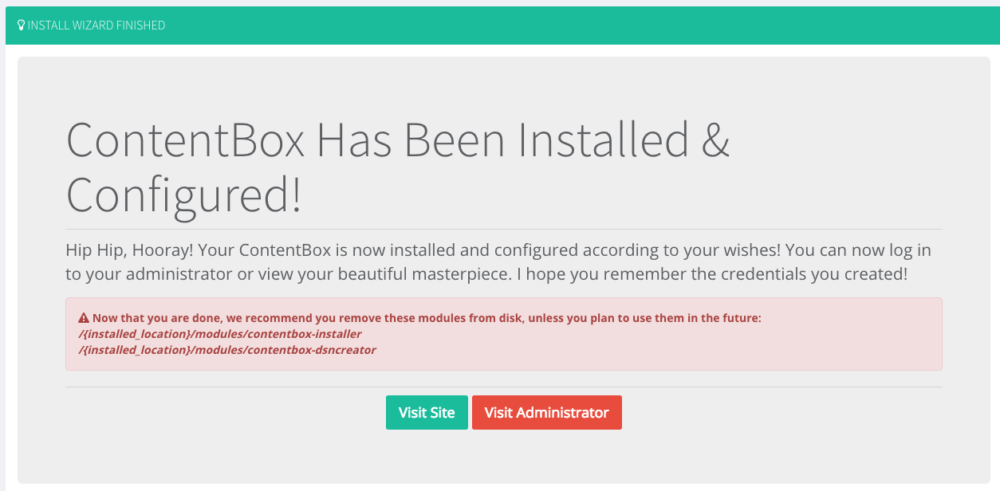

# Quick Guide

## Quick Setup

The Quick Setup will take you through 8 easy steps in order to configure and install a ContentBox Express Edition with an embedded database so we can start working with ContentBox. Ready, set, go!

> **Note** If you prefer a container \(Docker\) approach, then use the [Docker getting started guide](installation/docker.md).

### Step 1 : Download

Go to [https://www.ortussolutions.com/products/contentbox\#downloads](https://www.ortussolutions.com/products/contentbox#downloads) and click on the download ContentBox Express Edition for your operating system.

Once downloaded, extract the `contentbox-express-{version}.zip` \(we recommend you to do this in a new folder\).

### Step 2 : Start it up!

Open the `bin` folder and double click `startup.bat` \(Windows\) or execute the `startup.sh` \(Linux,Mac\) and Kaboom! ContentBox will start to deploy a local embedded server with an embedded database.

> **Warning** If you are in Unix or Mac OS X, make sure you give the `bin` folder execution permissions. You can do this by running `chmod -R +x bin` to give the directory execution permissions.

### Step 3 : Running the Installer

Once the server is online go to your browser and type `http://localhost:8085` which is the port that ContentBox Express uses and hit enter. Your browser should now open the install wizard. Read the instructions and click on the **Start Installer** button to start the process.

> **Hint** If you go back again to the `bin` folder you are going to find a new folder called `contentboxDB`. This is the ContentBox Express embedded database. This doesn’t mean you can’t use other data bases with ContentBox Express Edition, but it has been done this way out of convenience.

### Step 4 : Administrator Information

Fill out the setup details for your ContentBox Administrator and click Next Step.

### Step 5 : Site Setup

Fill out basic information for your ContentBox Site and click Next Step.

### Step 6 : Email Setup

You can connect ContentBox to any email system in order to send notifications. By clicking Next Step without changing anything ContentBox will use by default the email settings in your application server \(default\).

### Step 7 : URL Rewrites

ContentBox Express Edition already has Full URL Rewrites enabled. So just use the dropdown to select `ContentBox Express` and it will automatically configure ContentBox for full URL rewrites. We also support iis, nginx, apache, and CommandBox.

### Step 8 : Done!

Click Start Installation! ContentBox will prepare the database and process the final configurations so it can start running.

You are done! Go ahead and visit your site by clicking **Visit Site** and log into your Contentbox Administration by clicking **Visit Administrator**.

> **Danger** : Please make sure you delete the `contentbox-installer` and `contentbox-dsncreator` modules after installation. The administrator will warn you about it and you can even delete those modules from the admin dashboard.

Welcome to ContentBox!

## The ContentBox Dashboard

Before diving into ContentBox, we recommend you to take a few minutes to get to know your Dashboard.

### Home

Under Recent Content you have: Recent Pages, Recent Entries and Recent Content Store.

On the right panel you have Data Snapshots where you can check Top visited Content, Top commented Content, Discussions and Content. Everything you see through the site has what we call a Quick View. By right clicking on any instance you can get the content immediately as a quick view so you can edit or actually view it and see the content within. Note: You can’t quick view the Content Store. Then you have the whole layout of the administrator. On the upper right corner you have who you are and the about information about the software. There is also the add\/remove Sidebar button so that you can remove the Sidebar to have more reading space. On the upper left you have your administrator commands \[the house icon on top\] opening the site, \[the plus icon\] adding new data, \[pencil icon\] creating posts \[the pencil icon + close\] and some administrative options \[master 3xWheel icon:\] like the ability to clear the caches, reload the applications, reload the ORM, reload the administrator, and reload every single piece of module that you have available at ContentBox. You have a Global Search which searches pretty much anything in your ContentBox.

### About

Our about page is very useful. Apart from your build information it contains keyboard shortcuts! ContentBox has a lot of keyboard shortcuts available for you and you can very easily navigate throughout it once you memorize them. Also, for you module developers we also have an API based on a jquery java script library. And you can very easily do data biding for your own shortcuts so if you want to offer you own keyboard shortcuts it’s very easy.

### Updates

Our sophisticated auto-update system offers 3 ways of getting updates from Ortus Solutions. Check for updates: We have a Stable Channel which can check against new ContentBox releases. We also have a Bleeding Edge Release: all our releases will go in our release cycle so all our releases will be in the bleeding edge channel 1 or 2 weeks before actually making to a stable channel.

#### Download Updates:

If you are upgrading from an old version of ContentBox, or you are a Ortus Solutions support client, we have the capability to give you an URL for specific patches.

#### Upload Updates:

If you don’t have internet access you can upload the patch and it will be delivered through your ContentBox installation. Options 2 and 3 are great avenues for those companies and individuals that have support contracts or other special project arrangements with Ortus Solutions.

## Content

ContentBox provides many options for managing content, including:

* The ability to create pages which can be hierarchical
* An integrated blog which gives you instant, turn-key blogging capabilities
* The super-flexible Content Store which allows you to create and store any kind of content that you’d like. Whether you’re creating custom localized content, simple lists, or a complex content-delivery system for your mobile app, the Content Store is specifically designed to accommodate whatever your site or app needs. In conjunction with a RESTful API, you have a powerful content repository that can be used however you want!
* Categories which allow you to quickly and easily organize all your content in whatever way you choose
* An easy-to-use Media Manager which not only provides storage for your documents, images and other assets, but is also integrated into content creation tools to make using media in your content quick and easy.

### Pages

Let’s get started with Pages. Inside pages on your right panel you see that we have set up filters to filter out the view of the pages. You also have Global Actions: Delete Selected, Draft Selected, Publish Selected, Import, Export All and Show All.

#### Page Editor

Inside Pages click Create Page and the Page Editor will open. Name your page by giving it a Title and ContentBox will give you the permalink for the page. By default, the Page Editor uses CKeditor for a WYSIWYG editor. ContentBox also offers different other editors that are available in your installation.

> **Hint** Remember that editors are programmable so any module developer can actually register new editors in your system.

The Page editor has markup support \[button right beside Editor Button\]. HTML markup is currently supported by default.

ContentBox’s implementation of CKEditor comes with support for a number of plugins, including:

* Insert code snippets \[page icon beside \(right\) to World\],
* iframe \[the world\]
* Youtube or embedded media
* Insert Lorem Ipsum Dolor \[T\] to create content.
* Contentbox Widgets

On the right panel you have the Paging Details.

**Publishing**

ContentBox allows you to publish the page on a specific date and time, as well as set an expiration date to expire the content on any schedule you choose. Additionally, commit messages can be included \(and even required\) via the change log, providing built-in version control of your content.

When saving content, a number of options are available:

* Save: Preserve a snapshot of the page as is, and continue editing
* Draft: Save a draft of the content and close Page Editor
* Publish: Publish the content to your site and close Page Editor

> **Hint** You can collapse the side bar and still have your Quick Edits controls right from the gear widget \[on the up right corner\].

**Display Options**

Display options allows you to control many aspects related to how the page will be displayed within your site.

* Parent: Choosing a parent determines the hierarchy of the page within your site. For a “top-level” page, simply choose “No Parent”
* Layout: Specifies which layout the page will use. It can inherit default settings, or use a custom setting.
* Mobile Layout; Specifies what layout the page should use when viewed on a mobile device. Set to “None” to use the normal layout for the page.
* Show In Menus: Tells ContentBox whether this page should show up in automatic menu builders. If set to “No”, the page will not show in ContentBox menus.
* Menu Order: If your page is shown in menus, you can specify the order that this page should appear.

**Modifiers**

Modifiers allows you configure extra information about how your page will be accessed.

* Creator: Allows you to configure who is displayed as the author of this page. This is particularly useful if several editors have modified the page, but a specific author should be acknowledged
* Allow Comments: Allows you configure if comments should be allowed for the page.
* Password Protection: Allows you to specify a particular password needed to access this content. This password can be shared with allowed visitors to provide secure access to specific pages.

**Caching Settings**

ContentBox provides administrators with granular control over how content is cached within your site. Each page can be configured with the following caching settings:

* Cache Page Content: When set to “Yes”, the content of your page will be cached \(based on global or page-specific timeouts\)
* Cache Page Layout: When set to “Yes”, the content of your page, as well as the page layout HTML, will be cached \(based on global or page-specific timeouts\).
* Cache Timeout: Specifies how long \(in minutes\) the page should be cached. Set to “0” to use the global setting
* Idle Timeout: Specifies \(in minutes\) the idle timeout for your page. Set to “0” to use the global setting

**Categories**

ContentBox allows you to provide additional organization of your content by setting one or more categories. You can choose from a list of already-configured categories, or even add new categories by adding a comma-separated list of categories in the “New Categories” text field.

**HTML Attributes**

To help you configure your page for Search Engine Optimization \(SEO\), ContentBox provides the ability to specify HTML attributes for your page, including:

* Keywords: List of keywords that will be added to the `<head>` of your page
* Description: Text description of the content that will be added to the `<head>` of your page

On the bottom of the page you have the Page Excerpts. You can create summaries of your Page Excerpts pages and then in your UI use them as you see fit.

**Custom Fields**

One of the most powerful features of ContentBox content is the ability to attach metadata which can be done via Custom Fields. You can add as many Custom Fields as you like in the form of key-value pairs.

* A little Tale: How the metadata works

  The metadata is stored in the object itself and then you can retrieve it using the CBhelper when you are building themes, widgets and events.

After you are done editing your page, you can go ahead and Publish it \[click publish\]. You will then be redirected to the Pages page where you will see that your page is published.

#### Child Pages

In addition to specifying the parent of a page via the Page Editor, ContentBox also allows you to quickly create “child” pages via the main Page Manager.

On the Pages page, find a page you have already created and click Page Actions and select Create Child. Page actions button\) in the product row at the right edge; click ‘Create Child’\]. The Page Editor will open as normal. However, in this scenario, the new page will automatically be added to the selected parent page.

When you Publish your Child Page you will be redirected to the Parent Page Hierarchy View where you will be able to see all the Child Pages for the parent page. Just like with Pages, when you have created multiple Child Pages you have also complete control of manipulating how the Child Pages are rendered. So again, you can choose which Child Page should be last or first with simple drag and drop.

You can then continue to go back in your hierarchy and you can go back home \[click home button\]. The “+” sign beside a page indicates that that pages has at least one Child Page.

> **Hint** Visit your page to see the changes you have made to your site. We recommend you Clear Content Caches.

#### Global Actions

The Pages manager provides a number of global actions \[Global Action button; drop down menu\/beside create page button\] that make managing your content easy. These actions include:

* Delete Selected: Will delete all selected pages \(via checkboxes\)
* Draft Selected: Will put all selected pages into draft status \(via checkboxes\)
* Publish Selected: Will publish all selected pages \(via checkboxes\)
* Import: If you have a ContentBox page export file \(.json\) from another site, you can use the Import option to quickly import the file and add the page to your site\*
* Export All: Allows you to export all your pages as either XML o _r JSON. This is particular useful if you need to transfer content from one site to another._
* Show All: By default, ContentBox “pages” your view to provide the best performance. However, you can select “Show All” to view the full list of all the pages in your site.

#### Page Actions

Each page in the Pages view has an actions column which allows you to quickly execute several actions on your page.

**Page Info**

Provides detailed information about your page \[go to about row on the list and hover over the ‘’i’’\], from last edited date to page-rendering configuration.

**Clone**

If you have a page that you’d like to use as starting point for a new page, you can Clone a selected page by choosing “Clone” from the Page Actions menu. When cloning a page, you can specify a new, custom title for the page, as well as whether or not the new, cloned page should be automatically published. Additionally, you can clone entire hierarchy of pages \[hover over products\]. Interesting: ContentBox will look into the content of cloned pages and update any slug that points to any point of the hierarchy so anything that is slash “myoriginalpage” page will be rewritten to slash\/new-myoriginalpage.

**Delete**

Choosing “Delete” from the Page Actions menu will delete the selected page, as well as any child pages.

**History**

Choosing History from the Page Actions menu will open the history channel for the selected page. You can view how many versions of the page exist, as well as compare the current version \[black dot \(left side under diff\) to the last item\] with the latest version \[click compare versions; red button\]. Comparing two versions will display a comparison chart of the data that have changed between versions. If needed, content versions can roll back to previous versions. When content is rolled back, ContentBox will create a new version number for the current version with the rollback.

## Widgets. An Easy Example.

Widgets are one of the most powerful tools in ContentBox. Let’s start with an easy sample: Creating a News Page.

\[Pages view\] Create a New Page \[Create Page\] and name it “News Page” \[title\]. Inside the CKEditor \[ckeditor window\] type: “Welcome to my news!” and give it a heading \[heading 2\].

Click Create a New Widget and type “RSS” in the Quick Filter. Select the RSS Widget . You will see that it gives you an error because you need to fill out the required info for the widget. To do this, get the RSS link for your favorite news site and paste it in the feed URL field. If your link is valid, you should see a list of links display in the Widget Preview area.

Before clicking Insert Widget there are a few things you can modify. For example, maxItems allows you to select very easy how many items you want to be displayed in. You can also use showBody in order to show the body or collapse the body of the news article.

Now that you are done configuring the options that the RSS widget offers, click Insert Widget. You should now see a graphical representation of your widget within the CKEditor content editing area.

> **Hint** You can configure your inserted widget anytime by double-clicking the widget content, or by choosing “Edit Widget” from the context menu

You can actually have a Quick Preview by clicking the EYE or typing the Keyboard shortcut: Ctrl + P. The Quick Preview allows you to see how the changes you have made to your page \(like your new widget\) are going to render on your site before publishing them.

### Inside the Page Editor

Apart from the widgets you also have the ability to insert entries from the Content Store \[ contentstore icon\], to link to specific pages \[ link icon\], or to link to a specific entry \[pencil icon\]. You can also insert different media items and images \[image icon\].

For example, to link a few words \[select a word from TEXT\] to a specific page, highlight the desired words and click the \[Link Page\] icon. This will display a list of all pages in ContentBox from which you can choose the desired page to link to and even specify whether the link should be SSL or not. The same can be done with ContentBox blog entires.

You can also insert from the Content Store \[ccontentstore icon\]. You can try inserting something from the Content Store you will see it creates a kind of pseudo Markup. ContentBox will automatically render this content when the page is viewed.

> **Hint** \[clicking the eye or type CTRL+P\] to get a preview and to actually see the translation of that markup.

As an administrator here you have full control of how this editor looks like. So for example right now you are seeing every single option known to man. However you can basically limit this for editors. You can limit actually all the controls that you are seeing. So you have all control of how everything looks and feels. So if you need to make it simpler you can really do so very easy.

You can also insert images from the media manager gallery \[click image icon\/beside ‘A’\], you can insert an image and say, browse server \[click browse server\], and you'll see that it’ll give you our ColdBox file browser \[will pop up\]. You can see the different medias that are available in the system \[ ICONS\/quit list view\]. You can actually create new media very easily by drag and drop.

## Content Response Formats

When you are in your site \(not in the admin\) there are also pretty cool things you can do. We created what we call a print renders. You can now come in and say, I want to view my page as print. You just need to add &lt;.print&gt; to the page URL and hit enter. And you will see that it changes the whole format to print version. You have complete control of this layout as well. By convention you just have the same layout called underscore print. You can create one called underscore pdf as well or add “.pdf” to URL, and you'll see that it’ll produce a pdf output of your page as you designed it. You can also produce a word document by adding &lt;.doc&gt; to the URL of the page.

## The Blog

The Blog \[Content dropdown menu + blog\], it basically reuses almost the same things. Actually under the hood, you can say we have an ORM object model that you can very easily extend and create custom content types, so, entries actually are just another custom content type based on a custom content object that we provide in ContentBox. You have the same capabilities \[Global Actions\] except there is no hierarchy but the rest it’s the same as if you were writing a normal page except these are based on blogs.

## The Content Store

\[Click Content dropdown ContentStore\] The contentstore is one of the most interesting features of ContentBox which allows you to store any piece of content, whether it can be Java Script, HTML CSS internalization bid, anything that you like can be stored, binaries images RSS feeds, you name it. You can store anything you want in the content store.

This is also a custom content type based on ORM object. Same capabilities \[global actions\] of export, draft, importing, are available to you. The same actions pretty much. \[3xGears\] You have history, so you have version control, you have the ability to export them, edit them, clone them, delete them, etc.

When you create content \[click create content\] is a little bit different than the other ones. You have a title for your content. The slug is the unique identifier that you will access this content piece with; and a short description. And then in the editor \[click the editor box\] you can choose this to be content \[circle around blank area\] or if you wanted just a simple text area \[change Editor dropdown menu to Text Area\] you can move to a simple text area \[click OK\].

\[Content Store Editor opens\] and \[click typing box\] just type a content as you see fit. Or if you want, what we call \[drop down menu Editor, select Edit\/Area + cancel\/ok\] our coders.

Example: \[coders editors drop down, default HTML\] And right here is our coders editor and you can see that you can even say \[drop down menu\] 'I want to type in ColdFusion', you can go ahead and start typing here \[type asdf + enter x3\] and it’ll do some syntax highlighting for you.

But the whole thing is for you to be able to create content. Give the metadata \[scroll down\] to specific content.

You can also choose publishing schema \[scroll up, topright corner side bar\] for your content, different caching characteristics \[hover over caching open\/close\] if you are an administrator and also, categorize \[open\/close categories\] your content as you see fit. \[click BACK\] \[Content Store view opens\] So the Content Store is very powerful and you can pretty much do anything you like with it and then retrieve or build your own modules to get that content out.

## Categories

\[Content + Categories\] Categories is very simple, it's just categorization. This is where you can create as many categorize as you see fit.

## Media Manager

\[Content + Media manager\] Media manager is and embedded media manager that we ship with ColdBox. If you are an administrator you have different libraries \[Switch Library drop down menu; top right\] that you can managed for example if you want to manage the widgets \[click widgets in the DDM\] you can manage the widgets, so you can install manually other widgets or download some of the widgets that you have available here.

\[Switch Library + Update\] You can check out the auto update channel so you can actually do any type of modifications. So it’s up to you what you want to do with is \[switch to list view\]. Obviously, and administrator can choose all the different things \[select new ‘blog folder’ & click X to delete\] and all different permissions and right that you can do with this \[hover in circle\] as well.

## Comments

\[Click Comments + Inbox\] It’s basically an inbuilt commenting system. It has lots of capabilities \[Global Actions\] from approving to moderation. You have a lot of settings \[comment + settings\] available for commenting as well, from enabling ‘Site Wide’ comments, to disabling them. URL translations, security captchas, moderation rules, notification rules, so you have a lot of flexibility when it comes to your comments so you can attach comments to anything e.g. pages, blog entries, etc except the Content Store.

## Look and Feel

\[look & Feel + Layouts\] Now, Look and Feel are obviously very important. 0So you have our layouts section. As you can see some of our sections are tied to forgebox \[ForgeBox upper right corner\].

Again this is administration permission, but you can actually talk into ForgeBox \[click ForgeBox\] so you can connect to ForgeBox. It will bring you all the different setups available that you can install immediately. If you download a layout for example, you can then go to your Manage Layouts

\[click manage layouts \/ left side panel\] and you can see that the new layout will be there. If you want to set is as your current layout you can go ahead and activate it \[click Activate for the layout\]. You can go to your site and check your new layout. So very easy \[back to admin \/ active layout\] you can now start skinning or downloading themes.

If you are building themes just please remember to contribute into ForgeBox so everybody can benefit.

\[Manage Layouts\] Management is for you to be able to see which layouts you have. Activate them, upload them, if you need to upload a new theme \[Upload layout \/ up right\], rebuild the internal registry or do any kind of clean up.

