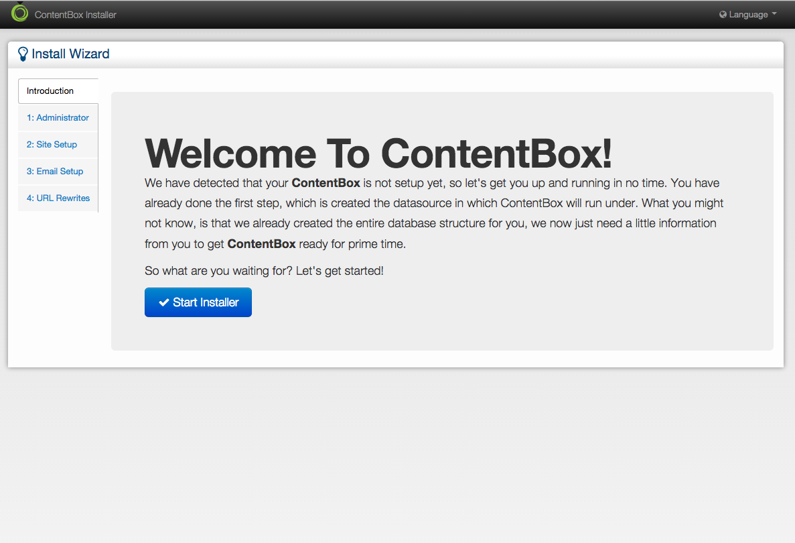

# Source Installation

In this section you will install ContentBox by using the **source** download option.

## Step 1: Download Source
The first step is for you to download the ContentBox installer (http://www.ortussolutions.com/products/contentbox) or you can use the command below:

```
# stable
wget https://www.ortussolutions.com/parent/download/contentbox?type=installer

# bleeding edge
wget https://www.ortussolutions.com/parent/download/contentbox?type=installer&version=be
```

Expand the archive into your web root or a sub folder of your favorite CFML engine.

```
unzip contentbox_{version}.zip 
```

> **Caution** Due to a bug in some CFML engines, DO NOT use the subfolder name `contentbox`, use cbox or site or whatever you like if you will be deploying under a subfolder.

## Step 2: Create Your Database
Now that the source is deployed in your webserver, it is time to create your database in your favorite DBMS engine.  ContentBox is built with Hibernate ORM technology, so in theory it should work in all major database systems. You can even use an embedded database like Apache or Hypersonic.

Make sure your database supports utf-8 or utf-16 character sets if you will be using multi-lingual or localization support.

## Step 3: Create A Datasource


You can now visit your application and will be presented with our datasource wizard.  You can either use our datasource wizard or you can create the datasource yourself manually in the CFML administrator.

### Datasource Creation Wizard
The datasource wizard requires your CFML Admin Password, or your ( Railo/Lucee ) Web Context Password to create the datasource. 

Note: Depending on your CFML Engine Install, the Web Context Password might not be set. To use the Datasource Creator Wizard, you will be required to access the admin, set the password, then continue the installation.


## Step 4: Run ContentBox Installer



That's it! We are now ready to run the ContentBox installer wizard.  ContentBox will automagically create all the necessary database tables, indexes and constraints for you.  After it does this, it will present you with our ContentBox installer, where you will fill in:

* Administrator Account
* Site Information
* Notification Emails
* Email Information
* URL Rewriting
* Enjoy your ContentBox installation!

 

> **Caution** We recommend that after you install ContentBox that you remove the installer and datsource wizard modules from disk.  You can do so manually or via the Dashboard once you log in. `{Root}/modules/contentbox-installer and {Root}/modules/contentbox-dsncreator`