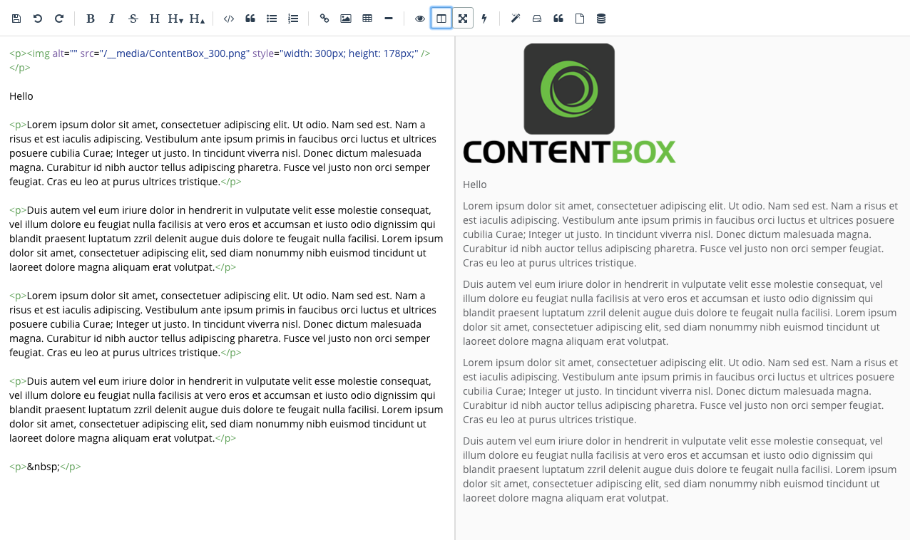
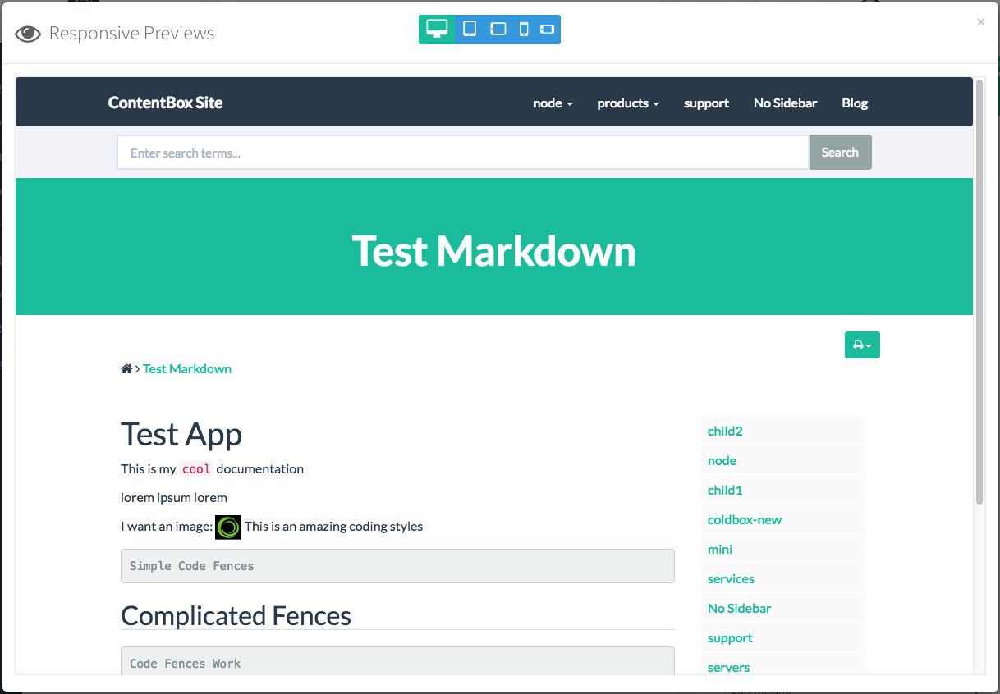
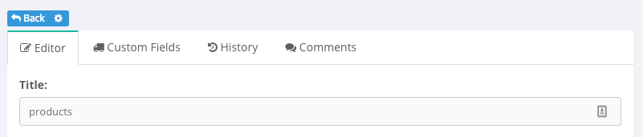
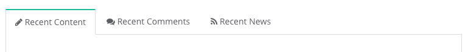
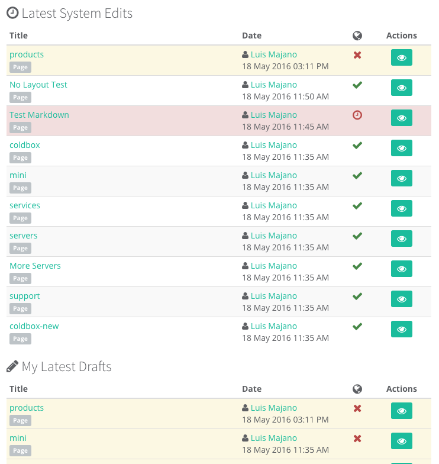
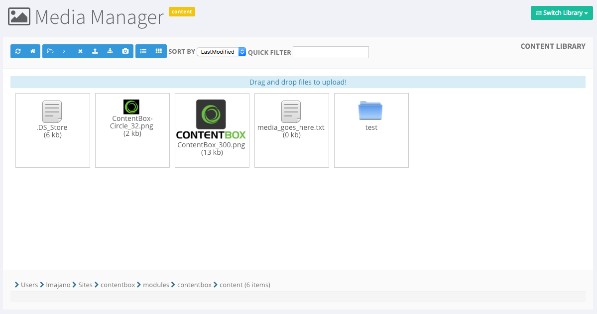
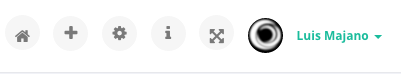
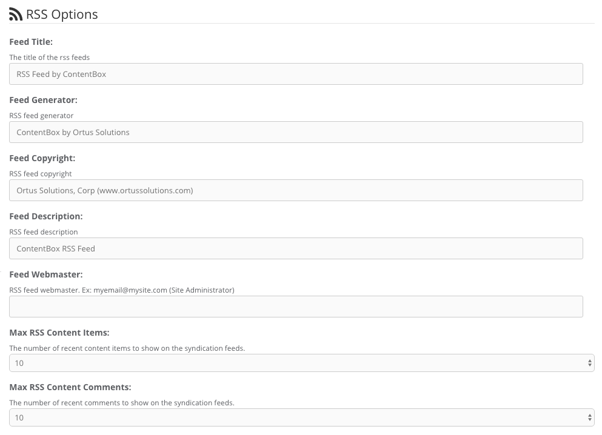
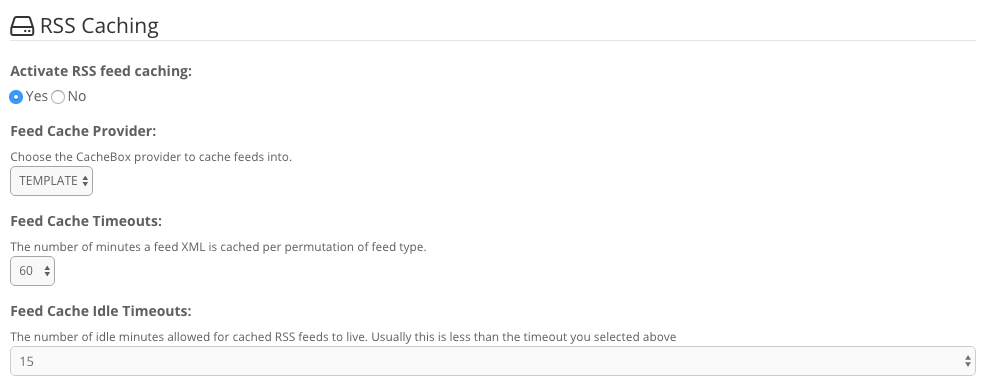
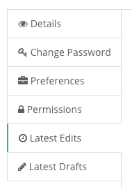

# Administrator

Below is a listing of all the major updates in the administration modules.

## Admin UI

The administration module sports a completely re-designed responsive UI. Our goal was to think mobile first and build from there. So you will see tons of great additions for working on mobile devices, new editors, new fullscreen mdoes and much much more. Below is a nice image gallery of all the changes in the administration module. Please note that every single screen has changed.

## Markdown Native Support

ContentBox now sports native Markdown support for writing all content objects. You can even choose markdown on a per-user level as your preferred writing style.

## New Code Editor

We have included a new code editor that supports HTML and Markdown natively. This will allow developers or editors to write in native markup and have all the integrations into ContentBox. It also sports realtime previews and side-by-side editing in full screen. Your editing experience is about to get a whole lot better now.

## Editor Auto Save

We have introduced local storage auto saving capabilities for all editors in ContentBox. No matter the implementation, we will provide auto-save capabilities. This is a great way to know that silently your work is secure.

## Editor Escaping Markup Translations

You can now use the `<escape></escape>` syntax in any content editor to escape ContentBox translations for settings, markdown, etc.

## Editor Responsive Previews

All live previews are now responsive. Meaning you can choose from the responsive previewer the type of device and get immediate feedback of the content result in real-time.

## Editor UI Updates

The content editors have completely been re-designed for mobile first paradigm. They sport new tabbed interfaces for history, comments, custom fields and editing. You also have much more real estate when editing and even full screen editing support.

## New Dashboard

The dashboard now supports a cleaner interface for visualizing the latest content edits, drafts, comments and news.

## Media Manager Updates

Improved UI to match the new admin UI with responsive updates. It also has a smoother uploading and drag and drop uploading capabilities.

## Admin Fullscreen Mode

We have added HTML5 fullscreen mode capabilities for the admin UI. This will allow you to go full screen to edit, create and manage in a gorgeous huge display.

## Configurable RSS

RSS feed options and caching options can now be customized via settings.

## Content Featured Images

All content objects now have the ability to set natively a featured image alongside the content.

## Author Edit Panels

The author details now sports two new panels to showcase their latest edits and latest drafts. It will make it much easier for authors or administrators to discover what they are working on.

## CBHelper Updates

The CBHelper sports some new methods:

* `getPrivateRequestCollection()` - Get the ColdBox private request collection
* `isHomePage()` - Verify if the current rendered page is the home page
* `prepareUIRequest()` - Use in any ColdBox module to prepare rendering under the ContentBox theme

## New Admin Interception Points

Here is a collection of all the new admin interception points:

* `onGlobalSearchRequest` - When a global search is made
* `onGlobalSearchDisplay` - When the global search is displayed
* `cbadmin_beforeLoginForm` - Before the login form renders
* `cbadmin_afterLoginForm` - After the login form renders
* `cbadmin_preThemeSettingsSave` - Before saving theme settings
* `cbadmin_postThemeSettingsSave` - After saving theme settings
* `cbadmin_onThemeSettings` - When displaying theme settings in the admin UI
* `cbadmin_onThemeInfo` - When displaying theme information on the admin UI

