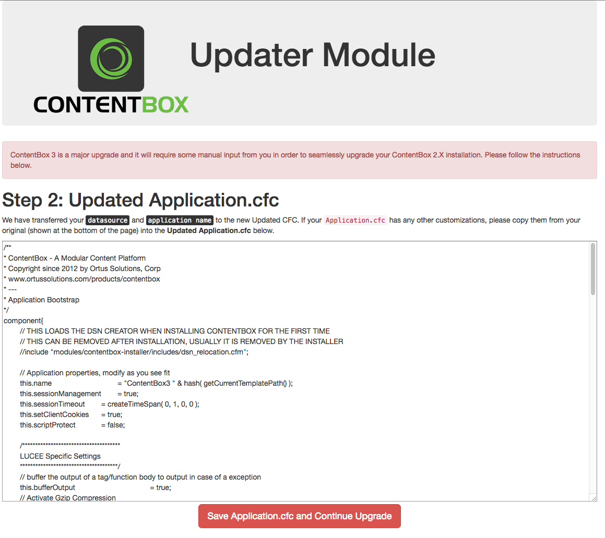

# Upgrading to 3.0.0

If you already have a ContentBox 2.X installation you will have to follow this guide in order to update your installation. Please note that ContentBox 3 is a major upgrade and will require some manual steps on your part in order to have a seamless upgrade.

## Step 1: Backup

Like with any automated process, there is room for error. So backup your files and database, we will not be held responsible for any mishaps.

## Step 2: Download CBCMS3 Updater

We have created a special ContentBox 2 module that will update your installation. Please visit [https://github.com/Ortus-Solutions/cbcms-updater-v3](https://github.com/Ortus-Solutions/cbcms-updater-v3) and download the **master** branch by clicking on the download button.

## Step 3: Install CBCMS3 Updater

Unzip the download and copy over the folder to your current ContentBox installation in the `modules` folder. Make sure the folder is called `cbcms-updater-v3`. It should be placed alongside the other ContentBox modules.

## Step 4: Restart Application

In order for the module to take effect, you must restart your application or even better your server.

## Step 5: Visit Module

Now open your application and visit the module by using the `/CB3Updater` URL entry point. Here is an example: `http://mysite.com/cb3updater`

The module will be active and it will tell you to upgrade your application's `config/ColdBox.cfc` that you must do so manually according to the instructions presented. Once you have done this manual step, then save your file and click on the **Continue** button.

## Step 6: Automation

Now you will be in step2 of the module wizard. It will show you an updated `Application.cfc` according to your old `Application.cfc` on disk. If there are any custom changes that are not reflected, then update as you see fit. Once done, then click on the continue and save button. This will start the upgrade process, grab a cup of coffee and wait for the installer to show you the finalization screens.

## Step 7 : WINDOWS ONLY

If you are on a Windows machine, unfortunately, you will have to have an extra step due to the fact the OS creates file locks on certain files. This means that the upgrader will not be able to upgrade the `coldbox` folder in its entirety. You will have to stop the ColdFusion/Java server, and remove the following folder: `coldbox/system/core/javaloader` manually. Once removed, restart the server and click on the button that says **Continue** so you can finalize the process.

## Step 8: DELETE UPDATE MODULE FROM DISK

If all went well, then you should see the screenshot above. You can now log in to your new application and site. We would recommend a final server restart if possible as well. **IMPORTANT: Now you must delete the module from disk**

