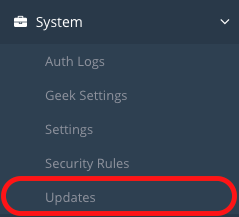
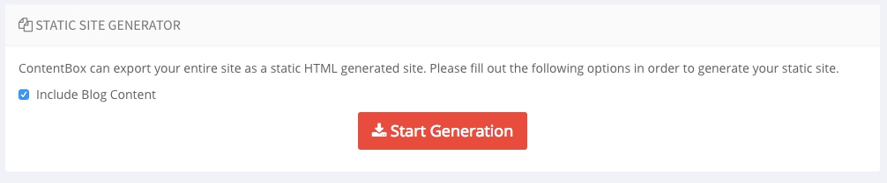

# What's New With 3.1.0

ContentBox 3.1.0 is a minor release with over 40 issues, improvements and new features addressed. Below you will find the detailed release notes about this release but also the major areas of improvement and new features introduced. Enjoy!

## Upgrading to 3.1.0

The easiest way to upgrade your ContentBox installation is to use the auto updater located in the **system &gt; updates** panel. Just make sure you please backup your database and source code as this release includes a major framework update and you will **most likely need to reboot your engine or server**. Go to our [upgrading guide](../../getting-started/installation/upgrading-contentbox.md) for much more information about upgrading ContentBox.

## Travis Integration

Travis is now building and publishing ContentBox to ForgeBox.io. We will also be able to accept pull requests with satisfaction that they do not break the builds. So pull away my friends!

## Updated JDK/JRE + Lucee Engines

All express versions have been updated with the latest JRE/JDKs and Lucee CFML engines.

## Easily Render Captcha Images

ContentBox supports native captcha support and now your themes can render out a nice captcha image by using the new ContentBox helper method: `cb.renderCaptcha()` method.

## SEO Enhancements

We have also devoted time to enhance the SEO capabilities of ContentBox not only in the ContentBox helper object but in the updated default theme. The new helper methods are:

* `getContentTitle()` : Retrieve the assigned title for a rendered page
* `getContentDescription()` : Retrieve the assigned description for a rendered page
* `getContentKeywords()` : Retrieve the assigned keywords for a rendered page

### Title Discovery

Please note that the **title** for a page now comes in the following discovery hiearchy:

1. Override set by custom modules
2. SEO Panel title
3. Page name

### Description Discovery

Please note that the **description** for a page now comes in the following discovery hiearchy:

1. Override set by custom modules
2. SEO Panel description
3. Excerpt
4. Dynamic Excerpt \(160 characters\) from content

### Keywords Discovery

Please note that the **keywords** for a page now comes in the following discovery hiearchy:

1. Override set by custom modules
2. SEO Panel keywords
3. Global Site Keywords

### SEO Module Overrides

If you are building custom modules with views that render in a site's theme, you can now also set SEO content for title, description and keywords by leveraging the following methods in the ContentBox Helper:

* `setMetaTitle()`
* `setMetaDescription()`
* `setMetaKeywords()`

## Static Site Generator

ContentBox 3.1 now supports the generation of static sites from your content and even your blog. This is a great addition to ContentBox as now you can produce static versions and workflows, deploy to CDN networks, secure your content and much more. Once you click on the **Start Generation** button, ContentBox will go over your entire site and produce a static archive for you in the associated theme. It will also announce two interception points for you during the process:

* `cbadmin_preStaticSiteExport` : Receives all the export `options` in the intercept data so you can alter the export behavior.
* `cbadmin_postStaticSiteExport` : Receives all the export `options` and also a `results` structure with the following keys: `exportLog:builder, exportDirectory, exportArchive`.  This is a great way to listen for the export and send to S3 for archiving, etc.

> **Warning** Dynamic elements like commenting, searching, etc must require a JavaScript implementation. So make sure you have a static export strategy in place.

## Module Enhancements

This release sports many enhancements to support module development authors in order for them to seamlessly build high impact applications using ContentBox.

### Author Object Availability

The logged in \(or not\) author/user of ContentBox is now globally available in the ColdBox private request collection as `prc.oCurrentAuthor`. This will allow module developers to have easy access to the current object that would represent a logged in Author or User of the ContentBox instance.

## File Manager UI Updates

The File Manager / Media Manager is an important part of a Content Management System, and we have fixed several UI bugs, and added a few smaller features. The Context Menus are more accurate, and function on the selected item. The file location breadcrumb is now clickable, to allow you to move about your file structure easier.

## Release Notes

### Bug

* \[[CONTENTBOX-762](https://ortussolutions.atlassian.net/browse/CONTENTBOX-762)\] -         If admin is in SSL mode, then previews should trigger ssl as well 
* \[[CONTENTBOX-766](https://ortussolutions.atlassian.net/browse/CONTENTBOX-766)\] -         BaseWidget not providing a default logging class 'log' as it did in ContentBox 2
* \[[CONTENTBOX-767](https://ortussolutions.atlassian.net/browse/CONTENTBOX-767)\] -         Admin Layout - loop through jsFullAppendList uses the wrong src base
* \[[CONTENTBOX-771](https://ortussolutions.atlassian.net/browse/CONTENTBOX-771)\] -         background color indicators for drafts, published future and expired content is not showing up
* \[[CONTENTBOX-776](https://ortussolutions.atlassian.net/browse/CONTENTBOX-776)\] -         PermissionService, RoleService missing date util injection
* \[[CONTENTBOX-777](https://ortussolutions.atlassian.net/browse/CONTENTBOX-777)\] -         exclude pages,entries on author mementos, they are not treated for export/import
* \[[CONTENTBOX-778](https://ortussolutions.atlassian.net/browse/CONTENTBOX-778)\] -         Importer not importing correct custom modules if coming from windows
* \[[CONTENTBOX-780](https://ortussolutions.atlassian.net/browse/CONTENTBOX-780)\] -         Blog excerpt not rendering ContentStore objects
* \[[CONTENTBOX-800](https://ortussolutions.atlassian.net/browse/CONTENTBOX-800)\] -         Adobe Compilation error due to ColdBox 4.3 updates
* \[[CONTENTBOX-803](https://ortussolutions.atlassian.net/browse/CONTENTBOX-803)\] -         Cascading issue on deletion of one-to-one relationship between base content and its stats
* \[[CONTENTBOX-808](https://ortussolutions.atlassian.net/browse/CONTENTBOX-808)\] -         Incorrect title on snapshots data table
* \[[CONTENTBOX-809](https://ortussolutions.atlassian.net/browse/CONTENTBOX-809)\] -         i18n properties out of sync with the US file
* \[[CONTENTBOX-815](https://ortussolutions.atlassian.net/browse/CONTENTBOX-815)\] -         Installer doesn't work without rewrites
* \[[CONTENTBOX-816](https://ortussolutions.atlassian.net/browse/CONTENTBOX-816)\] -         Blog Paging in front end works correctly but display is incorrect
* \[[CONTENTBOX-817](https://ortussolutions.atlassian.net/browse/CONTENTBOX-817)\] -         Blog Paging uses Javascript:null which errors in Firefox
* \[[CONTENTBOX-818](https://ortussolutions.atlassian.net/browse/CONTENTBOX-818)\] -         Blog Pagination - If you hit a page over total it shows up blank

### New Feature

* \[[CONTENTBOX-514](https://ortussolutions.atlassian.net/browse/CONTENTBOX-514)\] -         Content Subscriptions
* \[[CONTENTBOX-760](https://ortussolutions.atlassian.net/browse/CONTENTBOX-760)\] -         Update express editions to use latest JDK
* \[[CONTENTBOX-761](https://ortussolutions.atlassian.net/browse/CONTENTBOX-761)\] -         Update lucee to latest stable in 4.5 series for Express/War Editions
* \[[CONTENTBOX-765](https://ortussolutions.atlassian.net/browse/CONTENTBOX-765)\] -         New CBHelper method: renderCaptcha\(\) to easily render the img tag
* \[[CONTENTBOX-783](https://ortussolutions.atlassian.net/browse/CONTENTBOX-783)\] -         Static Site Generator
* \[[CONTENTBOX-796](https://ortussolutions.atlassian.net/browse/CONTENTBOX-796)\] -         prc.oCurrentAuthor is now set and available globally by the UI prepare request interceptor
* \[[CONTENTBOX-801](https://ortussolutions.atlassian.net/browse/CONTENTBOX-801)\] -         Travis integration
* \[[CONTENTBOX-802](https://ortussolutions.atlassian.net/browse/CONTENTBOX-802)\] -         edge case exception when a content object has no active content versions on ACF
* \[[CONTENTBOX-805](https://ortussolutions.atlassian.net/browse/CONTENTBOX-805)\] -         new cbhelper seo method: getContentTitle\(\) that retrieves the content title according to discovery rules
* \[[CONTENTBOX-806](https://ortussolutions.atlassian.net/browse/CONTENTBOX-806)\] -         new cbhelper seo method: getContentDescription\(\) that retrieves the metadata according to discover rules
* \[[CONTENTBOX-807](https://ortussolutions.atlassian.net/browse/CONTENTBOX-807)\] -         new cbhelper seo method: getContentKeywords\(\) that retrieves the metadata according to discover rules

### Improvement

* \[[CONTENTBOX-573](https://ortussolutions.atlassian.net/browse/CONTENTBOX-573)\] -         Auto-fill Name/E-mail and skip captcha on comments if logged in
* \[[CONTENTBOX-641](https://ortussolutions.atlassian.net/browse/CONTENTBOX-641)\] -         Add image resizing/cropping to filebrowser
* \[[CONTENTBOX-740](https://ortussolutions.atlassian.net/browse/CONTENTBOX-740)\] -         Update site maintenance feature to have admin still view site but it's down for everyone else
* \[[CONTENTBOX-756](https://ortussolutions.atlassian.net/browse/CONTENTBOX-756)\] -         SEO Convention for passing title, keywords, description to theme from modules
* \[[CONTENTBOX-759](https://ortussolutions.atlassian.net/browse/CONTENTBOX-759)\] -         Convention for Module Based Security Rules
* \[[CONTENTBOX-768](https://ortussolutions.atlassian.net/browse/CONTENTBOX-768)\] -         Admin Layout - loop through jsFullAppendList and cssFullAppendList expects no extension
* \[[CONTENTBOX-779](https://ortussolutions.atlassian.net/browse/CONTENTBOX-779)\] -         CBHelper now accounts for ssl via request context on all link building operations
* \[[CONTENTBOX-785](https://ortussolutions.atlassian.net/browse/CONTENTBOX-785)\] -         cbhelper isprintFormat not accounting for html formats
* \[[CONTENTBOX-797](https://ortussolutions.atlassian.net/browse/CONTENTBOX-797)\] -         CommentForm widget standardizes to default bootstrap themes
* \[[CONTENTBOX-798](https://ortussolutions.atlassian.net/browse/CONTENTBOX-798)\] -         Search Form Widget standardized to bootstrap
* \[[CONTENTBOX-799](https://ortussolutions.atlassian.net/browse/CONTENTBOX-799)\] -         Updated all box dependencies to latest releases
* \[[CONTENTBOX-804](https://ortussolutions.atlassian.net/browse/CONTENTBOX-804)\] -         Update mobile detector to latest incoming script
* \[[CONTENTBOX-811](https://ortussolutions.atlassian.net/browse/CONTENTBOX-811)\] -         Add more documentation options for theme elements and groups
* \[[CONTENTBOX-819](https://ortussolutions.atlassian.net/browse/CONTENTBOX-819)\] -         Filebrowser - Download a folder gives confusing error message
* \[[CONTENTBOX-820](https://ortussolutions.atlassian.net/browse/CONTENTBOX-820)\] -         FileBrowser - Right click doesn't select object when showing Context Menu
* \[[CONTENTBOX-821](https://ortussolutions.atlassian.net/browse/CONTENTBOX-821)\] -         FileBrowser - Format the timestamp in the status bar to be more user friendly
* \[[CONTENTBOX-822](https://ortussolutions.atlassian.net/browse/CONTENTBOX-822)\] -         FileBrowser - Make Location Breadcrumbs clickable
* \[[CONTENTBOX-823](https://ortussolutions.atlassian.net/browse/CONTENTBOX-823)\] -         FileBrowser - Excluded Items not removed from Item count in Status Bar
* \[[CONTENTBOX-824](https://ortussolutions.atlassian.net/browse/CONTENTBOX-824)\] -         FileBrowser - In grid view - the selection area isn't the full thumb square
* \[[CONTENTBOX-825](https://ortussolutions.atlassian.net/browse/CONTENTBOX-825)\] -         FileBrowser - Update Message to include Settings
* \[[CONTENTBOX-828](https://ortussolutions.atlassian.net/browse/CONTENTBOX-828)\] -         Widgets - Widgets loaded from Themes are still marked as Layouts

