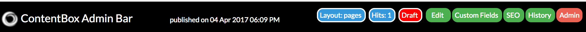
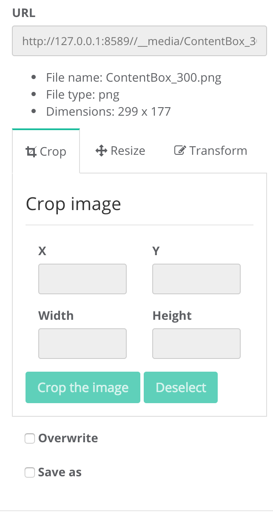
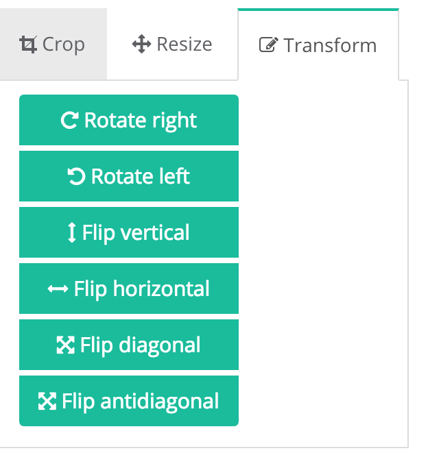
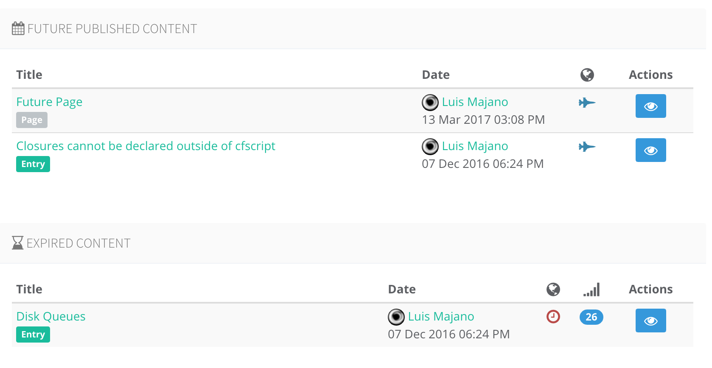
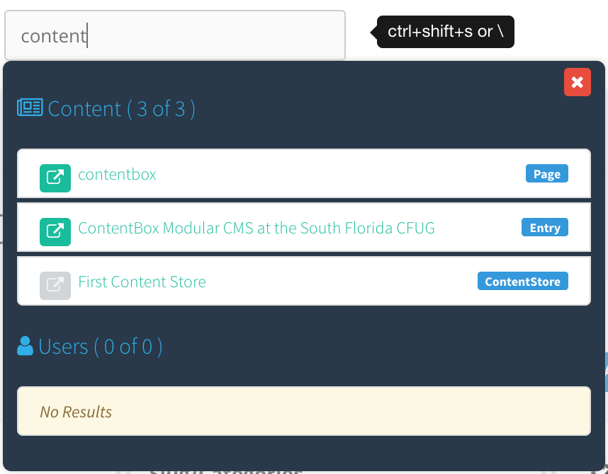
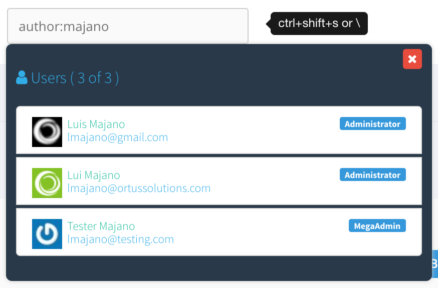
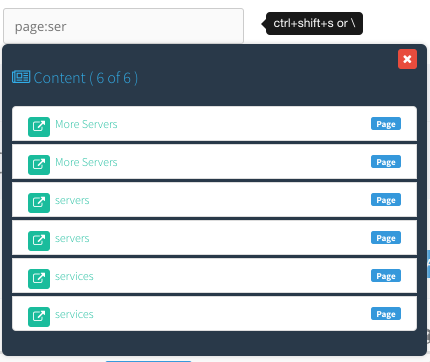
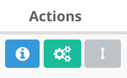
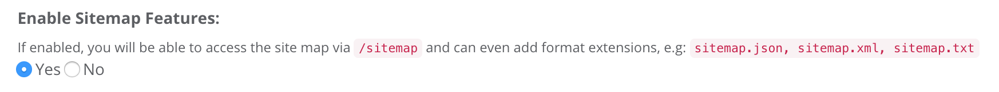
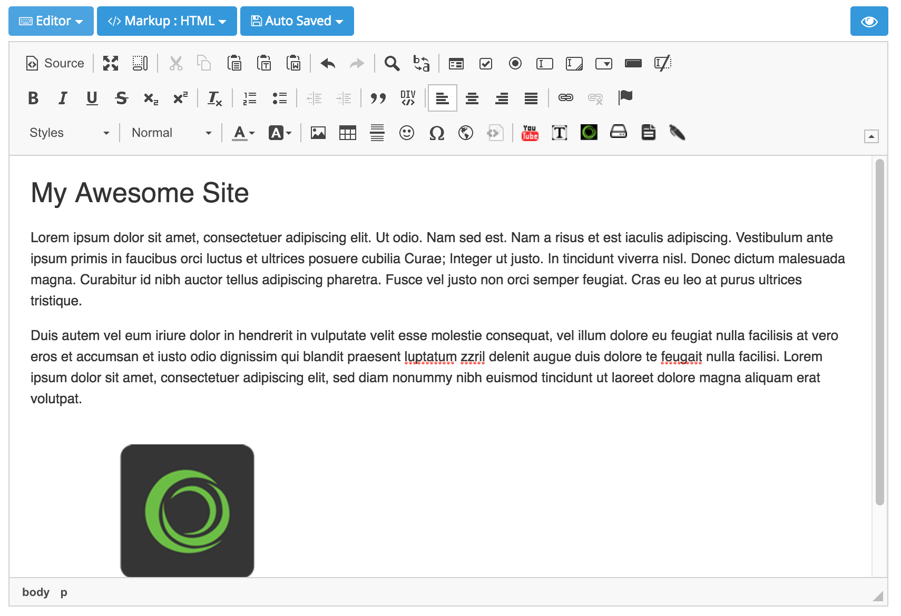

# What's New With 3.5.0

This release we're focusing on feedback from ContentBox 3.x customers and the ability to containerize ContentBox. Building on top of the SEO updates in ContentBox 3.1.0, we're continuing to make ContentBox more SEO friendly, Search Engine Friendly and Social Media Friendly. This update has a tremendous amount of updates and bug fixes for your current installations. So let's start investigating all the major areas of improvement:

## New Installation Slugs

ContentBox has been partitioned into three installation slugs from ForgeBox in this version going forward:

1. `contentbox` - Installs ContentBox as a module into any ColdBox application.
2. `contentbox-site` - Installs a new ColdBox site enabled for ContentBox with a dependency on `contentbox` for its module.
3. `contentbox-installer` - Same as above but with our DSN Creator and Installer Module.

This new schema and re-organization allows us better flexibility when updating ContentBox and installing ContentBox under docker containers. First of all, updating ContentBox will now be a matter of two simple steps:

1. Run `box update contentbox` in the root of the site
2. Apply the `contentbox-db` patch in the admin

We are trying to leverage CommandBox much more for updates and also for ease of use of installation.

## Container Based Updates

On our move to greater containerization we have made several improvements and re-structuring in ContentBox.

### Override ContentBox Settings via ColdBox.cfc

You can now override any runtime setting for ContentBox via a configuration structure in your main `ColdBox.cfc` configuration file. This will allow developers to override any runtime setting for any site \(yes multi-site is coming\).

All you need to do is create the a `contentbox` structure in your `configure()` or any tier method, with the name of the site \(`default` is the default site\) and then any setting name-value pair.

```javascript
contentbox = {

 // Runtime Settings Override by site slug
 settings = {
  // Default site
  default = {
   "cb_search_adapter"         = "my.search.adapter",
   "cb_media_directoryRoot"     = "/docker/mount"
  }
 }
}
```

### Override ContentBox Settings via Java Environment Variables

You can also override any runtime ContentBox setting by passing them via Docker/Java Runtime variables.

Since these are string keys we can now use our fancy structures like the settings above, so you must adhere to our recognition pattern:

```text
contentbox_{site}_{setting}=value
```

Here is an example on adding a custom media root:

```text
-Dcontentbox_default_cb_media_directoryRoot=./build/docker/contentbox/content
```

This will allow especially Docker environments to override settings as environments or even provide secrets. More is coming, so stay tuned to our updates.

## UI AdminBar


We have added a new Admin Bar that can help you manage and edit content from the front end website. This Admin Bar can be enabled/disabled from the ContentBox Settings panel and will only show up if it meets the following rules:

1. You are logged in
2. You have ANY of following permissions: `CONTENTBOX_ADMIN,PAGES_ADMIN,PAGES_EDITOR,ENTRIES_ADMIN,ENTRIES_EDITOR`

The admin bar will give you the following features:

* Visit admin
* Edit visited content
* Edit custom fields
* Edit SEO data
* View content history
* View Hits
* View page layout
* Visual Draft Mode
* Visual Publish in Future



Hopefully, this admin bar can help you manage and edit content in a more visual manner.

## Media Manager Image Editor + UI Updates



Thanks to our good friend Francesco Pepe \(@tropicalista\), we now have a full-fledged image editor in ContentBox Media Manager. The new Image Editor has the following capabilities:

* Visual Image Information
* Image Resizing
* Image Cropping
* Image Manipulation: Rotation, Flip and much more.



The media manager also sports better dialogs, context menus and better visualization. You can now also do multiple select via the use of the `ctrl` key.

## i18n Editor Integration

The ContentBox editors now accept a new markup for retrieving localized content from any resource bundle in the ColdBox application. You can now use the following markup:

```text
// Retrieve a key from the default resource bundle
${i18n:resourcekey}

// Retrieve a key from a named bundle
${i18n:resourceKey@bundleName}
```

This will allow you better localization in any page, blog entry or content store item.

## i18n Caching Updates

All the UI front-end caching mechanisms have been updated to incorporate the user's language locale via the `i18n` module included in ContentBox. This means that you can localize any content now by using the `getFWLocale()` method included in the `i18n` module.

## Updated Dashboard

The ContentBox dashboard gets some love with two new reports:



* Future Published Content - Shows top 10 content that publishes in the future.
* Expired Content - Shows the top 10 expired content.

The _Latest Edits_ widget also shows hit counts for the pages as a mini-report.

## Revamped Admin Global Search



The admin global search has been completely revamped. The UI has been updated to reflect the different types of context searches: pages, contentstore, entries and authors. It also allows you to edit or open directly to the site if available. We have also introduced that ability to scope your search context with the following search prefixes:

* `author:{text}`
* `page:{text}`
* `contenstore:{text}`
* `entry:{text}`

You can replace the `{text}` with whatever you want to search for and ContentBox will search only the context you applied.





### Global Search Interceptors

You can add your own search contexts and search contributions by listening to the following two events:

* `onGlobalSearchRequest`
* `onGlobalSearchDisplay`

## Content Store Ordering



The content store hierarchy has now been introduced to ordering digits. This means that instead of retrieving content store collections ordered by their natural keys, you now have full control of ordering hierarchies. This will allow you to create ordered collections for things like photo galleries, metadata, etc.

## On Demand Sitemap Generation for Search Engines

In an effort to make ContentBox work better with search engines, we have added a Sitemap Generation Module for Search Engines. You can now upload your XML sitemaps to Google, Yahoo, Bing and any other search engine you would like to work with.

The Sitemap generation is available on demand, and available in several formats. Following Google's convention, we have implemented the following url patterns:

* `/sitemap.xml`
* `/sitemap.txt`
* `/sitemap.json`
* `/sitemap.html`
* `/sitemap` - which defaults to `html`

Google recommends XML, but supports `txt` as well. XML allows for more information, including:

* `loc` - location / url of the content
* `lastmod` - last modified
* `image`
  * image:loc - image location / url

If you use the featured image with your pages and blog entries, the image will be included in the site map, and the last modified date as well.

The site maps shows all pages and blog entries that are published, and not hidden via the show in search bit. If you disable the blog, all blog posts are removed from the site map.

> **Info** The HTML version of the sitemap does not take into consideration any of the hierarchy of your site. It simply outputs all visible content into a list. This can be used for a crawl-able site page, but it not intended for your website visitors, at this time.

### Sitemap Options

You can turn on/off the sitemap features of ContentBox via the _Settings_ Panel.



### Sitemap.txt support requires manual step

To support `sitemap.txt`, you will need to edit your `config/routes.cfm` file. Inside that file you will find a line:

`setValidExtensions('xml,json,jsont,rss,html,htm,cfm,print,pdf,doc');`

For the `.txt` extension to work inside of ContentBox \( and ColdBox the framework underneath ContentBox \), you will need to append `txt` to the list of existing supporting file extensions.

`setValidExtensions('xml,json,jsont,rss,html,htm,cfm,print,pdf,doc,txt');`

Once you have made this change, reinitialize the site, the easiest way is to log into the admin, and then click the Setting Cog and click `Reload Application`. Once this is done, the /sitemap.txt will function in addition to the `xml` and `json` formats.

## Opengraph support for Facebook and Twitter

More information on Facebook and OpenGraph can be found here: [https://developers.facebook.com/docs/sharing/webmasters](https://developers.facebook.com/docs/sharing/webmasters)

## CKEditor Updates

CKEditor has been updated to its latest stable release with its new skin which looks fantastic within ContentBox.



## Update of all JavaScript libraries + Widgets

All internally used JavaScript libraries and widgets have been updated to their latest stable versions.

## Release Notes

### Bugs

* \[[CONTENTBOX-827](https://ortussolutions.atlassian.net/browse/CONTENTBOX-827)\] -         Widget - When loading widgets the error catching is ugly
* \[[CONTENTBOX-829](https://ortussolutions.atlassian.net/browse/CONTENTBOX-829)\] -         Widget - Test Widget in Firefox relocates to url and does not run js function
* \[[CONTENTBOX-838](https://ortussolutions.atlassian.net/browse/CONTENTBOX-838)\] -         Quick search in Contentstore ignores ajax traversing
* \[[CONTENTBOX-840](https://ortussolutions.atlassian.net/browse/CONTENTBOX-840)\] -         ContentStore - deleting an item with child throws a big bad error
* \[[CONTENTBOX-841](https://ortussolutions.atlassian.net/browse/CONTENTBOX-841)\] -         Forgebox - Cfloop uses lucee attributes not ACF and errors on ACF
* \[[CONTENTBOX-842](https://ortussolutions.atlassian.net/browse/CONTENTBOX-842)\] -         Javascript reloads like Application Reinit ignore rewrites
* \[[CONTENTBOX-843](https://ortussolutions.atlassian.net/browse/CONTENTBOX-843)\] -         Wrong link on the latest edits for content store items
* \[[CONTENTBOX-854](https://ortussolutions.atlassian.net/browse/CONTENTBOX-854)\] -         Ellusive contentbox filebrowser media root reset
* \[[CONTENTBOX-864](https://ortussolutions.atlassian.net/browse/CONTENTBOX-864)\] -         Installer for 3.5 fails - settings for file browser doesn't exist on load
* \[[CONTENTBOX-865](https://ortussolutions.atlassian.net/browse/CONTENTBOX-865)\] -         Default Theme Archive layout is not correct
* \[[CONTENTBOX-866](https://ortussolutions.atlassian.net/browse/CONTENTBOX-866)\] -         Textareas in Geek Settings should be disabled to stop editing
* \[[CONTENTBOX-867](https://ortussolutions.atlassian.net/browse/CONTENTBOX-867)\] -         Theme Service - adds settings without flushing setting cache
* \[[CONTENTBOX-871](https://ortussolutions.atlassian.net/browse/CONTENTBOX-871)\] -         Preference are not working properly
* \[[CONTENTBOX-872](https://ortussolutions.atlassian.net/browse/CONTENTBOX-872)\] -         Content caching was not working due to missing return

### New Features

* \[[CONTENTBOX-837](https://ortussolutions.atlassian.net/browse/CONTENTBOX-837)\] -         Sitemap admin settings
* \[[CONTENTBOX-844](https://ortussolutions.atlassian.net/browse/CONTENTBOX-844)\] -         admin latest content widgets hit counter support
* \[[CONTENTBOX-845](https://ortussolutions.atlassian.net/browse/CONTENTBOX-845)\] -         Ability for ordering content store items within hierarchies
* \[[CONTENTBOX-846](https://ortussolutions.atlassian.net/browse/CONTENTBOX-846)\] -         Integrate yarn for node dependencies
* \[[CONTENTBOX-847](https://ortussolutions.atlassian.net/browse/CONTENTBOX-847)\] -         update all node dev dependencies
* \[[CONTENTBOX-848](https://ortussolutions.atlassian.net/browse/CONTENTBOX-848)\] -         Update ckeditor to latest edition
* \[[CONTENTBOX-849](https://ortussolutions.atlassian.net/browse/CONTENTBOX-849)\] -         Updated all UI dependencies
* \[[CONTENTBOX-850](https://ortussolutions.atlassian.net/browse/CONTENTBOX-850)\] -         Revamped global search UI
* \[[CONTENTBOX-856](https://ortussolutions.atlassian.net/browse/CONTENTBOX-856)\] -         New dashboard reports: expired content, future published content
* \[[CONTENTBOX-858](https://ortussolutions.atlassian.net/browse/CONTENTBOX-858)\] -         Ability to override ContentBox settings from the ColdBox Config
* \[[CONTENTBOX-859](https://ortussolutions.atlassian.net/browse/CONTENTBOX-859)\] -         Ability to override ContentBox settings via environment variables
* \[[CONTENTBOX-860](https://ortussolutions.atlassian.net/browse/CONTENTBOX-860)\] -         New setting prefix: i18n which will retrieve any language key
* \[[CONTENTBOX-861](https://ortussolutions.atlassian.net/browse/CONTENTBOX-861)\] -         Incorporate fw locale for cachekeys for content to allow for multi-lingual front ends
* \[[CONTENTBOX-862](https://ortussolutions.atlassian.net/browse/CONTENTBOX-862)\] -         content viewelets UI updates and choice enhancements: showAuthor, showColorings, showHits, showPublishedStatus,showExpired 
* \[[CONTENTBOX-863](https://ortussolutions.atlassian.net/browse/CONTENTBOX-863)\] -         Ability to add a search context in the global admin search via a prefix \(page,entry,contentstore,author:search\):search
* \[[CONTENTBOX-870](https://ortussolutions.atlassian.net/browse/CONTENTBOX-870)\] -         UI Admin Bar
* \[[CONTENTBOX-873](https://ortussolutions.atlassian.net/browse/CONTENTBOX-873)\] -         Media Manager UI Updates
* \[[CONTENTBOX-874](https://ortussolutions.atlassian.net/browse/CONTENTBOX-874)\] -         Media Manager Image Editor

### Improvements

* \[[CONTENTBOX-784](https://ortussolutions.atlassian.net/browse/CONTENTBOX-784)\] -         Don't let the tools spinners spin infinitely after a form submission
* \[[CONTENTBOX-791](https://ortussolutions.atlassian.net/browse/CONTENTBOX-791)\] -         Mega Menu - JSON / Struct Export to allow Theme more control of display
* \[[CONTENTBOX-792](https://ortussolutions.atlassian.net/browse/CONTENTBOX-792)\] -         Add support for Facebook / Twitter OGRAPH elements in pages / entries
* \[[CONTENTBOX-826](https://ortussolutions.atlassian.net/browse/CONTENTBOX-826)\] -         Exporter - Once export is complete, UI does not update
* \[[CONTENTBOX-828](https://ortussolutions.atlassian.net/browse/CONTENTBOX-828)\] -         Widgets - Widgets loaded from Themes are still marked as Layouts
* \[[CONTENTBOX-832](https://ortussolutions.atlassian.net/browse/CONTENTBOX-832)\] -         update admin to use prc.oCurrentAuthor for consistency
* \[[CONTENTBOX-833](https://ortussolutions.atlassian.net/browse/CONTENTBOX-833)\] -         Sitemap UI module
* \[[CONTENTBOX-835](https://ortussolutions.atlassian.net/browse/CONTENTBOX-835)\] -         Contentbox Modules should have Forgebox Entries
* \[[CONTENTBOX-836](https://ortussolutions.atlassian.net/browse/CONTENTBOX-836)\] -         Allow cbCKfileBrowserDefaultEvent variable to be set in interceptor
* \[[CONTENTBOX-839](https://ortussolutions.atlassian.net/browse/CONTENTBOX-839)\] -         Anything using a .keyUp should have a debounce for better user experience
* \[[CONTENTBOX-851](https://ortussolutions.atlassian.net/browse/CONTENTBOX-851)\] -         When creating a contentstore item, you have no page modifiers for parents
* \[[CONTENTBOX-855](https://ortussolutions.atlassian.net/browse/CONTENTBOX-855)\] -         Latest Edits Viewlet need a ID for multiple viewlet renderings

