# What's New With 3.7.0

This release has a major focus on security, authentication, containers, testing and automation. Below you can find the major changes and updates for this release and our full release notes.

## Container Updates

Our ContentBox docker image has been updated to support this release and we have added two new areas of improvements for containerization:

### Portable Datasource

You can now create a `config/runtime.properties.cfm` file with your database information and ContentBox will leverage it dynamically. No more registering of datasources on the CFML engines if you do not need to. This can allow you to leverage dynamic datasources for multiple environments and container deployments.

### Author Sessions Cache & Distribution

In a world now of containers and distributed computing, we have added the ability for logged in sessions to be tracked by the ColdBox Cache Storages and CacheBox. This means that you can leverage in-memory sessions or distribute to any Cache provider CacheBox can talk to and distribute your sessions easily. It will also allow you to use the geek settings to monitor and manage the session objects of your users. You can even clear them all, expire them or choose a-la-carte.

> The new cache provider region is called `sessions` and you can find its definition in the `config/CacheBox.cfc` file.

```javascript
// ContentBox Sessions
sessions =     {
    provider = "coldbox.system.cache.providers.CacheBoxColdBoxProvider",
    properties = {
        objectDefaultTimeout = 60,
        objectDefaultLastAccessTimeout = 0,
        useLastAccessTimeouts = false,
        freeMemoryPercentageThreshold = 0,
        reapFrequency = 2,
        evictionPolicy = "LRU",
        evictCount = 5,
        maxObjects = 1000, // Can support up to 1000 user sessions concurrently.  Modify if needed. 0 = unlimited
        objectStore = "ConcurrentStore"
    }
}
```

Make sure that your `config.Coldbox.cfc` file contains in `configure` function

```text
        // ContentBox relies on the Cache Storage for tracking sessions, which delegates to a Cache provider
        storages = {
            // Cache Storage Settings
            cacheStorage = {
                cachename   = "sessions",
                timeout     = 60 // The default timeout of the session bucket, defaults to 60
            }
        };
```

## Security Updates

### Two Factor Authentication

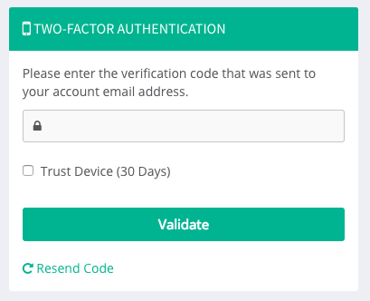

This is one of our biggest features for ContentBox is our two factor authentication framework. That's right, we built a two factor module framework that will allow you to build or use any two factor or multi-factor authentication mechanism. We have included one in the core which is Email verification.

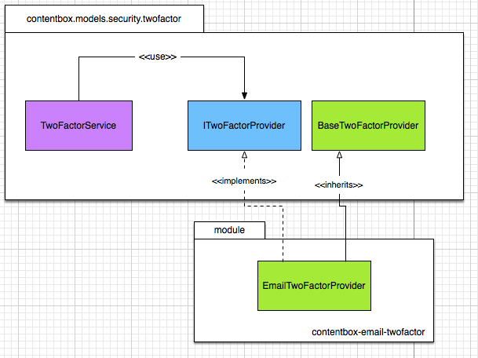

Please refer to the developing two factor authentication providers in order to get an in-depth look of how to build your own two factor authentication provider modules.

#### Two Factor Events

The following are the new interception points for two factor authentication

* `cbadmin_onTwoFactorSettingsPanel` - Shows on the two factor global settings panel
* `cbadmin_onAuthorTwoFactorOptions` - Shows on the options for two factor auth in the author editor
* `cbadmin_onAuthorTwoFactorSaveOptions` - Fires when the options are being saved
* `cbadmin_beforeTwoFactorForm` - Shows at the beginning of two factor form challenge
* `cbadmin_afterTwoFactorForm` - Shows after the two factor form challenge
* `cbadmin_onInvalidTwoFactor` - Fires when an invalid challenge has been made
* `cbadmin_onValidTwoFactor` - Fires when a valid challeng has been made

#### Global Settings

An admin can force two factor authentication for all users in the system and even provided a trusted device registry so ContentBox can track their devices and challenge only after a few days.

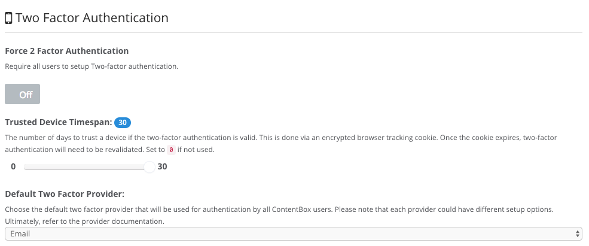

#### User Settings

The user can also setup two factor authentication for their account if so desired.

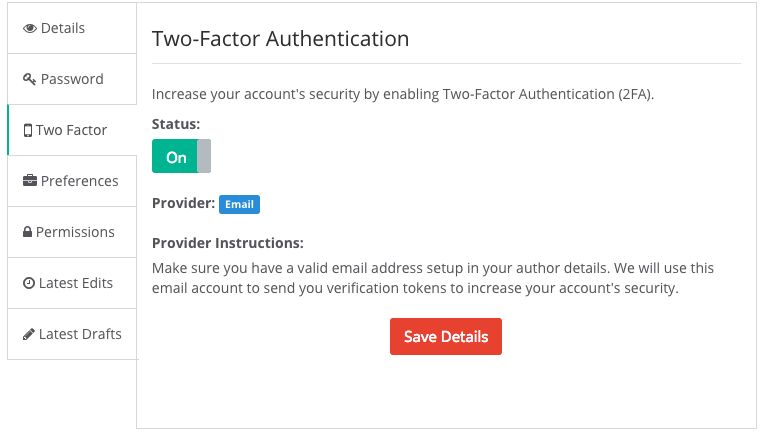

### Login Options

An administrator now can control login options and enhance the logging experience of their users.

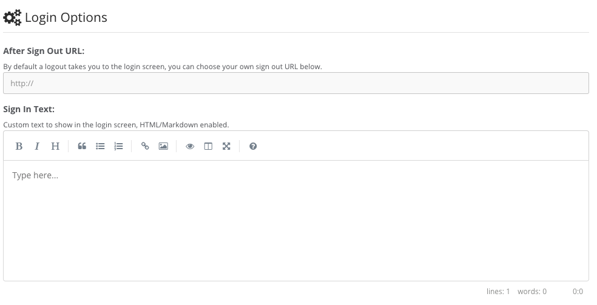

### Permission Groups

We have introduced the ability to create and organize permissions not only in roles but in our new permission groups. This will allow you to create more complex and robust permission schemas and be able to assign multiple permission groups to users. The entire permissions tab for authors has been revamped to allow you better visualization of rules and permissions.

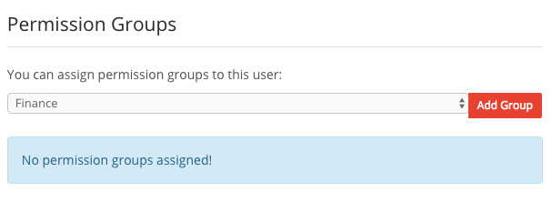

### Improved Rate Limiting

The rate limiting module has been revamped to help with Denial of Service attacks or even just pesky scrapers. You can now configure more options for fine-tuning including relocation URLs, custom messages and improved logging.

### Password Enhancements

There have been many updates on both the UI and the security of user passwords.

#### Password Meter

We have introduced the concept of a visual password meter, which can guide users when changing, resetting or setting passwords:

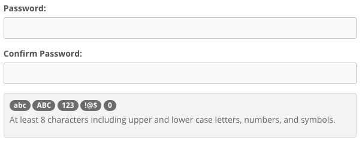

#### Password Length Options

You can now also as an admin decide on the minimum length of user passwords.

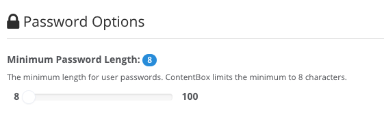

#### Password Reset Options

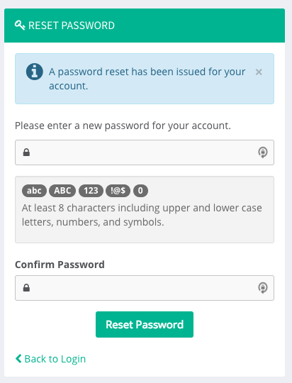

As an administrator, you can now reset user passwords a-la-carte or for every single user in the system. This will issue a notification to the user with instructions on resetting their system password. User password reset workflow has now been improved with our new password reset screens instead of bulky double email validation mechanisms.

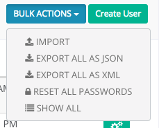

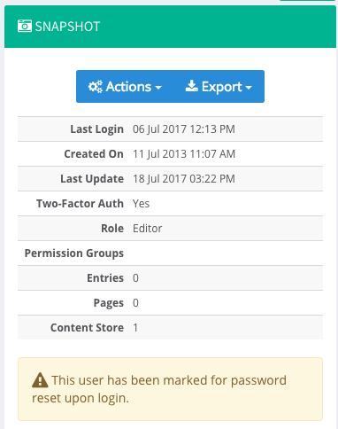

#### New Interception Events

Here are the new interception events you can listen on for password reset workflows:

* `cbadmin_onGlobalPasswordReset`
* `cbadmin_onPasswordReset`
* `cbadmin_onInvalidPasswordReset`

## Author Updates

### New Author Wizard

We have introduced a new approach to creating authors in ContentBox. You will now be presented with the new author wizard which will allow you to pre-fill author details in a secure manner. A notification will be sent to the new author's email address with a password setup token so they can secure their account.

### Improved Author Listings

The author listings have been improved with tons of new filters, reporting and even sorting options. Go admin like a mad man!

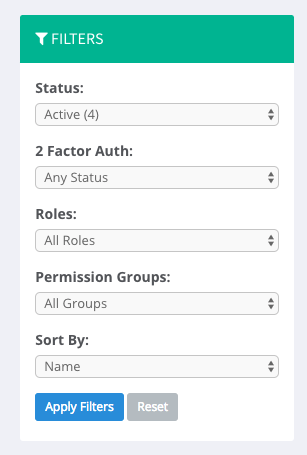

### Improved Author Snapshot

The Author Profile Snapshot has been updated to include a better UI, better visualization and a new action toolbar for direct Author actions and Author exporting.

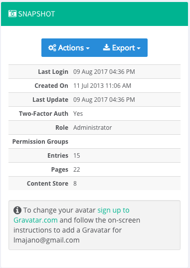

## Content Updates

### Markdown Support++

We introduced markdown support for all content in many versions before. This update includes a brand new markdown engine with table support, code syntax highlighting and much more. We also made several settings and author specific details available as markdown content. In other words, viva markdown!

### Markdown Editors

We have also updated our markdown UI editor and it can be used everywhere in the admin were markdown is allowed.

### Publishing Workflows

We have added a new two-step workflow for publishing any piece of content. This will allow you better visibility when working with drafts or live content. The new flow will also assist users that do not have any publishing capabilities.

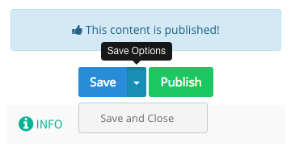

### Content Hierarchy Navigation History

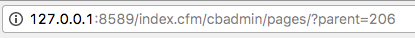

We have improved the navigation of the content store and the sitemap by taping into the browser history API and providing history support for hierarchy navigation. Never again loose your place in the hierarchy.

## Full Release Notes

### Bugs

* \[[CONTENTBOX-882](https://ortussolutions.atlassian.net/browse/CONTENTBOX-882)\] -When cloning blog posts \( possibly pages too \) the code format is lost
* \[[CONTENTBOX-891](https://ortussolutions.atlassian.net/browse/CONTENTBOX-891)\] -Trying to delete a single user with checked boxes fails
* \[[CONTENTBOX-907](https://ortussolutions.atlassian.net/browse/CONTENTBOX-907)\] -"notify me" checkbox is forgotten on comment submission failure
* \[[CONTENTBOX-913](https://ortussolutions.atlassian.net/browse/CONTENTBOX-913)\] -Fix issue of installer failing when rewrites turned off
* \[[CONTENTBOX-914](https://ortussolutions.atlassian.net/browse/CONTENTBOX-914)\] -Adobe Incompatibilities for sidebar
* \[[CONTENTBOX-915](https://ortussolutions.atlassian.net/browse/CONTENTBOX-915)\] -Render Markdown correctly on auto updates description
* \[[CONTENTBOX-925](https://ortussolutions.atlassian.net/browse/CONTENTBOX-925)\] -Installer issues with new radio buttons
* \[[CONTENTBOX-936](https://ortussolutions.atlassian.net/browse/CONTENTBOX-936)\] -Change $forgebox.load to GET request instead of POST for pagination to work
* \[[CONTENTBOX-943](https://ortussolutions.atlassian.net/browse/CONTENTBOX-943)\] -MSSQL Regression due to Category Formulas
* \[[CONTENTBOX-950](https://ortussolutions.atlassian.net/browse/CONTENTBOX-950)\] -Adobe 2016 Syntax Error
* \[[CONTENTBOX-953](https://ortussolutions.atlassian.net/browse/CONTENTBOX-953)\] -Check Permissions fails on User with a null Role

### New Features

* \[[CONTENTBOX-647](https://ortussolutions.atlassian.net/browse/CONTENTBOX-647)\] - Add a password meter on the installer and user profile page with key enforcements
* \[[CONTENTBOX-875](https://ortussolutions.atlassian.net/browse/CONTENTBOX-875)\] - Add content hierarchy history as URL doesn't reflect navigation into content hierarchy
* \[[CONTENTBOX-916](https://ortussolutions.atlassian.net/browse/CONTENTBOX-916)\] - User Permissions Groups
* \[[CONTENTBOX-917](https://ortussolutions.atlassian.net/browse/CONTENTBOX-917)\] - New setting for rate limiter to choose either a message or a redirection URL
* \[[CONTENTBOX-918](https://ortussolutions.atlassian.net/browse/CONTENTBOX-918)\] - New setting to control if blocked attempts are logged or not
* \[[CONTENTBOX-920](https://ortussolutions.atlassian.net/browse/CONTENTBOX-920)\] - New author quick report: numberOfContentStore
* \[[CONTENTBOX-921](https://ortussolutions.atlassian.net/browse/CONTENTBOX-921)\] - Creation of new author toolbar for actions in snapshot location
* \[[CONTENTBOX-922](https://ortussolutions.atlassian.net/browse/CONTENTBOX-922)\] - New export capabilities from new author toolbar
* \[[CONTENTBOX-926](https://ortussolutions.atlassian.net/browse/CONTENTBOX-926)\] - Ability to showcase raw content in history panel
* \[[CONTENTBOX-927](https://ortussolutions.atlassian.net/browse/CONTENTBOX-927)\] - Ability for a author password to be reset by an admin
* \[[CONTENTBOX-928](https://ortussolutions.atlassian.net/browse/CONTENTBOX-928)\] - New reset interception points: cbadmin\_onGlobalPasswordReset, cbadmin\_onPasswordReset, "cbadmin\_onPasswordReset", "cbadmin\_onInvalidPasswordReset"
* \[[CONTENTBOX-929](https://ortussolutions.atlassian.net/browse/CONTENTBOX-929)\] - Ability for admin to reset all author passwords
* \[[CONTENTBOX-930](https://ortussolutions.atlassian.net/browse/CONTENTBOX-930)\] - When resetting a password and you have a previous password, they should not be the same
* \[[CONTENTBOX-932](https://ortussolutions.atlassian.net/browse/CONTENTBOX-932)\] - New publishing details workflow
* \[[CONTENTBOX-933](https://ortussolutions.atlassian.net/browse/CONTENTBOX-933)\] - Ability for authors to be sorted in the listing by different common orderings
* \[[CONTENTBOX-938](https://ortussolutions.atlassian.net/browse/CONTENTBOX-938)\] - Make password length for authors a customizable rule
* \[[CONTENTBOX-939](https://ortussolutions.atlassian.net/browse/CONTENTBOX-939)\] - Update all range settings to new slider UI
* \[[CONTENTBOX-940](https://ortussolutions.atlassian.net/browse/CONTENTBOX-940)\] - New author creation wizard
* \[[CONTENTBOX-944](https://ortussolutions.atlassian.net/browse/CONTENTBOX-944)\] - Enable markdown for site maintenance
* \[[CONTENTBOX-945](https://ortussolutions.atlassian.net/browse/CONTENTBOX-945)\] - Enable MD Editors for settings for better usability
* \[[CONTENTBOX-946](https://ortussolutions.atlassian.net/browse/CONTENTBOX-946)\] - Two Factor Auth Framework and Authentication
* \[[CONTENTBOX-948](https://ortussolutions.atlassian.net/browse/CONTENTBOX-948)\] - Update markdown processor to latest version
* \[[CONTENTBOX-949](https://ortussolutions.atlassian.net/browse/CONTENTBOX-949)\] - Create server.json for site and installers, so we can have rewrites and nice logos
* \[[CONTENTBOX-951](https://ortussolutions.atlassian.net/browse/CONTENTBOX-951)\] - New preFlight checks for settings to avoid setting upgrade issues and better encapsulation
* \[[CONTENTBOX-954](https://ortussolutions.atlassian.net/browse/CONTENTBOX-954)\] - Email two factor authentication provider
* \[[CONTENTBOX-955](https://ortussolutions.atlassian.net/browse/CONTENTBOX-955)\] - Refactor captcha out of the core and into an addon module.
* \[[CONTENTBOX-957](https://ortussolutions.atlassian.net/browse/CONTENTBOX-957)\] - Security services now rely on the CacheStorages instead of session to provide distribution out of the box if necessary via CacheBox
* \[[CONTENTBOX-958](https://ortussolutions.atlassian.net/browse/CONTENTBOX-958)\] - Ability to make the datasource portable for container deployments via config/runtime.properties.cfm convention

### Improvements

* \[[CONTENTBOX-568](https://ortussolutions.atlassian.net/browse/CONTENTBOX-568)\] - Allow user to choose new password on reset
* \[[CONTENTBOX-725](https://ortussolutions.atlassian.net/browse/CONTENTBOX-725)\] - User Management: Allows duplicate emails
* \[[CONTENTBOX-919](https://ortussolutions.atlassian.net/browse/CONTENTBOX-919)\] - Author snapshot updates
* \[[CONTENTBOX-923](https://ortussolutions.atlassian.net/browse/CONTENTBOX-923)\] - Added auto height to select boxes
* \[[CONTENTBOX-924](https://ortussolutions.atlassian.net/browse/CONTENTBOX-924)\] - Page Publishing Permissions
* \[[CONTENTBOX-931](https://ortussolutions.atlassian.net/browse/CONTENTBOX-931)\] - Content cloning needs to clone all new properties
* \[[CONTENTBOX-934](https://ortussolutions.atlassian.net/browse/CONTENTBOX-934)\] - Added pagination to ForgeBox installer
* \[[CONTENTBOX-935](https://ortussolutions.atlassian.net/browse/CONTENTBOX-935)\] - Don't show data snapshot donut charts if there is no data
* \[[CONTENTBOX-937](https://ortussolutions.atlassian.net/browse/CONTENTBOX-937)\] - Make admin bar responsive
* \[[CONTENTBOX-941](https://ortussolutions.atlassian.net/browse/CONTENTBOX-941)\] - Cache installer detection query to improve performance
* \[[CONTENTBOX-942](https://ortussolutions.atlassian.net/browse/CONTENTBOX-942)\] - Global HTML not flushing settings cache
* \[[CONTENTBOX-952](https://ortussolutions.atlassian.net/browse/CONTENTBOX-952)\] - Refactor formulas for category reports and optimized for better performance
* \[[CONTENTBOX-956](https://ortussolutions.atlassian.net/browse/CONTENTBOX-956)\] - Deprecated ColdBox fileUtils to internal Utility

