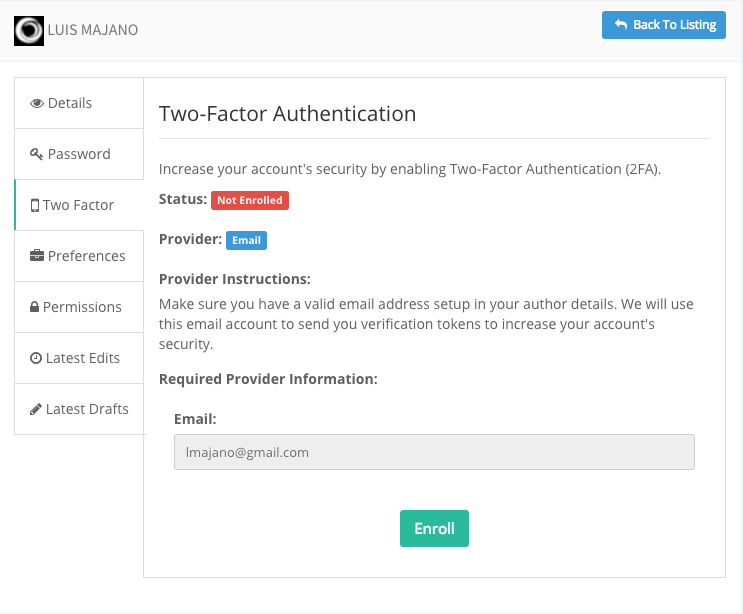

# What's New With 4.0.0

## Intro

ContentBox v4.0.0 is the first major release of ContentBox and it sports tons of new updates, improvements and bug fixes including a major upgrade to [ColdBox v5.x](https://coldbox.ortusbooks.com/intro/introduction/whats-new-with-5.0.0) which in itself gives us tons of new updates and features.  So let's start exploring the major areas of improvement of this release.

## ColdBox 5

The entire ContentBox core has been migrated to leverage ColdBox 5.x.  This introduction has given us a plethora of features not only for development purposes but also great stability, and speed.  The major areas of improvement are:

* Performance, performance, performance
* Container and Environment support and detection
* Full null support
* Inheritable entry points for Modules
* New modularity events
* `modules_app` inception
* Default Module Exports
* Simplified URL Routes
* Enhanced Routers for core and modules
* Named Routes
* Event Caching Improvements
* Default JSON renderings
* Rendering Regions
* Faster Integration Testing

You can read all about the ColdBox 5 release here: [https://coldbox.ortusbooks.com/intro/introduction/whats-new-with-5.0.0](https://coldbox.ortusbooks.com/intro/introduction/whats-new-with-5.0.0)

## ContentBox Modules Full URL Routing

In 4.x, modules can leverage the full power of ColdBox Routing as each module has its own `Router.cfc` now.  No more are you bound to just simple `moduleEntryPoint/handler/action` URLs, you can now use the full expressive power of ColdBox Routes:

```text
cbadmin/{module-entry-point}/${Full URL Route}
```

## ContentBox Modules Inception

Thanks to ColdBox 5, your ContentBox modules now support full inception of child modules. Even the children will respond to full URL routing using the pattern shown previously.

## New `contentbox-custom` Module

This is one of the **major** updates for this release in order to adhere to our containerization and portability strategies.  Let's investigate the problem first:  

In previous releases, custom code \(media library, themes, widgets, and modules\) had to be installed in specific folders inside of the `contentbox` module, which is installed by CommandBox.

```text
+ modules
  + contentbox
    + content
    + themes
    + modules_user
    + widgets
```

This is fine and dandy, but the issues arise once you want to put your custom code into source control but **NOT** the ContentBox source.  It makes no sense to store the ContentBox source code in source control since the inception of CommandBox and package management.  This created many issues in figuring out how to JUST add your custom pieces to source control and then came CommandBox 4 which allowed inline updates and just destroyed custom code.

Then came our containerization strategy where we wanted a simple mount point for all custom code.  This was painful under the 3.x layout.

### Conventions

This gave way to the creation of the `contentbox-custom` module which is a module stored under the `modules_app` convention.  This module will store all **custom** code and can be stored in source control without interfering with ContentBox source code.

```text
+ modules_app
    + contentbox-custom
        + _content (media libary)
        + _modules (custom modules)
        + _themes (custom themes)
        + _widgets (custom widgets)
        ModuleConfig.cfc
```

### Core and Custom Locations

This also gave fruition to a new feature where now you can use the **custom** module for your **custom** media library, modules, themes and widgets, but also gave way to also store CommandBox controlled **core** modules and themes.  This means that when you install modules and themes from ForgeBox they will install under the previous locations because they are managed by CommandBox.

### Custom Module Configuration

You will also find the `ModuleConfig.cfc` in the root of your custom module with the basics to bootstrap the module by ContentBox.  The rest is up to you.  You can now leverage a full module to bootstrap all your custom code.  You now have the power to control the loading/unloading of all your custom assets. Yeayyy for modularity.

### Custom Widgets

If you wanted to create custom widgets before you either had to place them in themes or in the core location.  Now you can store them in the custom module under the `_widgets` folder and have them available globally.

### Widget Discovery

Since the addition of these new locations for widgets we have also added a **discovery** process when using widgets just by **name** in content markup or retrieval:

* Check custom location: `modules_app/contentbox-custom/_widgets`
* Check **active** theme widgets folder
* Check core location: `modules/contentbox/widgets`

### Custom Media Library

The new custom module will also house your media library under the `_content` folder.  The ContentBox v3 upgrader will move your library here \(if it exists\).

### Docker Container Mount Point

If you are leveraging the CommandBox or ContentBox docker images, you can now easily mount your custom source code by just pointing it to the `modules_app/contentbox-custom` folder.

```bash
docker run -p 8080:8080 \
    -e express=true \
    -v `pwd`/contentbox-db:/data/contentbox/db \
    -v `pwd`/contentbox-custom:/app/modules_app/contentbox-custom \
    ortussolutions/contentbox
```

## Multi-Factor Enrollment

We have now added the capability for users to enroll and unenroll in multi-factor authentication according to their provider of choice or admin's choice :\)




**Tip:** Admins can also un-enroll users as a fail-safe in order to allow them to re-enroll if needed.


## Release Notes

### Bugs

* \[[CONTENTBOX-775](https://ortussolutions.atlassian.net/browse/CONTENTBOX-775)\] - Error clicking Tools --&gt; Export in admin
* \[[CONTENTBOX-961](https://ortussolutions.atlassian.net/browse/CONTENTBOX-961)\] - Bulk remove comments throws an error
* \[[CONTENTBOX-962](https://ortussolutions.atlassian.net/browse/CONTENTBOX-962)\] - Calling right function for bulk remove comments
* \[[CONTENTBOX-963](https://ortussolutions.atlassian.net/browse/CONTENTBOX-963)\] - Update TwoFactorService to check for provider only if enabled
* \[[CONTENTBOX-975](https://ortussolutions.atlassian.net/browse/CONTENTBOX-975)\] - Media provider HTML producing non-unique IDs
* \[[CONTENTBOX-984](https://ortussolutions.atlassian.net/browse/CONTENTBOX-984)\] - Force users to enroll in MFA if the global MFA setting is turned ON.
* \[[CONTENTBOX-987](https://ortussolutions.atlassian.net/browse/CONTENTBOX-987)\] - RenderView widget errors due to event arguments
* \[[CONTENTBOX-989](https://ortussolutions.atlassian.net/browse/CONTENTBOX-989)\] - ThemeService was erroring when saving settings
* \[[CONTENTBOX-990](https://ortussolutions.atlassian.net/browse/CONTENTBOX-990)\] - quickLayout defaults to the contentbox module not the module the theme belongs to
* \[[CONTENTBOX-991](https://ortussolutions.atlassian.net/browse/CONTENTBOX-991)\] - Widget Discovery Mode regression in Theme location change
* \[[CONTENTBOX-992](https://ortussolutions.atlassian.net/browse/CONTENTBOX-992)\] - Submodules of ContentBox Modules are not registered
* \[[CONTENTBOX-993](https://ortussolutions.atlassian.net/browse/CONTENTBOX-993)\] - Modules default value for Module Type is Core
* \[[CONTENTBOX-994](https://ortussolutions.atlassian.net/browse/CONTENTBOX-994)\] - Module Deactivation Failures throw errors instead of catching nicely?
* \[[CONTENTBOX-998](https://ortussolutions.atlassian.net/browse/CONTENTBOX-998)\] - When admin close the 'Quick View' pop-up the 'ContentBox Asset Chooser' also closed.
* \[[CONTENTBOX-999](https://ortussolutions.atlassian.net/browse/CONTENTBOX-999)\] - Do not show error message for expired content. Currently when I create expired Content Store Items. When the expiration happens I get an Error message. There should be no error message.
* \[[CONTENTBOX-1001](https://ortussolutions.atlassian.net/browse/CONTENTBOX-1001)\] - Checkboxes alignment issue in Content store -&gt; Categories menu
* \[[CONTENTBOX-1002](https://ortussolutions.atlassian.net/browse/CONTENTBOX-1002)\] - 'Transform' tab displaying alignment issue in Image edit model window
* \[[CONTENTBOX-1003](https://ortussolutions.atlassian.net/browse/CONTENTBOX-1003)\] - Invalid return type while Search and Apply filters on Comments-&gt;Inbox
* \[[CONTENTBOX-1004](https://ortussolutions.atlassian.net/browse/CONTENTBOX-1004)\] - blog paging bootstrap compatable
* \[[CONTENTBOX-1008](https://ortussolutions.atlassian.net/browse/CONTENTBOX-1008)\] - Error Installing ContentBox-installer@be -security interceptor not found
* \[[CONTENTBOX-1009](https://ortussolutions.atlassian.net/browse/CONTENTBOX-1009)\] - Issue while uploading files With Long name in Media manager

### New Features

* \[[CONTENTBOX-973](https://ortussolutions.atlassian.net/browse/CONTENTBOX-973)\] - Creation of new contentbox-custom module for storing all custom user data
* \[[CONTENTBOX-974](https://ortussolutions.atlassian.net/browse/CONTENTBOX-974)\] - Refactor media content to new contentbox-custom/content location
* \[[CONTENTBOX-976](https://ortussolutions.atlassian.net/browse/CONTENTBOX-976)\] - Allow for modules to exist in internal contentbox module and also in contentbox-custom/modules location
* \[[CONTENTBOX-978](https://ortussolutions.atlassian.net/browse/CONTENTBOX-978)\] - Update exporter/importer for custom modules location
* \[[CONTENTBOX-979](https://ortussolutions.atlassian.net/browse/CONTENTBOX-979)\] - Update themes to work with core and custom location
* \[[CONTENTBOX-980](https://ortussolutions.atlassian.net/browse/CONTENTBOX-980)\] - Create widgets at custom location with override capabilities to core.
* \[[CONTENTBOX-982](https://ortussolutions.atlassian.net/browse/CONTENTBOX-982)\] - Migrate away from bower to yarn for UI
* \[[CONTENTBOX-988](https://ortussolutions.atlassian.net/browse/CONTENTBOX-988)\] - Enable MFA enrollment and unenrollment
* \[[CONTENTBOX-1000](https://ortussolutions.atlassian.net/browse/CONTENTBOX-1000)\] - ContentBox Module executions now support child modules and also full URL Routing

### Improvements

* \[[CONTENTBOX-960](https://ortussolutions.atlassian.net/browse/CONTENTBOX-960)\] - Revamps of many-to-many relationships with cascading side effects
* \[[CONTENTBOX-964](https://ortussolutions.atlassian.net/browse/CONTENTBOX-964)\] - Media manager bug fixes concerning uploads and styles
* \[[CONTENTBOX-966](https://ortussolutions.atlassian.net/browse/CONTENTBOX-966)\] - Add interception points around lost password form
* \[[CONTENTBOX-969](https://ortussolutions.atlassian.net/browse/CONTENTBOX-969)\] - Update lost password instructions to match new flow
* \[[CONTENTBOX-970](https://ortussolutions.atlassian.net/browse/CONTENTBOX-970)\] - Restrict Administrators from setting User Passwords
* \[[CONTENTBOX-971](https://ortussolutions.atlassian.net/browse/CONTENTBOX-971)\] - Improve two factor flow by adding enrollment and unenrollment screens and interface updates
* \[[CONTENTBOX-983](https://ortussolutions.atlassian.net/browse/CONTENTBOX-983)\] - Update all JS libraries to their latest versions
* \[[CONTENTBOX-985](https://ortussolutions.atlassian.net/browse/CONTENTBOX-985)\] - content search improvements to do fuzzy searches instead of eq searches
* \[[CONTENTBOX-1006](https://ortussolutions.atlassian.net/browse/CONTENTBOX-1006)\] - Var scoping issues in Widget Render lead to variable bleeding
* \[[CONTENTBOX-1007](https://ortussolutions.atlassian.net/browse/CONTENTBOX-1007)\] - Contentbox installer doesn't allow you to select a special port for the datasource
* \[[CONTENTBOX-1010](https://ortussolutions.atlassian.net/browse/CONTENTBOX-1010)\] - config and environment overrides are now reloaded if the settings cache is flushed.

