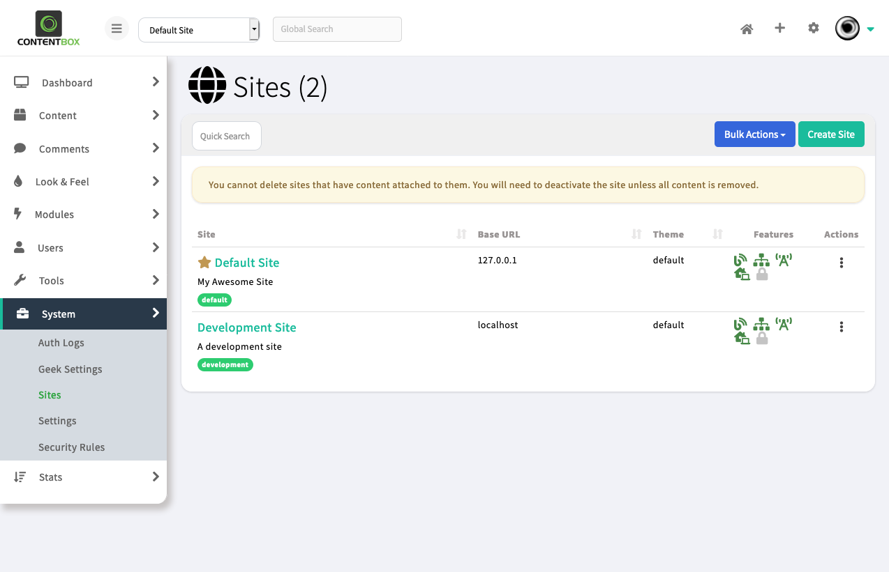
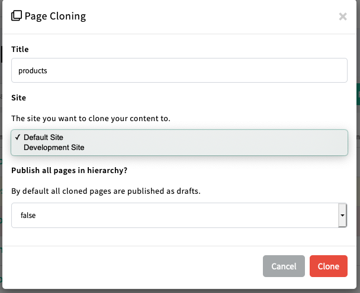
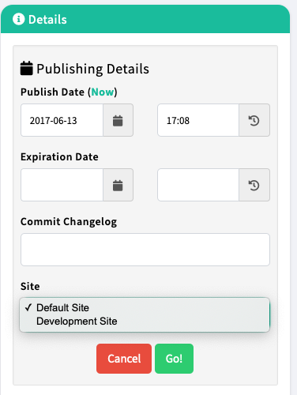
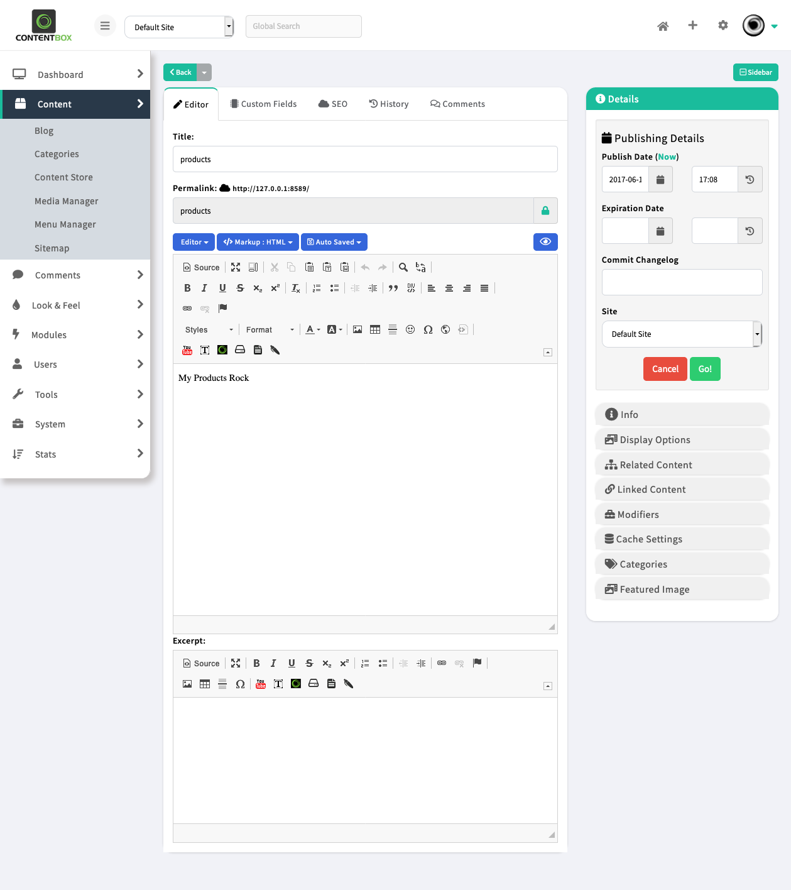
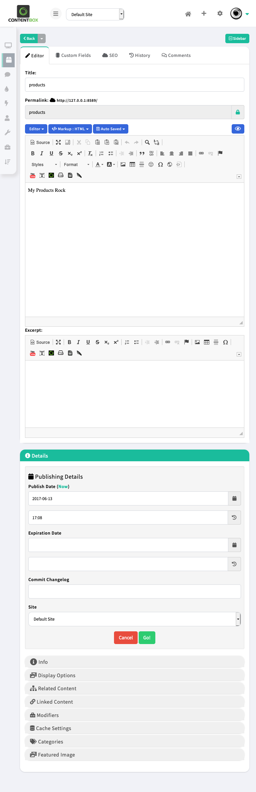

# What's new With 5.0.0

ContentBox 5 is a major update for this CMS and it includes a major architectural change to move the CMS forward.  We have introduced multi-tenancy and a complete headless approach to ContentBox.  It has become on of our biggest releases since our initial release since 2011.

You can find our release notes here and we will discuss our major areas of improvement for this release.

## ColdBox 6 Core


We have upgraded our core to ColdBox 6 and we have received a tremendous amounts of benefits \([https://coldbox.ortusbooks.com/intro/release-history/whats-new-with-6.0.0](https://coldbox.ortusbooks.com/intro/release-history/whats-new-with-6.0.0)\).  Here are some of the features we get with this upgrade:

* Performance, performance, performance.  ColdBox 6 has been finely tuned to make your applications much more performant and stable under high load.
* Better new CFML engine support
* Asynchronous programming.  We have introduced the concepts of the async package to the core and ContentBox will leverage more of these features for background job processing, automation and much more.
* New logging facilities and enhancements
* Better exception handling for developers
* REST Handlers and highly performant REST Routing
* Singleton View Rendering. You will find that all renderings are way faster than before.
* Much more!

## CBSecurity 2


We have migrated our `cbsecurity` module to the latest version to give you a wealth of features \([https://coldbox-security.ortusbooks.com/intro/release-history/whats-new-with-2.0.0](https://coldbox-security.ortusbooks.com/intro/release-history/whats-new-with-2.0.0)\) such as:

* Fortified rule engine
* Annotation based security engine
* JWT support
* Security Services
* Cross site request forgery support

## Multi Site Support


This has been one of the most requested features and we where hesitant for many years to comply due to the size of the needed refactoring.  However, we have finally created a great base for making ContentBox multi-tenant.  You can now configure 1 or 10000 sites under the same ContentBox umbrella.  The new installer actually creates two sites for you: a development/staging site and a production site.  That means that you can manage different content environments all under the same deployment.



Here are some of the features you get with multi-site ContentBox:

* Ability to register an infinite number of sites
* Site detection by regular expressions or patterns on incoming URIs
* Site detection by header identifier if using the headless cms or reverse proxies
* Each site can contain its own
  * Categories
  * Blog
  * Pages
  * Content Store
  * Menus
  * Commenting System
  * Themes
* Admin site switcher
* Admin site control bar
* Clone content or entire content hierarchies from one site to the other
* Publish content directly to different sites
* Move content between sites
* Much more coming soon.






## Admin UI Revamp



The entire admin UI has been revamped and streamlined.  You will find it much more breathable and easier to work with especially from mobile devices and smaller screens.  We are also starting to prepare a major theme change and customization that might be introduced in the final release or scheduled for a minor update.



## PostgreSQL Support


We have completely changed our ORM structures and custom queries so it can be friendlier to other RDBMS.  In this release we focus on portability of the host database and finally have core PostgreSQL support.

## Performance

We have analyzed the entire ORM structures, queries and CFML code in this release thanks to [FusionReactor](https://www.fusion-reactor.com/)'s Profiler.  We have streamlined the way the CMS loads and the results are impressive.  The first load of ContentBox is about 70% faster than ContentBox 4. Along page executions with around 30-40% faster executions.  

## No More Admin Auto Updates

This is such a controversial feature to be able to deliver patches via the admin.  We have completely _dropped_ the capability to patch the CMS from within the CMS.  It caused more issues than it solved and in Windows it was pretty much impossible.

We have moved to a CommandBox + Migrations approach and the results are amazing.  No more broken installs, half done db updates and more.  Now you can simply run two CLI commands and be done with it.  Here is a typical flow for updating your system:

```bash
# stop the server
stop
# Update ColdBox and ContentBox
update coldbox,contentbox
# Run Migrations
migrate up
# start it up again
start
```

## Release Notes

### Bugs Squashed!

* \[[CONTENTBOX-1085](https://ortussolutions.atlassian.net/browse/CONTENTBOX-1085)\] - **Preflight** check has a race condition where duplicate settings can be inserted and stop app from starting
* \[[CONTENTBOX-1106](https://ortussolutions.atlassian.net/browse/CONTENTBOX-1106)\] - ColdBox modules directory renamed to modules\_bak during upgrade to ContentBox 4.2
* \[[CONTENTBOX-1107](https://ortussolutions.atlassian.net/browse/CONTENTBOX-1107)\] - Custom Module Dependencies are not respected by ContentBox ModuleService
* \[[CONTENTBOX-1111](https://ortussolutions.atlassian.net/browse/CONTENTBOX-1111)\] - When deactivating modules, module widgets still remained registered
* \[[CONTENTBOX-1115](https://ortussolutions.atlassian.net/browse/CONTENTBOX-1115)\] - Regression `cachelayout` setting missing from UI on pages and blog entries
* \[[CONTENTBOX-1118](https://ortussolutions.atlassian.net/browse/CONTENTBOX-1118)\] - media service had a `hardlink` to the UI module which threw an exception when the UI module was removed
* \[[CONTENTBOX-1126](https://ortussolutions.atlassian.net/browse/CONTENTBOX-1126)\] - `BaseContent` has `expireDate` as required via validation but not in the model
* \[[CONTENTBOX-1127](https://ortussolutions.atlassian.net/browse/CONTENTBOX-1127)\] - Problem with multiple select options in `RecentPages` widget
* \[[CONTENTBOX-1128](https://ortussolutions.atlassian.net/browse/CONTENTBOX-1128)\] - Problem in `RecentPages` widget on filter by category
* \[[CONTENTBOX-1132](https://ortussolutions.atlassian.net/browse/CONTENTBOX-1132)\] - Fix CB admin bar image alignment on tailwind sites
* \[[CONTENTBOX-1133](https://ortussolutions.atlassian.net/browse/CONTENTBOX-1133)\] - Fix ContentBox "**latestversion**" updater error \#445
* \[[CONTENTBOX-1134](https://ortussolutions.atlassian.net/browse/CONTENTBOX-1134)\] - Fix content sidebar toggle label \#444
* \[[CONTENTBOX-1143](https://ortussolutions.atlassian.net/browse/CONTENTBOX-1143)\] - multi domain bug when using cgi.http\_host just like ColdBox, move to cgi.server\_name instead affects all caching cleanups
* \[[CONTENTBOX-1151](https://ortussolutions.atlassian.net/browse/CONTENTBOX-1151)\] - Bug in Widget View clearing out cached widget query
* \[[CONTENTBOX-1152](https://ortussolutions.atlassian.net/browse/CONTENTBOX-1152)\] - ACF incompats with `relocate`\(\) after `applicationStop`\(\) due to ungraceful app metadata wiping by ACF
* \[[CONTENTBOX-1155](https://ortussolutions.atlassian.net/browse/CONTENTBOX-1155)\] - Admin Views Accessible even if logged out: cbsecurity not firing.
* \[[CONTENTBOX-1157](https://ortussolutions.atlassian.net/browse/CONTENTBOX-1157)\] - CB 5, Context menu Sitemap not visible, see screenshot
* \[[CONTENTBOX-1158](https://ortussolutions.atlassian.net/browse/CONTENTBOX-1158)\] - ms sql server doesn't support `sqltype` boolean
* \[[CONTENTBOX-1196](https://ortussolutions.atlassian.net/browse/CONTENTBOX-1196)\] - When cloning and marking to publish, not publishing due to missing publish date
* \[[CONTENTBOX-1198](https://ortussolutions.atlassian.net/browse/CONTENTBOX-1198)\] - Site settings for comments are not being transferred
* \[[CONTENTBOX-1182](https://ortussolutions.atlassian.net/browse/CONTENTBOX-1182)\] - "\" doesn't goes to global search

### New Feature

* \[[CONTENTBOX-1121](https://ortussolutions.atlassian.net/browse/CONTENTBOX-1121)\] - Upgrade `javaloader` to v2.0
* \[[CONTENTBOX-1123](https://ortussolutions.atlassian.net/browse/CONTENTBOX-1123)\] - Upgrade to `cborm` 3 and get all of it's goodness
* \[[CONTENTBOX-1135](https://ortussolutions.atlassian.net/browse/CONTENTBOX-1135)\] - Upgrade to ColdBox 6
* \[[CONTENTBOX-1136](https://ortussolutions.atlassian.net/browse/CONTENTBOX-1136)\] - Upgrade to `CBSecurity` 2
* \[[CONTENTBOX-1139](https://ortussolutions.atlassian.net/browse/CONTENTBOX-1139)\] - New configuration for site is using `cfconfig` with environment variables
* \[[CONTENTBOX-1140](https://ortussolutions.atlassian.net/browse/CONTENTBOX-1140)\] - Upgrade the usage of \`bit\` sql type to \`boolean\` sql type to avoid issues with major DB vendors and also to support PostgreSQL natively
* \[[CONTENTBOX-1141](https://ortussolutions.atlassian.net/browse/CONTENTBOX-1141)\] - Multi-site capabilities for all content and installations
* \[[CONTENTBOX-1142](https://ortussolutions.atlassian.net/browse/CONTENTBOX-1142)\] - All administrator js/css libraries updated to latest versions
* \[[CONTENTBOX-1149](https://ortussolutions.atlassian.net/browse/CONTENTBOX-1149)\] - Installer can now create a production and development site for you thanks to multi-site support
* \[[CONTENTBOX-1153](https://ortussolutions.atlassian.net/browse/CONTENTBOX-1153)\] - update security rules to match cbsecurity 2.0
* \[[CONTENTBOX-1179](https://ortussolutions.atlassian.net/browse/CONTENTBOX-1179)\] - Upgrade to cborm 3
* \[[CONTENTBOX-1192](https://ortussolutions.atlassian.net/browse/CONTENTBOX-1192)\] - Use Docbox 3 to generate the docs instead of the old approach

### Task

* \[[CONTENTBOX-1110](https://ortussolutions.atlassian.net/browse/CONTENTBOX-1110)\] - Drop lucee 4.5 support
* \[[CONTENTBOX-1138](https://ortussolutions.atlassian.net/browse/CONTENTBOX-1138)\] - Drop support for \`runtime.properties.cfm\` in favor of cfconfig datasource additions
* \[[CONTENTBOX-1144](https://ortussolutions.atlassian.net/browse/CONTENTBOX-1144)\] - Remove autoupdates capabilities in order to rely on CommandBox for patches and updates
* \[[CONTENTBOX-1166](https://ortussolutions.atlassian.net/browse/CONTENTBOX-1166)\] - Upgrade v4 migration to only run on v4 systems
* \[[CONTENTBOX-1177](https://ortussolutions.atlassian.net/browse/CONTENTBOX-1177)\] - Removal of full screen button as all browsers support this now
* \[[CONTENTBOX-1181](https://ortussolutions.atlassian.net/browse/CONTENTBOX-1181)\] - Remove the textarea editor, it's useless

### Improvements

* \[[CONTENTBOX-1108](https://ortussolutions.atlassian.net/browse/CONTENTBOX-1108)\] - Add restrictions on orm cfc locations for faster startups on Application.cfc
* \[[CONTENTBOX-1109](https://ortussolutions.atlassian.net/browse/CONTENTBOX-1109)\] - Remove directory browsing for production installations
* \[[CONTENTBOX-1116](https://ortussolutions.atlassian.net/browse/CONTENTBOX-1116)\] - Change the order of the logout function, to the announcement has the oCurrentAuthor still, for logging purposes.
* \[[CONTENTBOX-1117](https://ortussolutions.atlassian.net/browse/CONTENTBOX-1117)\] - Update dsn creator to support lucee 5.3 mysql jdbc path
* \[[CONTENTBOX-1120](https://ortussolutions.atlassian.net/browse/CONTENTBOX-1120)\] - Intercept installer relocation to check if the installer module is even installed else present a nice message
* \[[CONTENTBOX-1125](https://ortussolutions.atlassian.net/browse/CONTENTBOX-1125)\] - Add a setting for the timeout in the forgot password workflow
* \[[CONTENTBOX-1131](https://ortussolutions.atlassian.net/browse/CONTENTBOX-1131)\] - Encode theme settings in active theme page
* \[[CONTENTBOX-1150](https://ortussolutions.atlassian.net/browse/CONTENTBOX-1150)\] - CSS Updates to match new admin theme
* \[[CONTENTBOX-1156](https://ortussolutions.atlassian.net/browse/CONTENTBOX-1156)\] - CB5 - Multi site - feature to allow URL Path
* \[[CONTENTBOX-1161](https://ortussolutions.atlassian.net/browse/CONTENTBOX-1161)\] - DSN Module Update to latest CFML engine settings
* \[[CONTENTBOX-1197](https://ortussolutions.atlassian.net/browse/CONTENTBOX-1197)\] - Refactor formulas to methods so they can give a performance boost and increase encapsulation
* \[[CONTENTBOX-1193](https://ortussolutions.atlassian.net/browse/CONTENTBOX-1193)\] - update express to latest stable lucee
* \[[CONTENTBOX-1194](https://ortussolutions.atlassian.net/browse/CONTENTBOX-1194)\] - update express to latest tomcat 9
* \[[CONTENTBOX-1195](https://ortussolutions.atlassian.net/browse/CONTENTBOX-1195)\] - update tuckey rewrites to latest based on commandbox

