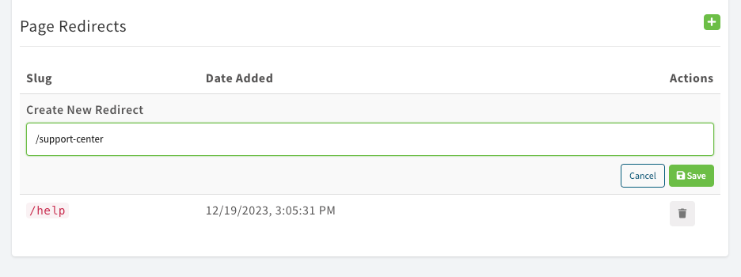

# What's new With 6.0.0

ContentBox 6 is a major update for this CMS, including its supporting libraries.  This version includes tons of improvements and stability enhancements that will make your content fly.

You can find our release notes here, and we will discuss our major areas of improvement for this release.  If you need to upgrade your previous versions of ContentBox, please see our [upgrade guide](upgrading-from-v5.x.md).

## ContentBox CLI

The ContentBox CLI based on CokmkmandBox is also updated to support C0ojntentB0ox 6 natively:

```bash
box install contentbox-cli
```

That's it. This will install the `contentbox` namespace to assist you in your ContentBox adventures.  Please see the [installation](../../getting-started/installation/) guide on usage.

## ColdBox 7 Core


We have upgraded our core to ColdBox 7, and we have received a tremendous amount of benefits ([https://coldbox.ortusbooks.com/readme/release-history/whats-new-with-7.0.0](https://coldbox.ortusbooks.com/readme/release-history/whats-new-with-7.0.0)). Here are some of the features we get with this upgrade:

* New CFML Engines Support
* JDK 11 and 17 Support
* Asynchronous programming.  We have introduced the concepts of the **`async`** package to the core and ContentBox will leverage more of these features for background job processing, automation and much more.
* New logging facilities and enhancements
* Better exception handling for developers
* REST Handlers and highly performant REST Routing
* Transient and ORM performance
* ColdBox Delegates
* App Modes
* Date Helpers
* Tons of Scheduled task updates
* Much more!

## CBSecurity 3

<figure><figcaption></figcaption></figure>

We have migrated our `cbsecurity` module to the latest version to give you a wealth of features ([https://coldbox-security.ortusbooks.com/readme/release-history/whats-new-with-3.0.0](https://coldbox-security.ortusbooks.com/readme/release-history/whats-new-with-3.0.0)) such as:

* Fortified rule engine
* Firewall Visualizer
* Delegations
* JWT enhancements
* Cross-site request forgery support

## Ortus ORM Lucee Extension

We have released our own Hibernate support extension for Lucee: [https://orm-extension.ortusbooks.com/](https://orm-extension.ortusbooks.com/)

This comes with tons of features, enhancements, and speed.

## Content Templates

Most content objects have the same type of content over and over again. ContentBox content templates will allow you to capture this content into a reusable template that can be easily recreated.

<figure><figcaption></figcaption></figure>

Content Templates are stored according to the three main ContentBox types or globally for all content types:

1. Entry
2. Page
3. ContentStore

<figure><figcaption></figcaption></figure>

The content templates will capture the following information:

* Title
* Content
* Description (content store)
* Excerpt (page, entry)
* Custom Fields
* Categories
* SEO
* Modifiers
* Cache Settings
* Featured Image
* Display Options (Page)
* Editor in Use
* Markup

This information will be restored once you start a new content object based on the template.

## Domain Aliases

You can add as many domain aliases as you want to site definitions. This will allow ContentBox to match 1 or more domain expressions to one site.

<figure><figcaption></figcaption></figure>

## Migrations FTW!

Previously, all releases relied on the Hibernate Schema builder to build the initial database. This was great initially, but dealing with four major RDBS and the different intricacies they bring was a disaster and a pain to manage.  With the advent of [ColdBox migrations](https://cfmigrations.ortusbooks.com/), we have moved all our database schema-related operations to source-controlled migrations.

You will now find a few valuable scripts in your `box.json`

* `contentbox:migrate:up`
* `contentbox:migrate:down`

### Custom Migrations

You can also create your custom migrations using the `default` manager and source control additions to your ContentBox installations.  They will be stored in the `resources/database` folder.

## CORS

The [ColdBox CORS](https://forgebox.io/view/cors) module is now included to assist with headless communication and API deployment.  You can configure it like any other ColdBox module.

## Focus Mode

We have started to introduce focus modes wherever content can be edited. This creates a seamless experience so you can focus on content editing and no distractions.

<figure><figcaption></figcaption></figure>

## CBFS Powered Media Manager

<div align="left">

<figure><figcaption></figcaption></figure>

</div>

[CBFS](https://cbfs.ortusbooks.com/) now powers our ContentBox media manager.  Our ColdBox File System module.  This increases the performance of all file operations and allows you to store the media content on any CBFS Disk: local, RAM, AWS, Digital Ocean, Google Cloud Storage, and more.

```cfscript
// Register the disks on the system
"disks"       : {
  // Your default application storage
  "contentbox" : {
 	provider   : "Local",
	properties : {
		path    : "#controller.getAppRootPath()#modules_app/contentbox-custom/_content",
		diskUrl : function(){
			return application.wirebox
				.getInstance( "CBHelper@contentBox" )
				.site()
				.getSiteRoot()
			&
		"/modules_app/contentbox-custom/_content/"
		}
	}
  }
}
```

## Menu Manager

The menu manager has been upgraded to render previews correctly and help you build reusable menu content.  We are not done, but it's a step up.

<figure><figcaption></figcaption></figure>

## Content History Redirects

<figure><figcaption></figcaption></figure>

If you change the `slug` a new page redirect will be created for you on any page or blog entry. For SEO purposes, all slug changes will be kept in our new page redirects table.  You can also add manual redirects within each content piece if you want as well.  A great win for SEO!

## Release Notes

### Bugs

* [CONTENTBOX-1323](https://ortussolutions.atlassian.net/browse/CONTENTBOX-1323) Import With Overwrite Throws an Error
* [CONTENTBOX-1370](https://ortussolutions.atlassian.net/browse/CONTENTBOX-1370) UI Disappoints in Menu Manager and Broken ContentMenuItem Functionality
* [CONTENTBOX-1404](https://ortussolutions.atlassian.net/browse/CONTENTBOX-1404) Issue Importing Site using ContentBox 5.03 and a fresh export
* [CONTENTBOX-1406](https://ortussolutions.atlassian.net/browse/CONTENTBOX-1406) Switching Editors Sends Item Being Edited in to Draft Status
* [CONTENTBOX-1427](https://ortussolutions.atlassian.net/browse/CONTENTBOX-1427) CBRequest postRender of AdminBar will throw errors if Buffer is flushed to Browser
* [CONTENTBOX-1428](https://ortussolutions.atlassian.net/browse/CONTENTBOX-1428) Incorrect Site and Parent Re-Assignment When Using Admin Bar Edit
* [CONTENTBOX-1439](https://ortussolutions.atlassian.net/browse/CONTENTBOX-1439) NOW for a new blog post doesn't update the time anymore with the alpine updates
* [CONTENTBOX-1445](https://ortussolutions.atlassian.net/browse/CONTENTBOX-1445) Menu Manager Create new does not working
* [CONTENTBOX-1450](https://ortussolutions.atlassian.net/browse/CONTENTBOX-1450) menu manager sandbox display is broken
* [CONTENTBOX-1453](https://ortussolutions.atlassian.net/browse/CONTENTBOX-1453) modules\_user is not currently included in the ormSettings so some contentbox modules on forgebox don't work without Application.cfc being updated by the user
* [CONTENTBOX-1454](https://ortussolutions.atlassian.net/browse/CONTENTBOX-1454) files fail to upload in media manager after server restart
* [CONTENTBOX-1462](https://ortussolutions.atlassian.net/browse/CONTENTBOX-1462) Generated Sitemap has broken links
* [CONTENTBOX-1467](https://ortussolutions.atlassian.net/browse/CONTENTBOX-1467) FeedGenerator.cfc Incompatible with ACF 2018+
* [CONTENTBOX-1468](https://ortussolutions.atlassian.net/browse/CONTENTBOX-1468) getOpenGraphMeta broken for description
* [CONTENTBOX-1472](https://ortussolutions.atlassian.net/browse/CONTENTBOX-1472) Ensure visibility of Menu Toggle in mobile views
* [CONTENTBOX-1476](https://ortussolutions.atlassian.net/browse/CONTENTBOX-1476) Links do not have enough contrast
* [CONTENTBOX-1481](https://ortussolutions.atlassian.net/browse/CONTENTBOX-1481) Missing Icons
* [CONTENTBOX-1482](https://ortussolutions.atlassian.net/browse/CONTENTBOX-1482) PageInclude/EntryInclude/Menu widgets are not including the current site
* [CONTENTBOX-1484](https://ortussolutions.atlassian.net/browse/CONTENTBOX-1484) Menu Preview Error
* [CONTENTBOX-1496](https://ortussolutions.atlassian.net/browse/CONTENTBOX-1496) checkAll failing due to window scoping issues
* [CONTENTBOX-1498](https://ortussolutions.atlassian.net/browse/CONTENTBOX-1498) Missing fieldset tag
* [CONTENTBOX-1499](https://ortussolutions.atlassian.net/browse/CONTENTBOX-1499) An error is recorded in the log when initialising a custom widget in an add-on module

### New Features

* [CONTENTBOX-1270](https://ortussolutions.atlassian.net/browse/CONTENTBOX-1270) ContentBox Content Templates
* [CONTENTBOX-1377](https://ortussolutions.atlassian.net/browse/CONTENTBOX-1377) Add Child Layout Property to Pages
* [CONTENTBOX-1451](https://ortussolutions.atlassian.net/browse/CONTENTBOX-1451) use onServerInstall migration scripts from latest CommandBox on server scripts
* [CONTENTBOX-1477](https://ortussolutions.atlassian.net/browse/CONTENTBOX-1477) Upgrade to ColdBox 7
* [CONTENTBOX-1480](https://ortussolutions.atlassian.net/browse/CONTENTBOX-1480) cfconfig definitions additions to the server definitions
* [CONTENTBOX-1487](https://ortussolutions.atlassian.net/browse/CONTENTBOX-1487) Ability to define domain aliases for sites for domain detection
* [CONTENTBOX-1491](https://ortussolutions.atlassian.net/browse/CONTENTBOX-1491) Migration to cfmigrations for full database and seeding creations instead of ORM
* [CONTENTBOX-1492](https://ortussolutions.atlassian.net/browse/CONTENTBOX-1492) Added the cors module to the site since we have API deployments now
* [CONTENTBOX-1497](https://ortussolutions.atlassian.net/browse/CONTENTBOX-1497) New Content Editing Focus mode to remove distractions
* [CONTENTBOX-1452](https://ortussolutions.atlassian.net/browse/CONTENTBOX-1452) Convert File Operations to cbfs

### Improvements

* [CONTENTBOX-721](https://ortussolutions.atlassian.net/browse/CONTENTBOX-721) Menu Manager Improvements
* [CONTENTBOX-1296](https://ortussolutions.atlassian.net/browse/CONTENTBOX-1296) Add historical slug storage and automatic redirects
* [CONTENTBOX-1399](https://ortussolutions.atlassian.net/browse/CONTENTBOX-1399) Editors Should Have the Ability to Evict Content Cache with new permission: RELOAD\_CACHES
* [CONTENTBOX-1429](https://ortussolutions.atlassian.net/browse/CONTENTBOX-1429) Sitemap Search in Admin is extremely slow on large sites.
* [CONTENTBOX-1447](https://ortussolutions.atlassian.net/browse/CONTENTBOX-1447) Logical Groupings for Content Template Form Fields
* [CONTENTBOX-1448](https://ortussolutions.atlassian.net/browse/CONTENTBOX-1448) Move Global Content Template Assignment Up to Template List
* [CONTENTBOX-1455](https://ortussolutions.atlassian.net/browse/CONTENTBOX-1455) 'Remove All' button is displayed under Blog > Custom Fields even when there are no custom fields defined.
* [CONTENTBOX-1458](https://ortussolutions.atlassian.net/browse/CONTENTBOX-1458) Remove content returnformats for pdf to avoid server and bot attacks
* [CONTENTBOX-1469](https://ortussolutions.atlassian.net/browse/CONTENTBOX-1469) Improve position of the menu toggle
* [CONTENTBOX-1474](https://ortussolutions.atlassian.net/browse/CONTENTBOX-1474) Enhance logo quality
* [CONTENTBOX-1488](https://ortussolutions.atlassian.net/browse/CONTENTBOX-1488) latest logins should only be displayed if the tracker is enabled
* [CONTENTBOX-1489](https://ortussolutions.atlassian.net/browse/CONTENTBOX-1489) SEO for meta data on home page, needs to follow site rules instead of page only rules
* [CONTENTBOX-1490](https://ortussolutions.atlassian.net/browse/CONTENTBOX-1490) Removed moment js to luxon for increased support and viability
* [CONTENTBOX-1494](https://ortussolutions.atlassian.net/browse/CONTENTBOX-1494) When using hierarchical slugs on the contentstore and pages the api does not work for retreiveing the right slug due to CF decoding of encoded slugs

### Tasks

* [CONTENTBOX-1172](https://ortussolutions.atlassian.net/browse/CONTENTBOX-1172) Migrate UI development from bower/grunt to npm/elixir
* [CONTENTBOX-1321](https://ortussolutions.atlassian.net/browse/CONTENTBOX-1321) Convert from Yarn to NPM for package management
* [CONTENTBOX-1470](https://ortussolutions.atlassian.net/browse/CONTENTBOX-1470) Update Panels Styles
* [CONTENTBOX-1471](https://ortussolutions.atlassian.net/browse/CONTENTBOX-1471) Update Tabs Styles
* [CONTENTBOX-1473](https://ortussolutions.atlassian.net/browse/CONTENTBOX-1473) Update Sidebar Styles
* [CONTENTBOX-1478](https://ortussolutions.atlassian.net/browse/CONTENTBOX-1478) Remove old tuckey urlrewrite.xml as this is now in the CommandBox Core
* [CONTENTBOX-1493](https://ortussolutions.atlassian.net/browse/CONTENTBOX-1493) ContentBox Express removed since we now have CommandBox
