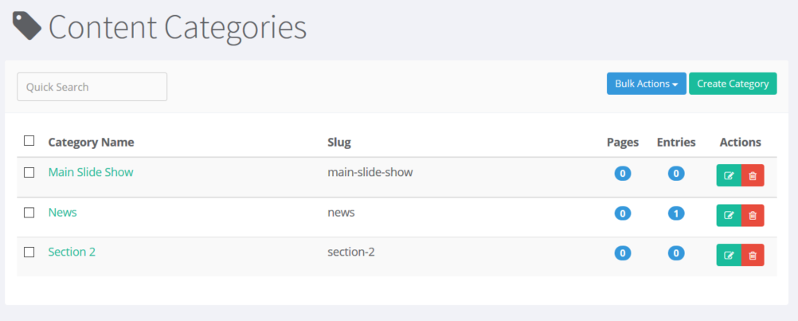

# Categories

Content categories can be edited in the administrator, located under the left hand menu 'Content'.

Each post \( Page or Blog \) can be filed under zero, one or many categories. Categorization helps group content and gives users more options for navigating your content.

Links to your categories of blog posts show up in the right hand menu of your blog layout \(theme implementation may vary\), and show up as 'Tags' for your blog entry.

The category manager is simple, including a simple search, listing Categories with their associated slug, and a list of pages and entries currently associated with this category, and options to 'Edit' or 'Delete'.

You can perform Bulk actions using the checkboxs next to Category Name, and clicking 'Bulk Action', which allows you to perform one of the following tasks:

* Delete Selected
* Import
* Export All as JSON
* Export All as XML



## Add a new Category

To add a new category, click the green button labeled 'Create Category' in the top right hand corner of the category manager. Clicking the 'Create Category' button pops a modal window up like below, asking for category name, and slug.


**Category Name** This is the name of the category, displayed wherever the category is used.

**Slug** The category slug is the unique id refereneced throughout the site, including the URL. If you leave the slug blank, the system will generate a slug for you, for example: If your category is called 'Recipes', the generated slug would be 'recipes' and the url would be [http://www.yoursite.com/blog/recipes](http://www.yoursite.com/blog/recipes) In some cases, you would prefer a slug different from the auto generated slug, for example: If you category is called 'Tasty Recipes', instead of 'tasty-recipes' for a slug, you could use 'recipes' or 'food' and the url would use the slug of your choice, so the url would be [http://www.yoursite.com/blog/food](http://www.yoursite.com/blog/food)

**Save Category** Once you have entered your category information, click 'Save Category' to save the category, and return to the Category list.

**Cancel - Close Modal** Clicking the X \(close\) or 'Cancel' button will cancel the creation of the new category.

## Edit Category

To edit a category, click the name of the category from the category list, or click the green edit icon.


Update the category name, and slug as needed, and click 'Save Category' when you are happy with the changes. Closing or Canceling will revert your changes to the last saved version.

_Note: The Category Slug is an important part of the url creation, so changing the slug will affect your existing links._

## Delete a Category

Deleting a category is a simple action, but can have a lot more impact that you might initially think. A category slug is used to create urls, and removing a category will render all those previous url links invalid. Deleting a category does not remove the content that belongs to that category, but does remove one of the ways to view that for your user.

### Deleting a single Category

You can delete a category, one at a time, using the red delete \(trash can\) icon button on the line of the category you wish to delete.


### Deleting Multiple Categories

If you wish to delete multiple categories at once, you can select the check boxes next to the categories you wish to delete, and click the 'Bulk Actions' button, and select 'Delete Categories' from the drop down menu.


### Deleting a Category with associated Pages or Entries

When you delete a category that has associated content, pages or entries, the category is deleted, and the association is deleted, but **the original page / entry is not deleted**.

## Export Categories as JSON/XML

For convenience, ContentBox has easy import and export options for your categories. To export all of your categories, simply click 'Bulk Actions' and select 'Export All as JSON' or 'Export All as XML'. Your browser will prompt you to download the Categories.json or Categories.xml, depending on the option you chose.


The JSON/XML includes just the 3 base fields, category, slug, and categoryID, as shown below in a json example.

```text
[{"category":"Homepage Rows", "categoryID":2, "slug":"homepage-rows"},{"category":"Slider","categoryID":1,"slug":"slider"}]
```

