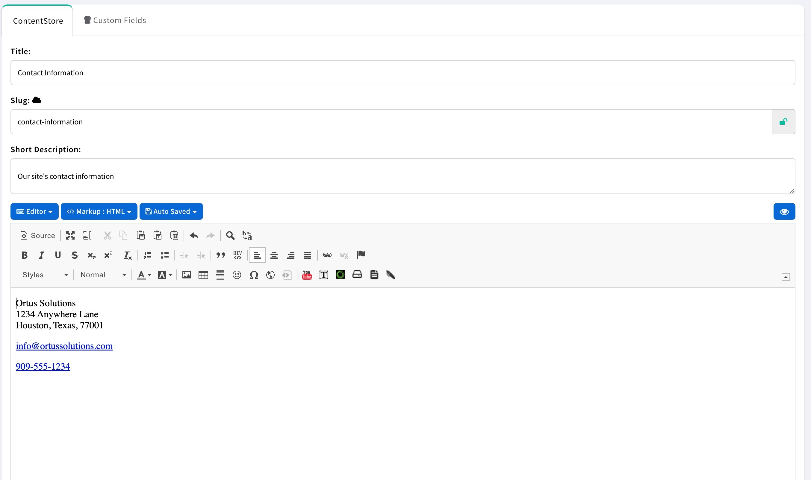

# Content Store

Often, there are items which a user wishes to be dynamic in a content layout, template or even a custom view.  The ContentBox Content Store allows you to create and group these reusable elements.

Let's say, for example, that you wish to include a block of Contact information in the footer of your site.  You could code that directly in to your [Layout](../../../../font-end-development/theme-development/theme-layouts.md), but by using the Content Store, you make that content easily editable by Editors and Administrators of your site.

To create Content Store custom content, navigate to Content > Content Store in the sidebar menu and click the "Create Content" button.  Then provide your custom content in the editor. &#x20;

<figure><figcaption></figcaption></figure>

Note the `slug` value in the editor.  You will use this slug to retreive the custom content item in your layout.

Open your them layout or footer view and insert the custom content reference using the shorthand annotation like so:

`{{{ContentStore slug='contact-information' }}}`

Now your Content Store item will render in the footer of your site theme and can easily be changed from within the administration
