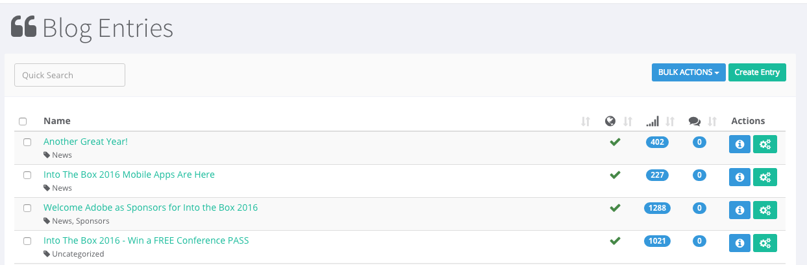
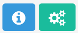
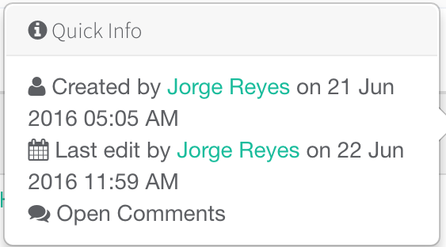
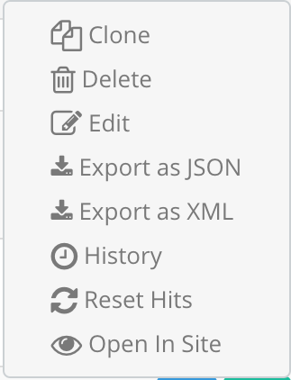

# Blog

Blogging capabilities are essential component for any web site and web application. Blog entries help provide more context around products, services. It inherently creates more on-line presence and, if managed properly, better search engines results.

ContentBox comes with a built-in blog which you can turn ON and OFF from `System > Settings`. The default setting is **ON**.

The main Blog page in your ContentBox Administrator shows a table with all your blog posts. We have 3 useful indicators.

* 

   Shows if your post has been published

* 

  Shows the numbers of views

* 

   Shows the number of comments

And you also have quick actions:

Where you can check the info related to each individual post 

And entry actions

