# Active Theme

When installing a CMS, one of the first steps you'll likely take is to install a theme. We wanted to give you a head start and give you a theme that gives you plenty of options to customize your site, colors, social media icons, and even a hero style homepage. In ContentBox 3.1 we even updated Themes to have better documentation, so it's easier to get started with your theme. Let's see what the default theme can do for you.

## Theme Settings

Theme settings is where all of your configuration happens. In ContentBox 3 we added a lot of functionality to make the Theme Settings easier to work with, for Devs and Users. The first you will see is the groupings of settings. This allows a User to focus on one set of settings at a time. With a complex theme, having all of the settings visible at once can be very overwhelming.

## Default Theme Settings

Since each theme controls their own settings, lets look through the Default Theme's settings.

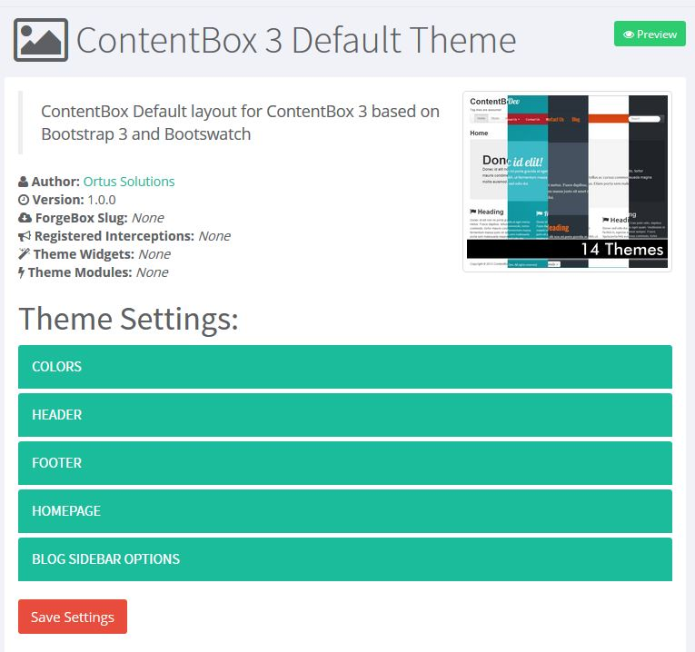

### Colors:

When you expand your group, you will see all of the settings of that group, displayed with a Group Introduction, a label for each setting, optional setting description \( not shown in the example below \) and an optional help modal \( the blue ? Icon below \) . In colors, you can choose one of many Bootswatch themes. Bootswatch is a set of color swatches made to extend the traditional Bootstrap framework. Below you will see a selection of the swatches.

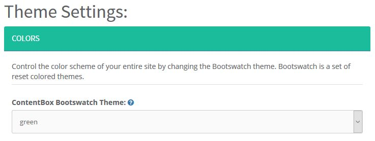

Here is an example of an optional help modal, for settings that require more information for the user.

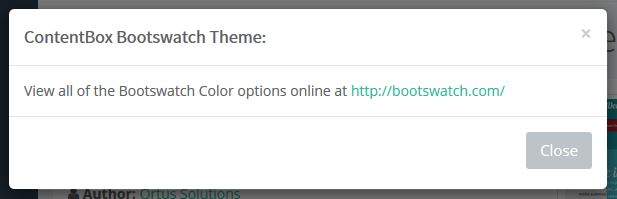

Changing the color dramatically changes your sites appearance. Lets look at your site default \( green \) and some options.

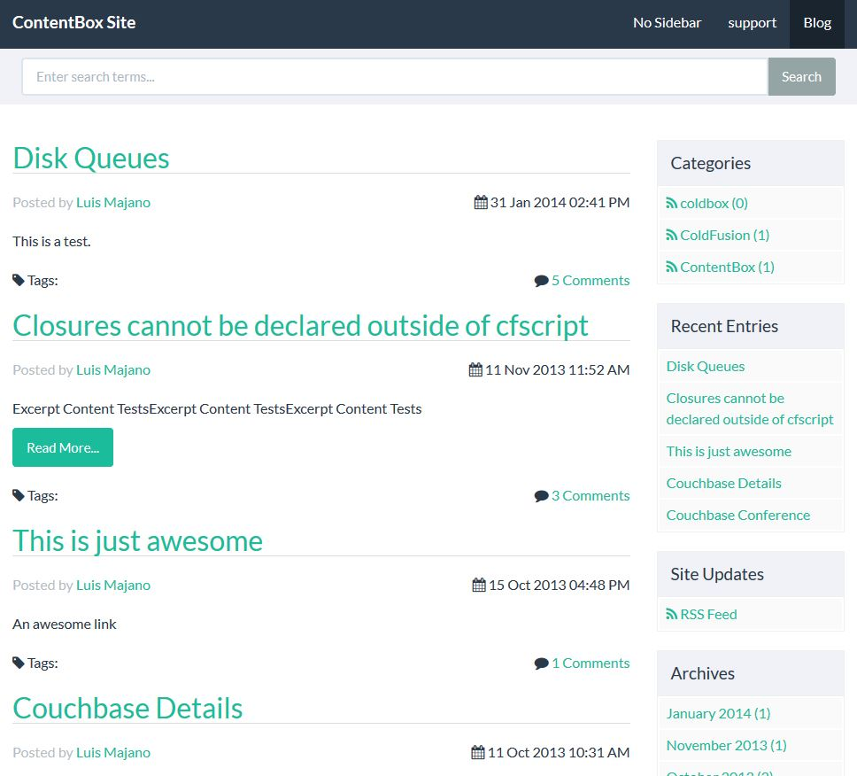

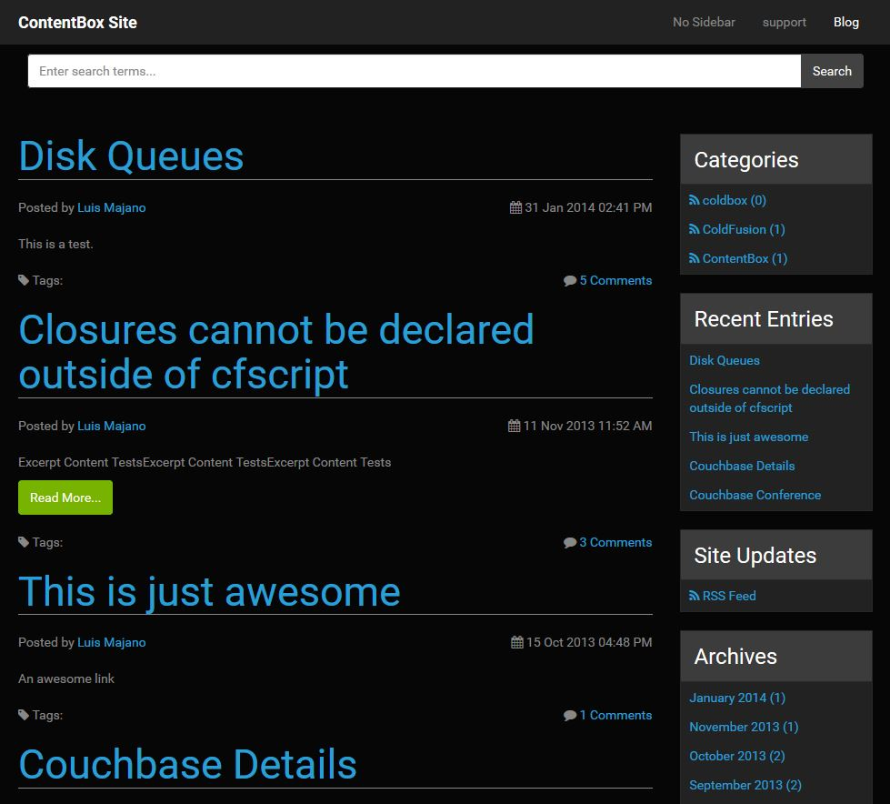

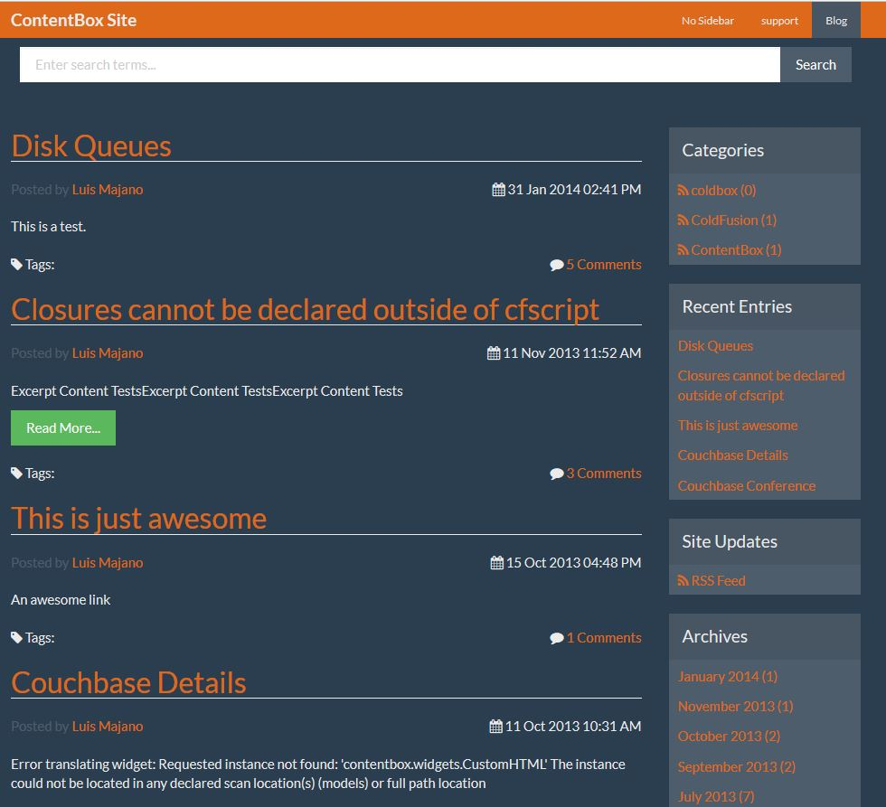

Of course you have plenty of options, visit bootswatch.com for thumbnails and more information on each swatch.

### Header

**Logo URL:**

You can choose whether you would like to use Text for your Logo, like the screenshots above, or you can choose to use a logo. One important thing to note here is the size is not restricted, please ensure your resize your logo.

**Show Search form field in Header.**

If you are not a fan of the large search box, you can disable it with this setting.

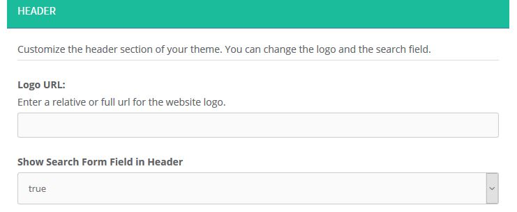

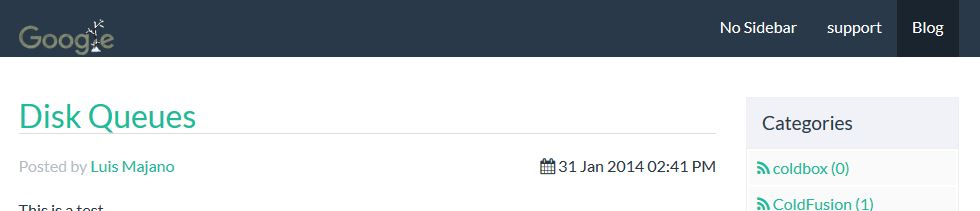

### Footer

The footer is just a text field, so you can add some copy to your footer. I decided to spice things up with Bacon, here is a footer with Bacon Ipsum.

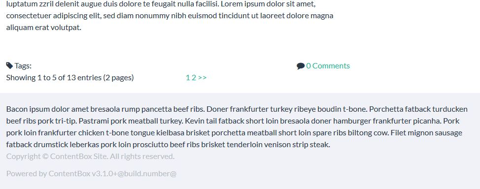

### HomePage

The home page has lot of options, as you can see in the screenshot below. You can change the header title, add some text, give text for the button and add the link that the button links to, as well as selecting a preselected background image, or your own custom background.

After changing a few settings, your homepage now has a nice hero image, like the screenshot below.

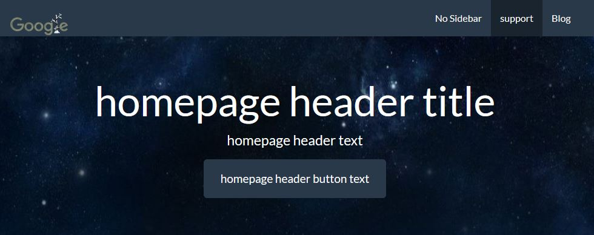

### Blog Sidebar Options

When looking at the blog part of ContentBox, you'll see you have loads of options on the right hand side.

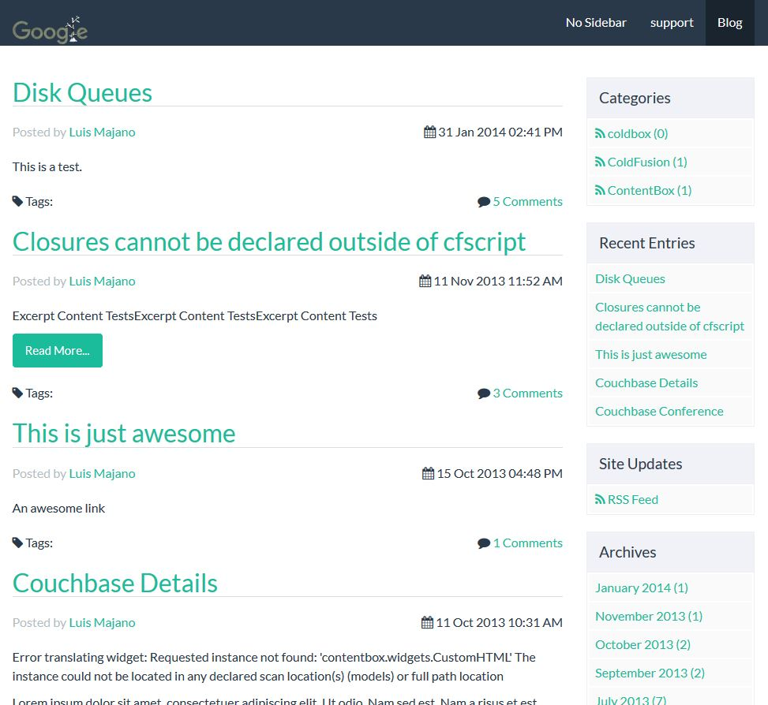

This might be too much for some sites, so you can choose whether to show / hide some of those mini widgets.

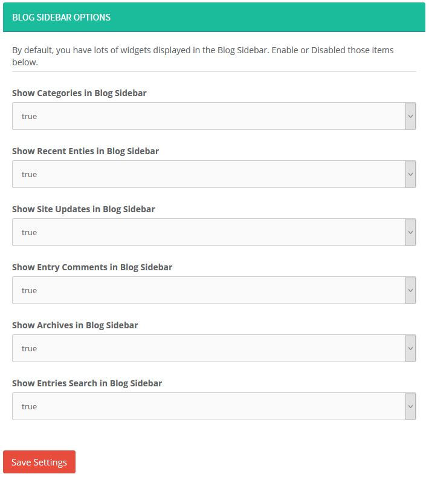

Turn them off, and hey presto, no more side bar mini widgets.

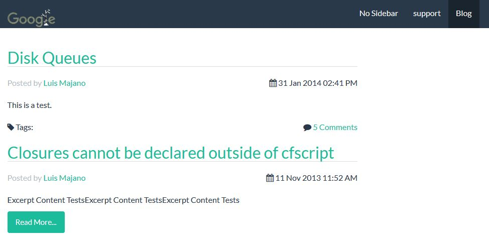

This is just the default theme. There are many more [themes on ForgeBox](https://forgebox.io/type/contentbox-themes) and new ones being added all the time.

