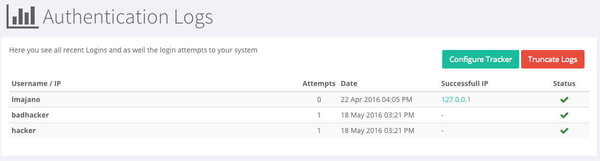
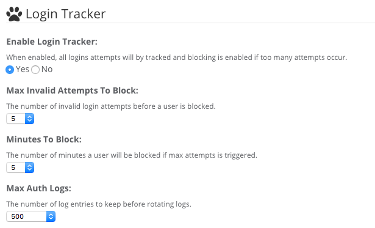
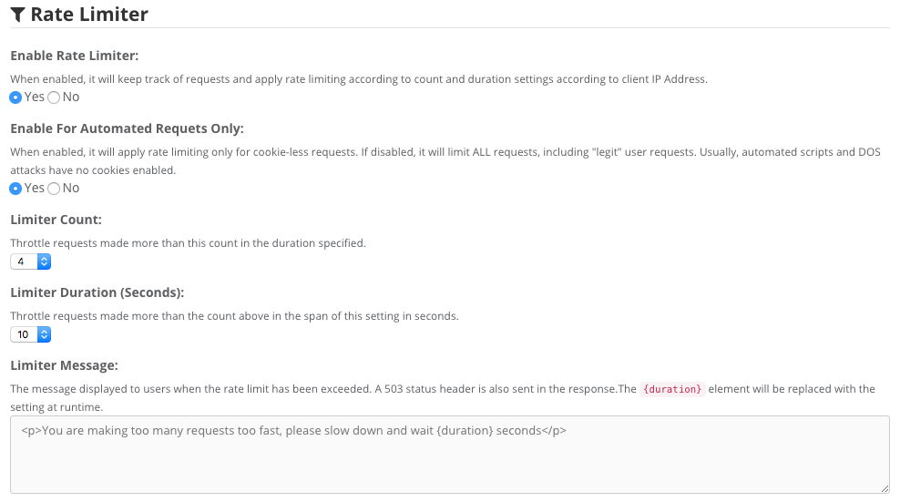

# Security Options

In `System > Settings > Security Options` - You will see 3 new features to ContentBox ( released in ContentBox 3.0 ), the Login Tracker, the Rate Limiter, and Secure Sockets Layer ( SSL ) Encryption.

## Login Tracker and Lockout

The ContentBox administrator module now comes with a login tracker which if enabled can track invalid logins and be able to block individual ip addresses from brute-force attempts. We even track all valid logins into the new ContentBox Security Audit Log.

## Rate Limiter

One of the biggest problems on the internet today, is out and out traffic overload. Of course, hardened hardware is the best approach to stop denial of service attacks, but we have given you some tools inside of ContentBox to help at the software level. You can now run your very own Rate Limiter.

## SSL Support

SSL support can now be found everywhere in ContentBox for both the UI and admin modules. Users can even select specific pages for users to transition into or out of SSL for richer eCommerce or secure experiences.

.png>)

## Other Security Information

Security is a big issue with any website these days, and with the number of word press hacks in the wild, it’s a big PRO to using ContentBox. With Brute force attacks to admins so prominent, we have a fewof features to make your life easier, and your website safer.

### Bcrypt Support

One of the major upgrades in ContentBox 3.0, ContentBox now offers BCrypt support for password encryption, to make cracking passwords harder than ever. The default algorithm for passwords is now based on BCrypt with work factors for better security and entropy. You can read more on bcrypt here: [https://en.wikipedia.org/wiki/Bcrypt](https://en.wikipedia.org/wiki/Bcrypt)

### Password Policy

A new password policy is now in place for ContentBox for new and current users, which must be greater than 8 characters with at least one:

* Lower case character
* Upper case character
* Digit
* Special character

### Adminless ContentBox Site

All of these features are definitely great addons to ContentBox, but one of the best features of all… you can completely remove the Admin itself from your production site. This would give hackers no access to the login page at all.

Secure your site today.
