# Manage

To create or edit administrative users for ContentBox, select the `User` menu in the navigation bar on the left. The menu will drop down and you will need to select `Manage`.

## User Management List

Once in the User Management screen you will be presented with existing users, email addresses, roles and last time a user logged in.

There is also a icon that will allow you to select user actions such as:

* Edit User
* Delete the user 
* Export the information for a user as JSON or XML to import to another site. This is a simple way to give users access to additional websites. 

You will also see a star next to the user you are currently logged in as.

Above the users there is a bulk actions button. This allows you to import JSON or XML files or export all users as JSON or XML.

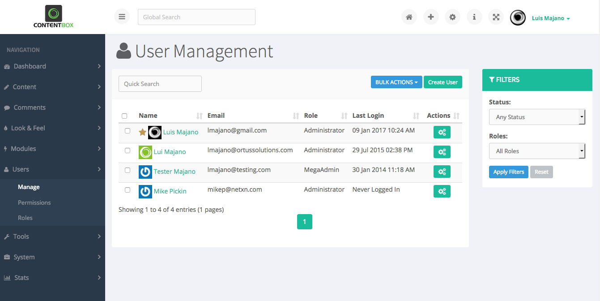

### Filtering Users

When managing large number of users, this screen might become overwhelming. On the right hand side you will have an option to help filter the users. You can filter by status or roles or a combination of both.

## Creating a user.

Click on create user in the top right corner of the User management box.  
On this screen you will see the user details. Fill out the details with \* as these are required.

Then you will need to choose if the user is active and what role you will assign to the user. \(please see roles for further information\)

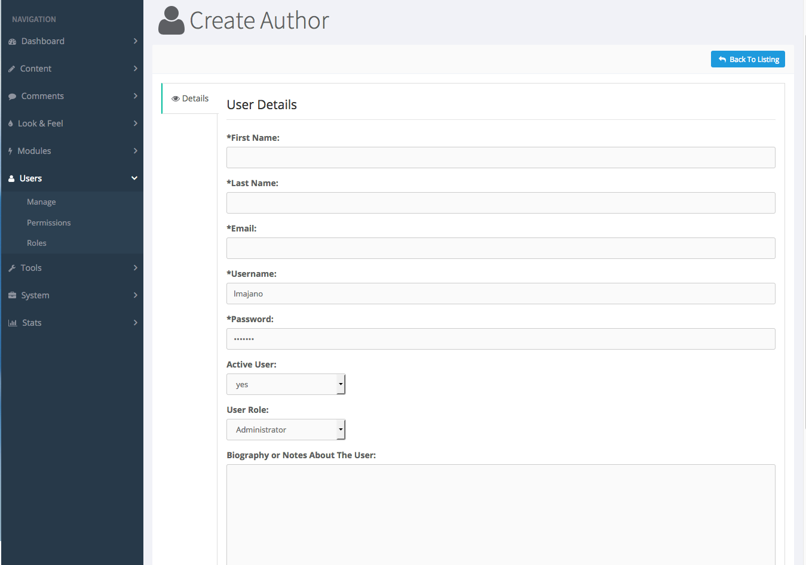

Below here you have the option to enter a Biography or Notes About The User. This is not required.

Once this has all been completed click save details at the bottom of the page.

### Password Security

The password has requirements to make sure that they are secure.

It requires the following:

* 8 Characters long
* 1 Capital letter
* 1 Number
* 1 Special Character \(such as @\#$%\)

## Edit a User

On the User Management page click on the User Action icon at the end of the user.

This will open up the editing page.

This look a lot like the create user screen however you will notice on the left hand side, there are `Tabs`, with categories of more information to save about a user.

### Details

The Details menu allows you the same information as creating a new user apart from the password. You are not able to change the password in this area.

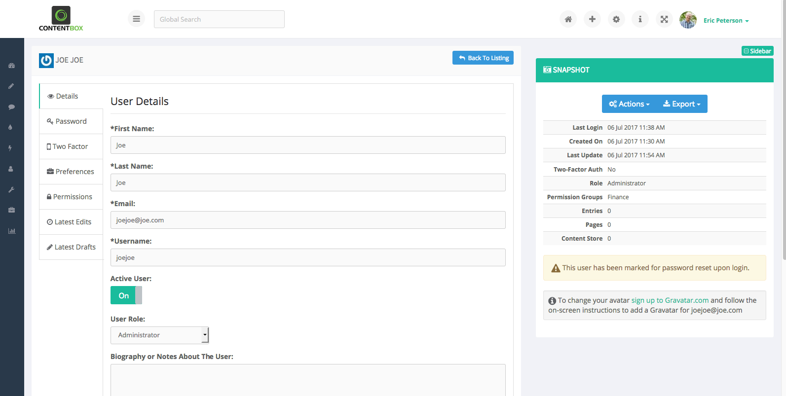

### Password

Changing Password allows you to change your own password or reset the password for another user \(given you have the correct permissions\).

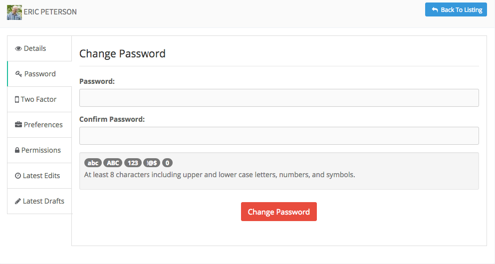

You can email a password reset to any user that is not the currently logged in user.

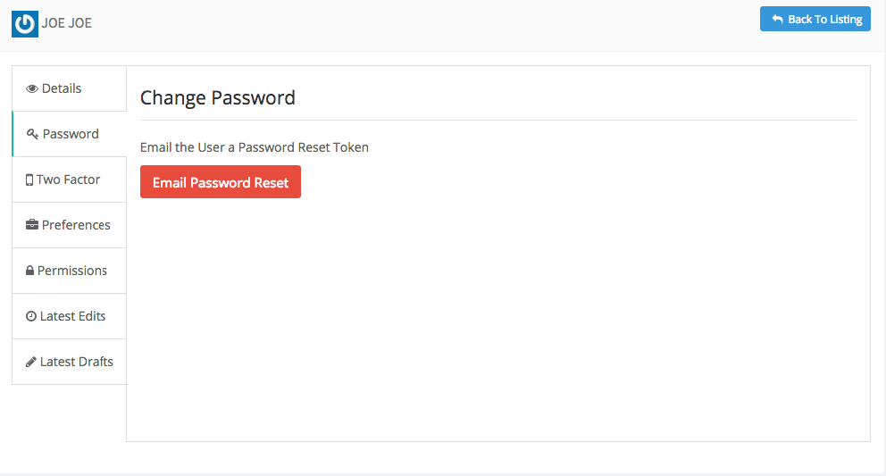

Two Factor Authentication

A user can enroll themselves in two factor authentication. The manage screen allows the user to configure any required information before starting the enrollment process.

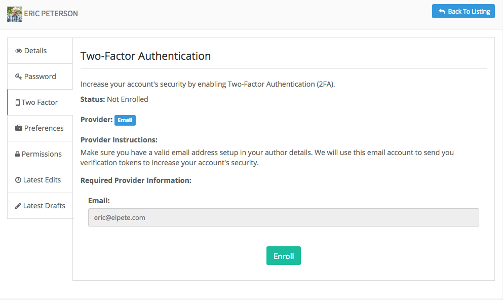

To enroll, a user must successfully enter in the code or credentials sent via the default provider. On a successful entry, the user will be enrolled in two factor authentication.

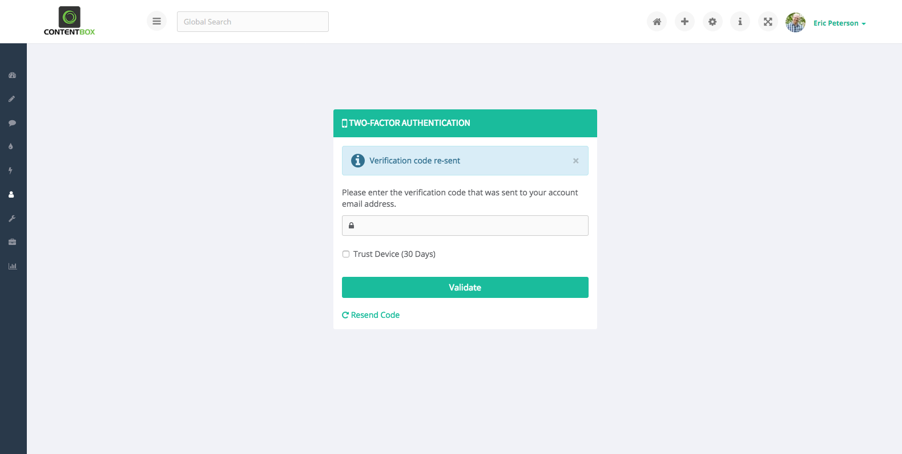

Users are able to unenroll from two-factor authentication themselves from the manage screen. Users with an admin role assigned are able to unenroll not only themselves but other users as well.

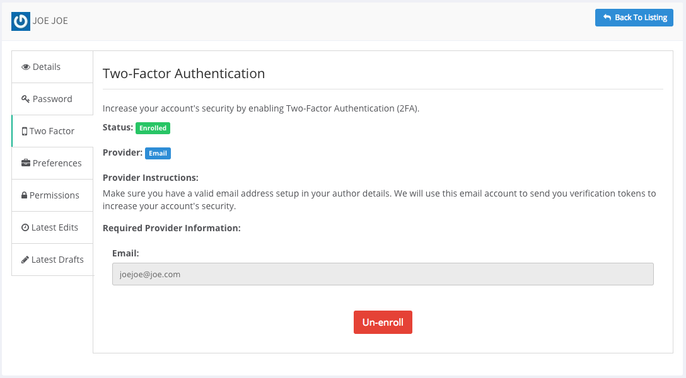

### Force Two Factor Authentication

If two factor authentication is being enforced, users will be forced to enroll in two factor authentication. if a user unenrolls

from two-factor authentication a form to enroll in two-factor will be presented right away.

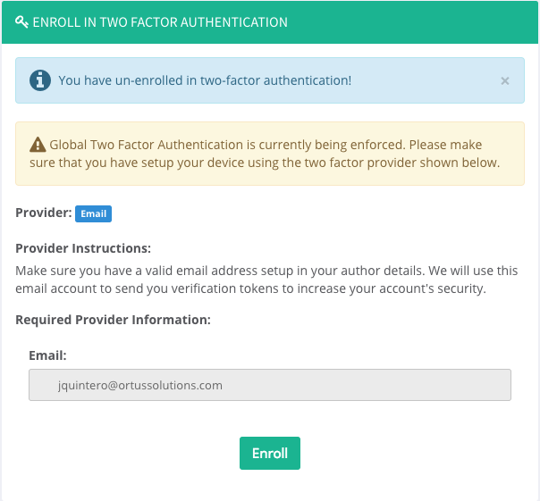

When a not enrolled user is logging in and the two-factor authentication is being enforced, the enrollment form will be presented and the user won't be able to see the dashboard or any other content unless a successful enrollment in two-factor authentication is performed.

### Preferences

The next menu is Preferences. In this menu you will notice there are areas for social media profiles and setting such as collapsed left nav bar enabling the user to setup contentbox the way they prefer.

### Permissions

The next menu is Permissions. In this area it enables you to see what permissions this user has \(please see permissions for more information\).

**Role Permissions**  
Role permissions are assigned to the user when creating the user by assigning the role. Each role has a default set of permissions allocated to it. If the user requires an additional role you can use the A-la-Carte Permission area below.

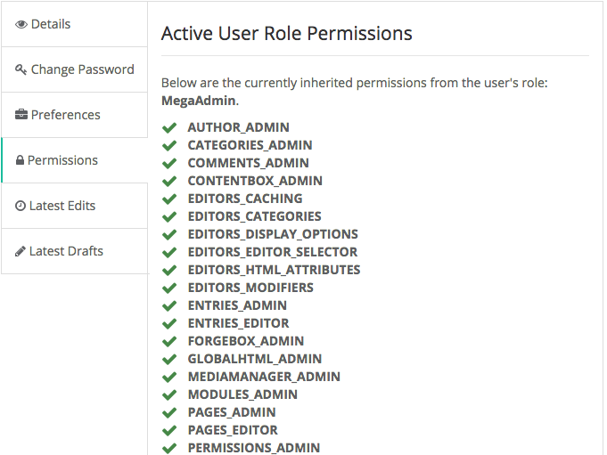

**A-la-Carte Permissions**  
In this section you can Assign A-la-Carte Permissions. This means that if someone doesn’t have access to a permission from their standard permission profile but needs access to it, you can give access to just that selection without enabling the user more access than needed.

### Latest Edits

The next Menu is Lastest Edits. This will show you anything this user has edited. This will show you the title, date/time, whether it was published, and lets you view the change on the site by clicking the action button.

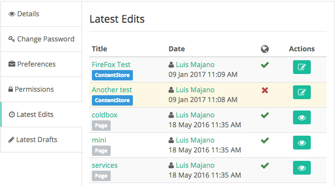

### Latest Drafts

The last menu option is Latest Drafts. This will show you what work has been saved but not yet published. Again it will show you title, date/time and lets you edit the draft directly from this menu.

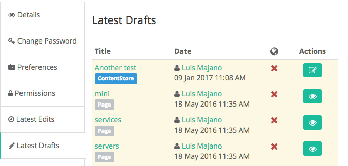

