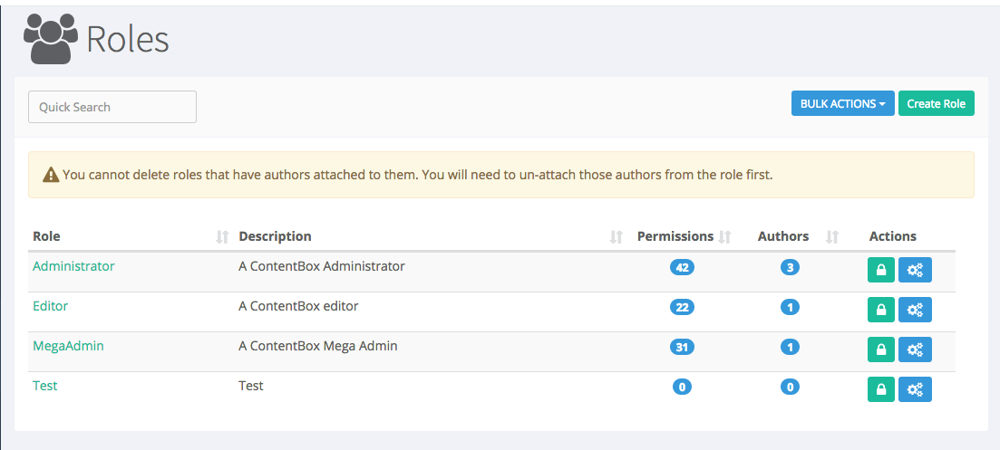
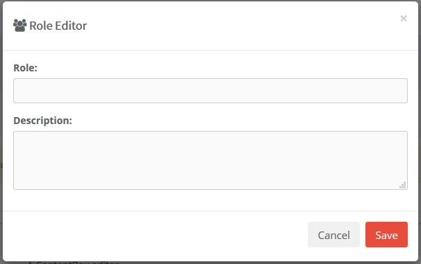
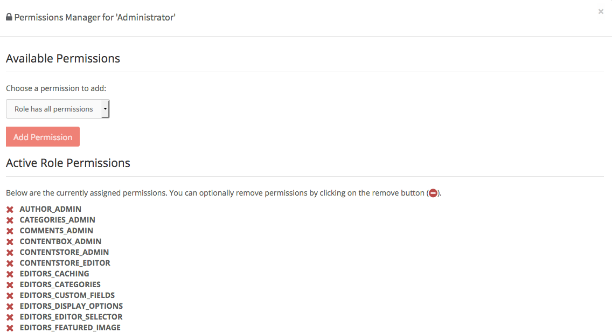
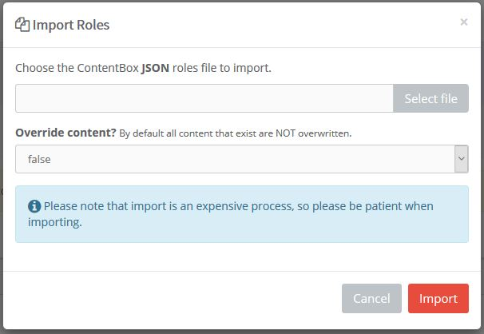
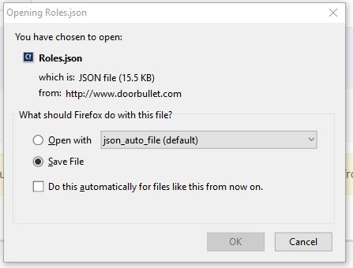

# Roles

The roles menu is located under the `User` menu in the navigation bar to the left of the screen.

In this menu you will see a list of roles available to assign users, which will allow you to define their access to the site. You can use the quick search function if you are looking for specific roles, otherwise you can look in the main body of the page.

You will see 5 headings across the page

* Role - This will be the name given to the role
* Description - This will explain the role and access
* Permissions - This will tell you how many permissions have been assigned to the role.
* Authors - This will tell you how many users are assigned to this role
* Actions - There are 2 options:
  * Green Icon - `Manage the Permissions`&#x20;
  * Blue icon - Role Actions has 3 options
    * Edit Role
    * Export as JSON
    * Export as XML.&#x20;

\*You can only edit permissions if you yourself have permission to make changes.

## Create Role

You can create new roles by selecting Create Role. A box will appear and you enter the `Name` and `Description`. Once this is done you can add abilities to the new role by managing the permissions (see below).

## Edit Role

Edit Role only allows you to edit the Name and Description, like the Create Role Form. You will spend more of your time with Roles, managing the Permissions.

## Manage Permissions

In the Manage Permission menu it will show the `Available Permissions` & `Active Role Permissions`.

### Available Permissions

Available Permissions are shown in a dropdown box. You will be able to add permissions to a role by selecting the permission and clicking Add Permission.

### Active Role Permissions

In the Active Role Permissions below are the permissions that are currently available to this role. You can also remove permissions available to the role by click the red X next to the permission in the active role section.

## Bulk Actions

In the top right section of the page, you will see a `Bulk Actions` button next to `Create Role`. This allows you to do the following:

* Import
* Export All as JSON
* Export All as XML

### Import

This is a nice feature when you manage several sites. You can setup roles on one site, and then export them, and import them into the other sites you manage.

For safety reasons, when you Import Roles, by default you will not override any content. If you have existing roles, that you want to be updated, please set `Override Content` to true. Otherwise existing content will be skipped during the import process.

### Export as JSON / XML

Exporting to JSON or XML is a simple process. Click `Bulk Actions` and select your format, and in seconds you will see a file download prompt pop up, asking you to open or save your file ( in most browsers ).

